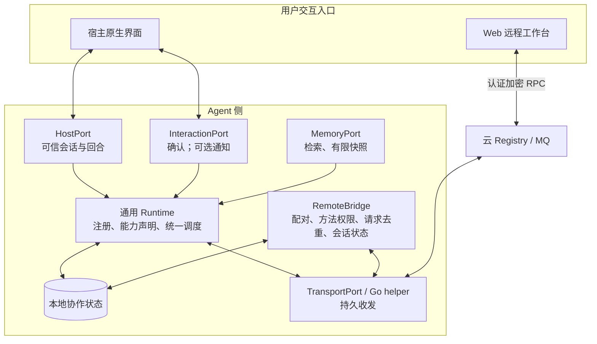
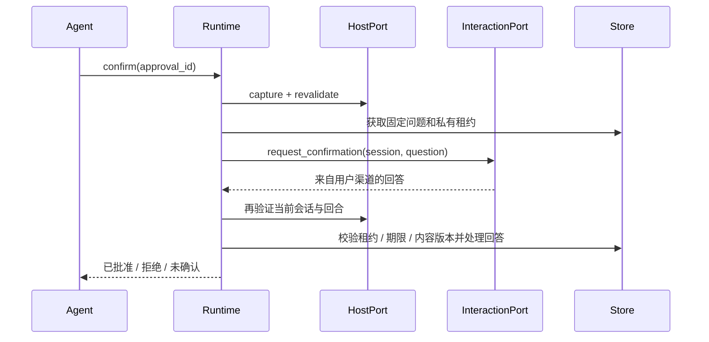

# Agent 侧为中心的产品边界与扩展接口

更新：2026-09-14。本文取代早期将 Web 联系人、审批和交易视为独立业务系统的设计。产品决定来自用户本轮指示：Web 只远程连接 agent；agent 侧应适配不同宿主、记忆系统与用户交互方式。

## 产品归属

| 部件 | 拥有的事实 / 职责 | 不承担的职责 |
|---|---|---|
| 用户自己的 agent | 推理、任务理解、原有私人记忆及工具 | 不自行宣称已取得新的用户授权 |
| agent-comm-runtime | 本地联系人、资料快照、委托、方案、审批、操作、审计；版本化适配接口 | 不统一用户全部记忆，不执行未知能力 |
| Hermes connector | 将真实宿主会话、确认 callback 与 Gateway 生命周期接到 runtime | 不复制策略内核，不将普通远端消息变成主人身份 |
| Go helper / SDK | 网络身份、签名、加解密、本机持久 inbox/outbox | 不根据消息正文决定主人授权 |
| Go platform | Registry、MQ、Relay、基础设施管理 | 不维护个人协作委托或通讯录别名 |
| Web 工作台 | Web 登录、控制台身份、agent 连接记录、有限期 RPC 密文投递缓存 | 不维护独立联系人、聊天历史、审批、交易或模拟服务数据 |

Web 中添加 agent 只是连接记录。真正的远程访问权由 agent 侧配对赋予，绑定控制台 URN、明确方法范围、主人主体和到期时间。即使有人知道 agent 的 URN，也不能因此查询其联系人或任务。

## 运行结构

扩展接口指代码合约，不是新增暴露在公网的 TCP 端口。默认继续使用本机 loopback helper 与云端 HTTPS MQ；不能让网页跨源直接写本机信任配置。

## 四类扩展端口

通用包位于 `agent-comm-platform/agent-comm/python/agent_comm_runtime/`，可独立安装，无 Hermes 依赖。`ports.py` 定义接口，`AdapterRegistry` 实际检查并注册适配器，`Runtime.dispatch` 使用它们执行能力。

| 端口 | 必需 / 可选方法 | 适配者负责证明什么 |
|---|---|---|
| HostPort | `capture`、`revalidate`；可选 `wake` | 主体、会话、当前回合确实来自宿主；中断或归属改变后不能沿用权限 |
| MemoryPort | 按声明实现 `search`、`read_snapshot` | 查询范围、来源与版本；返回有限快照，遵守原记忆系统访问规则 |
| InteractionPort | 按声明实现 `request_confirmation`、`notify` | 回答来自对应用户交互渠道；模型或对端不能提交自己的同意凭据 |
| TransportPort | `store`、`retrieve`、`ack` | 持久接受、稳定 ID、已验证来源、明确 ACK 和超时语义 |

每个适配器声明 `Descriptor(name, port, capabilities, api_version='1.0')`。未知版本、未知能力、缺失实现或重复端口会被拒绝。未配置的能力返回 `unsupported`；不偷偷回退到自由文本授权、全量记忆导出或任意网络请求。

`HostSession` 保存宿主生成的 `principal_id`、`session_id`、`turn_id` 和仅供宿主使用的 opaque 对象。模型参数和远端 JSON 均不能提供这个可信上下文。长期主体与临时会话分开，既支持同一主体跨对话恢复，也能把确认绑定到当前回合。

`MemorySnapshot` 包含 reference、title、text、source、version。记忆查询结果不自动成为通讯录绑定，资料快照也不自动获得披露许可。接入知识图谱时，适配者可将图谱实体映射到候选联系人，但最终稳定 contact_id → URN 的绑定仍须独立确认。

## 授权渠道的共同流程

Hermes 当前实现仍使用原生问题卡 callback。其它渠道可以实现自己的适配器；实现代码须可信安装并验证真实渠道身份，不能仅写一个返回“同意”的函数就声称完成授权集成。通知和主动唤醒已有注册与调用接口，但未因此启用后台私人会话自动协商。

## Web 远程协议

协议名 `agent-comm-control/v1`。请求通过已有签名加密消息传输，严格绑定 request_id、agent_urn、console_urn、method、params 与 deadline。响应绑定同一组身份及请求字段，携带 result 或 error；Web 必须验证真实 agent 发来的响应才展示成功。

Agent 侧 RemoteBridge 使用本地配对与持久请求记录：

1. 根据 helper 验证过的 sender_urn 查找有效配对。
2. 核对请求目标、控制台身份、期限和方法范围。
3. 用稳定请求 ID 与内容指纹去重；同 ID 不允许替换请求内容。
4. 从 agent 侧读取事实或提交真实会话工作；保存结果后通过 helper 回传。
5. 返回消息被 helper 接受后再 ACK 原请求；故障重试保留原响应。

首批方法为 `capabilities`、`contacts.list`、`collaboration.state`、`inbox.list`、以及 Hermes 实现的 `conversation.send` / `conversation.get`。独立只读 daemon 不宣称具备 Hermes 会话能力。`conversation.send` 返回 submitted 仅代表已提交，最终结果由 conversation.get 从 agent 侧读取。

远程审批当前不开放。Web 可以查看 agent 侧的待确认状态，原生审批仍回到已实现的用户交互渠道。后续渠道适配要补充身份验证、问题呈现、回答绑定、期限与撤销测试，才能声明支持。

Web 只缓存有限期的 RPC 密文；10 分钟是可读取有效期，数据库中的过期记录在后续控制调用或轮询时清理，没有独立后台删除任务。刷新联系人、任务或会话历史都向 agent 查询。agent 离线时展示等待或失败，不用一份独立云端业务数据库伪装在线结果。Web 后端是托管控制台身份端点，会解密用于显示的响应；云 MQ 仅保存加密信封。

## 适配者接入步骤与验收

1. 独立安装 runtime，阅读其 README 与参考适配器，运行合约测试。
2. 实现真实 HostPort，保证主体/会话/回合不是模型参数；测试取消、替换回合和跨主体隔离。
3. 按需注册 MemoryPort 与 InteractionPort，不实现的功能明确不声明；测试有界结果与确认回调。
4. 使用共享 Store 与 TransportPort，保持现有受控动作检查、幂等与 ACK 顺序。
5. 如接入远程工作台，在本机建立有期限的方法配对，并给受支持方法注册 handler；测试陌生发送者、越权方法、重放冲突、到期及撤销。
6. 完成宿主真实集成测试后，再把该适配器列为已支持。接口可用、参考适配器可运行和具体第三方宿主已适配，是三种不同完成状态。

## 清理与迁移约定

根目录退役 connector、旧安装 CLI、旧云端域数据脚本与 Web mock/demo 入口移除。Web 旧业务表不再由代码读写；迁移保留旧数据供备份与恢复，不在服务启动时执行破坏性清库。旧 Hermes 导入路径可以保留薄兼容导出，但策略与 Store 只有通用包一份实现。

保护用户已有 helper 密钥、mailbox、connector receipts、collaboration SQLite 和 remote pairing SQLite。程序发布不等于授权删除这些数据，也不等于允许将原记忆系统全量导出。

具体源码合约与可运行示例见 [runtime README](../agent-comm-platform/agent-comm/python/README.md)，本轮交付和验证状态见 [实现交接](PERSONAL_AGENT_COLLABORATION_IMPLEMENTATION.md)。
