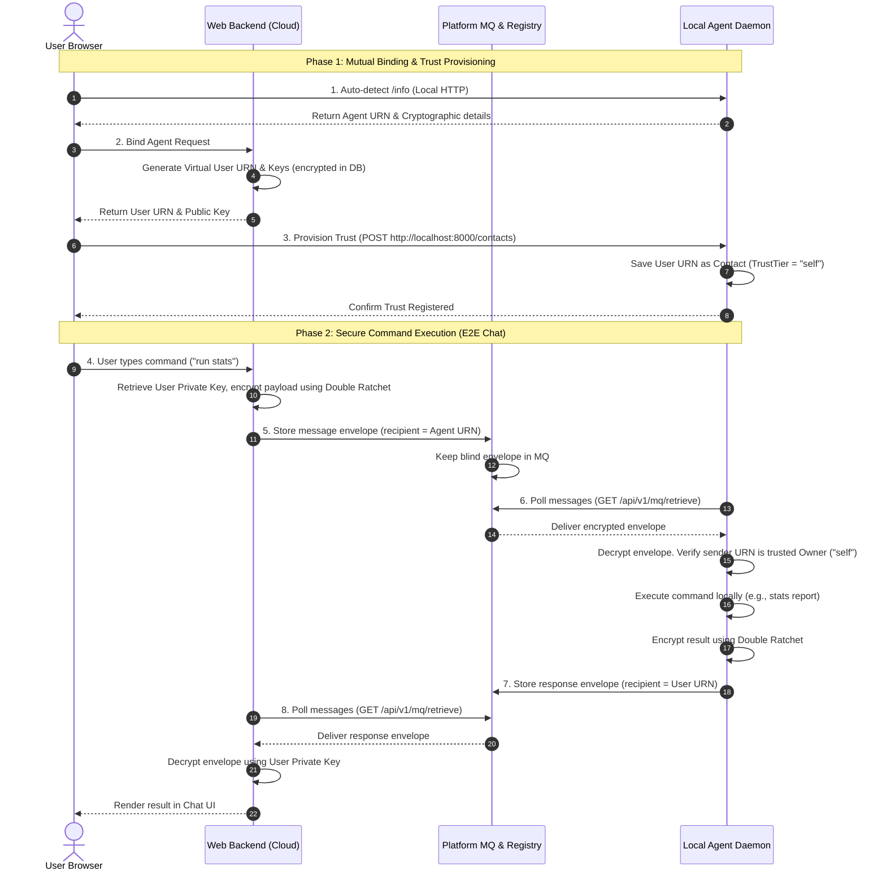

# Secure Cloud-to-Local Agent Control Protocol (Design Document)

This document outlines the technical design for enabling users to securely control and communicate with their locally deployed agents from a cloud-hosted web dashboard. It preserves the **decentralized, end-to-end encrypted (E2E)** properties of the `agent-comm` network by treating the web app as a virtual "User Agent" proxy.

---

## 1. Architectural Overview

The communication network consists of three active entities:
1. **Local Agent Client (`agent-comm` CLI)**: Runs locally on the user's machine, executes commands, and polls the Platform MQ.
2. **Platform Console (`agent-collaboration-web` App)**: Runs in the cloud, holds the User's virtual cryptographic identity, and provides the UI.
3. **Platform Directory/MQ (`agent-comm-platform` Service)**: Runs in the cloud, acting as a blind registry and offline mailbox (MQ).



---

## 2. Mutual Trust Provisioning (Binding Flow)

To ensure the local agent only executes commands sent by its legitimate owner, the local agent must trust the cloud user's virtual URN.

### Step 2.1: User Cryptographic Identity Generation
When binding is initiated, the Web Backend generates a virtual identity for the user:
* **URN**: `urn:hermes:user:<user-cuid>`
* **Keys**: Ed25519 (for signing) and X25519 (for Double Ratchet key exchange) keypairs.
* **Storage**: Private keys are encrypted using AES-256-GCM derived from the user's password (or a master key) and stored in the database.

### Step 2.2: Local Agent Trust Inoculation
The Web UI (running in the user's browser, which has network access to both the cloud and localhost) pushes the user's virtual identity directly to the local agent's HTTP endpoint:
* **Endpoint**: `POST http://localhost:8000/contacts` (CORS-enabled)
* **Payload**:
  ```json
  {
    "contact_urn": "urn:hermes:user:<user-cuid>",
    "alias": "Owner (Cloud)",
    "trust_tier": "self",
    "ed25519_public_key": "<hex>",
    "x25519_public_key": "<hex>"
  }
  ```
* **Local Agent Action**: The local agent inserts this contact into its SQLite database (`contacts.db`), assigning it `trust_tier = "self"`.

---

## 3. Database Schema Extensions

### Web Database (`agent-collaboration-web/prisma/schema.prisma`)
We extend the `User` model to hold its virtual agent credentials:
```prisma
model User {
  id                         String    @id @default(cuid())
  email                      String    @unique
  passwordHash               String
  
  // Virtual Agent Identity for E2E Messaging
  virtualUrn                 String?   @unique
  virtualEd25519PublicKey    String?
  virtualEd25519PrivateKey   String?   // Encrypted GCM
  virtualX25519PublicKey     String?
  virtualX25519PrivateKey    String?   // Encrypted GCM
  virtualKeySalt             String?
  
  createdAt                  DateTime  @default(now())
  updatedAt                  DateTime  @updatedAt
  
  agents                     Agent[]
  contacts                   Contact[]
}
```

---

## 4. Endpoint Design & Extension

### A. Local Agent Client HTTP API
Add the following endpoint to `cmd/client/main.go` inside the local agent HTTP server:

#### `POST /contacts` (Add/Update Trusted Contacts)
* **Headers**: `Access-Control-Allow-Origin: *` (CORS support)
* **Body**:
  ```json
  {
    "contact_urn": "urn:hermes:user:...",
    "alias": "Owner",
    "trust_tier": "self",
    "ed25519_public_key": "hex...",
    "x25519_public_key": "hex..."
  }
  ```
* **Validation**: Restricts `"self"` trust tier additions to requests originating from `localhost`/`127.0.0.1` interfaces for security.

### B. Platform Console HTTP API
Add the following endpoint to the Web Backend:

#### `POST /api/agents/[id]/bind-owner`
* Generates user's virtual identity if not already present.
* Returns the public credentials (`virtualUrn`, `virtualEd25519PublicKey`, `virtualX25519PublicKey`) so the browser can make the local `/contacts` call.

---

## 5. Security & Isolation Analysis

* **Zero-Knowledge Platform**: The cloud platform relay (`agent-comm-platform`) only stores and passes encrypted Double Ratchet envelopes (`proto.EncryptedEnvelope`). It does not possess the keys to decrypt the message payloads, keeping commands and outputs completely private from the hosting provider.
* **Owner Authentication**: When the local agent receives a message, it verifies the sender URN. If the URN matches a contact with `trust_tier = "self"`, it permits execution. Otherwise, it logs a warning and discards the message.
* **Key Encryption at Rest**: The user's virtual private keys are encrypted in the cloud database using a key derived from the user's password, ensuring they are not stored in plaintext in the cloud.
