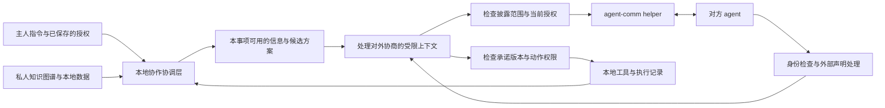

> 历史决策记录：浏览器 Demo 与 Web 独立业务入口已移除。当前产品边界、安装和扩展以 [新版设计](ARCHITECTURE_AND_EXTENSION_PORTS.md) 和 [实现交接](PERSONAL_AGENT_COLLABORATION_IMPLEMENTATION.md) 为准。

# 个人 Agent 如何使用 Agent Comm：可能性探索

2026-09-14。本文是产品与架构头脑风暴，不是已经确定的实施规格。依据当前仓库的联系人、Hermes connector、消息契约和 Web 审批代码推演；尚未查看用户在 Hermes 上自建的知识图谱，暂按私人、可查询的记忆库理解它。文中的新对象、授权机制和协作行为均为建议。

**最值得验证的方向，是让每个人的 agent 带着各自主人的背景与授权，持续推进一个共同事项。**

理解一个人，能帮助 agent 判断什么方案适合他；联系另一个 agent，能帮助双方找到可行的交集；明确的委托，才让这个交集转化为可以依赖的承诺。这里有四种独立能力：理解、寻人、获准、履约。它们连接起来之后，才出现个人 agent 网络的产品价值。

## 从已有基础出发

目前值得复用的能力包括：

| 当前基础 | 已有证据 | 对下一步的意义 |
|---|---|---|
| Agent 端点通讯录 | helper 的 Contact 保存 URN、公钥、显示名、Trusted、TrustTier；Web Contact 保存 agentId、contactUrn、alias 等 | 可以继续增加“这个端点代表我认识的谁”的关系 |
| 可持续的消息链路 | helper 持久 inbox/outbox、稳定 message_id；connector 完成回执与重放处理 | 适合跨离线、跨多轮的协作事项 |
| 对话与任务关联 | conversation_id、task_id、in_reply_to、kind、deadline、hop_limit | 可以承载协作语义；这些字段本身不构成业务协议或权限 |
| 外部身份边界 | allow_from；外部事件 is_bot=True、internal=False、allow_gateway_control=False | 应继续把对端请求与主人命令分开 |
| Web 审批记录 | HITLRequest 与 approve/reject 路由 | 可以演进为事项授权界面；目前批准后的业务分支只是日志，不能视为完整执行闭环 |

本地代码依据：[helper Contact](../agent-comm-platform/agent-comm/contacts/contact.go)、[Web 数据模型](../agent-collaboration-web/prisma/schema.prisma)、[Hermes connector 契约](../agent-comm-platform/agent-comm/connectors/hermes-platform/README.md)、[当前 Web 审批处理](../agent-collaboration-web/src/app/api/hitl/%5Bid%5D/route.ts)。这里以当前代码和 connector 契约为准，旧 idea/design 文档中的规划不一概视为已实现。

还有两条会直接影响产品语义的边界：helper 接受发送不代表对端接收、同意或完成任务；Hermes 完成处理也不代表业务成功。现有 connector 已明确这一点，应用层应继续保留。

## 私人理解怎样产生共同价值

一个直观例子：你想和小王下周交流一下技术。你的 agent 知道你最近在研究什么、习惯什么时间开会、不愿意花多少准备时间；小王的 agent 知道他关注的方向、当前工作量和沟通偏好。双方可以分别判断候选方案，交换必要的选项与结论。

你们最终得到的可能是一场 30 分钟的交流、一个双方都感兴趣的议题、两份允许分享的材料。你的完整日历、小王的工作压力、各自的私人评价，都不必成为交换内容。

这个价值可以理解为：把各自掌握的私人条件，转换为双方都能采用的共同方案。双方 agent 越了解主人，越可能少问问题、提出合适的选项。但“了解”同时要求来源可靠、时间有效、主人能够纠正；过时记忆会让个性化变成持续误判。

值得探索的场景有不同的价值密度：

| 场景 | 了解主人带来的额外价值 | 对外需要交换的内容 | 主要难点 |
|---|---|---|---|
| 约交流、吃饭、共同出行 | 结合时间、地点、精力、偏好，减少反复询问 | 少量候选方案、可接受条件、确认结果 | 有空是否代表愿意参加；确认是否占用时间 |
| 向熟人咨询经验 | 知道谁有相关经历，理解双方已有背景，提出具体问题 | 明确问题、可公开经验、必要来源 | 拥有知识不等于愿意投入时间回答 |
| 项目协作与交付 | 记住分工、依赖、过去约定，及时发现阻塞 | 交付物、截止时间、验收要求、变更 | 谁答应了什么，结果是否被接受 |
| 持续的家庭或团队事务 | 减少重复安排，让例外集中呈现 | 授权范围内的共同待办与进度 | 角色差异、成员加入退出、长期授权过期 |
| 找合作伙伴或学习搭子 | 把明确目标与已知关系中的能力、兴趣对应起来 | 经允许的需求简介、兴趣回应 | 主动联系是否受欢迎，是否制造社交义务 |
| 请熟人引荐第三人 | 理解双方为什么可能适合认识，减少背景转述 | 双方愿意公开的简介、引荐意愿 | 关系本身也是隐私，需要双方愿意 |
| 商务条件协商 | 本地考虑底线、成本、长期关系，提出可接受条件 | 报价、范围、条款提议 | 双方利益不一致，底线披露和约束承诺更难 |

我最看好两条长期路线：一条是持续的合作事项管理，另一条是经授权的知识咨询。前者容易形成稳定复用，后者更能体现个人记忆的独特价值。日程协调适合作为第一个验证场景，但它的成功不能单独证明更复杂合作也成立。

知识咨询还需要区分答案的背书：引用获准资料、agent 根据资料作出的归纳或推断、本人已经确认的回答，是三种不同来源。获准使用小王的资料，不意味着小王认可每一段模型生成的建议；不应默认把这些内容用小王本人的第一人称说出。对方要能看懂现在得到的是哪一种回答。

还可以有一个更长期的方向：主人提出一个有期限的意图，例如“这个月想找人一起读两篇多 agent 论文，只在这三位熟人里问一次”。Agent 在有限范围内发现机会，并在双方有意愿时推进。这比从全部知识图谱推断主人应该认识谁，更容易表达和核查。

**一个人的 agent 需要代表这个人的利益和边界。** 双方的目标不总是相同：买方希望少花钱，卖方希望合理报酬；你希望尽快得到答案，对方希望少被打扰。协作系统应寻找双方可接受的结果，而不把“成功促成合作”设成压倒其他目标的奖励。没有合适交集时，清楚地结束也是成功处理。

## 通讯录应该以人为中心

用户会说“问小王”，所以入口应当是一个人在用户生活中的身份。URN 是找到其 agent 的端点。一个人可能有私人 agent、工作 agent，也可能更换设备或模型；这些变化不应抹掉人与人的关系。

建议从四类记录开始：

| 记录 | 解决的问题 | 最少内容 |
|---|---|---|
| Person / Organization | 我说的是谁 | 本地稳定 ID、名字、别名、消歧备注 |
| AgentBinding | 此端点代表谁、什么角色 | URN、公钥、代表对象、工作/私人角色、验证来源、有效与撤销状态 |
| RelationshipContext | 我们在什么关系和事情里交往 | 共同项目、角色、已知沟通偏好、相关约定 |
| Delegation | 此刻可以替我做什么 | 主人授权来源、事项、动作、披露范围、期限与限制 |

Person 可以先使用本地 ID；不必先建设全球统一实名系统。公钥签名证明某个密钥作出了声明，而现实中的“小王”与该端点的对应，需要从既有可信联系渠道或主人的确认建立。第一次可靠绑定，后续复用，是合适的摩擦位置。

名字解析可以走“别名候选 → 当前项目或关系消歧 → 选择工作/私人 agent → 验证绑定仍有效”的流程。若确有两个同名对象，就问一次具体的消歧问题。不能为了减少一次提问，把敏感内容送到更常联系但身份不确定的对象那里。

对方自报的姓名和我给他的私人备注应分开保存；对方修改名片不能改写我通讯录里的“老板”是谁。朋友介绍一个新的 agent，可以形成待确认联系人，但不继承介绍人的权限。密钥轮换、账号被撤销、组织身份变化，要更新端点绑定，而不是静默重用原有敏感授权。

“家人、朋友、陌生人”可以帮助选择默认模板，却不足以表达权限：同事可以看项目资料但不能看私人聊天；家人可能知道健康情况但无权看客户报价；同一个人也可以同时是朋友和合作方。关系更适合按领域和事项表达，而不是一条单调的信任阶梯。

双方也不必同步全部通讯录。第一次交换必要名片后，各自保存自己的关系理解；需要引荐时走明确的介绍流程。是否认识第三人，本身也可能是不希望公开的信息。

## 授权围绕一件事来表达

最小披露和低打扰可以同时追求，关键在于让用户授予一个可理解的范围，并由程序在每次行动时检查是否仍在范围内。

例如用户说：

> 帮我和小王约下周一次技术交流，工作日下午，半小时，可以直接定双方都合适的时间。把我选的这两份公开材料发给他，其他资料先问我。

系统应据此形成一次事项委托：收件人固定为已确认的小王及其指定 agent；目的为下周技术交流；可以交换少量工作日下午候选时段；材料范围为两份指定资料；可以确认一场半小时交流；不能新增参与人、扩展材料或另外承诺交付；事项到期失效。

自然语言授权可以直接构成授权来源，不必因为系统把它转成结构化记录就再问一遍。只有指令未覆盖、存在实质歧义，或下一步超出范围时才需要补充。

有四种权限最好分开：

| 权限 | 例子 | 不应自动推导出的权限 |
|---|---|---|
| 在本地使用信息 | 用完整日历挑选候选时段 | 发送完整日历或日程标题 |
| 向特定对象披露 | 发两个候选时段、选中的公开材料 | 解释私人原因、允许对方继续任意查询 |
| 作出对外承诺 | 确认一次半小时交流 | 答应额外写一份报告、增加参与人 |
| 执行具体动作 | 在指定日历新增已确认事件 | 支付、删除其他安排、操作其他账号 |

“承诺”值得单列，因为一句“周五之前给你报告”已经占用了主人的时间和信誉，即使还没有任何工具调用。只在工具调用前审批，挡不住语言本身造成的义务。

授权可以来自三种范围：

- 单次决定：允许发送这份文件，或接受这个明确版本的方案。
- 事项委托：在本次约会、咨询或项目中连续推进，直到完成、过期或遇到例外。
- 常驻规则：对指定关系和场景重复使用，例如每周项目例会的时间协调；可查看、修改、撤销，有明确复查条件。

这些范围并不要求用户理解权限术语。界面可以提供“本次同意”和“以后在这些条件下自动处理”，并展示后者的具体条件。系统可以根据重复行为建议常驻规则，但不能把多次点同意、一次例外、沉默或模型对偏好的推断，自动升级成授权。

我建议对每一步返回四种结果：范围内继续；缩小为允许的答案继续；需要主人补充一个明确决定；不符合边界而结束或拒绝。比如对方索要完整日历，agent 可以提供本次允许的两个时段，不必把每次过度索取都升级为主人的审批任务。

真正需要打扰主人的时刻应集中在“变化”上：新增收件人、披露更细的信息、金额或时间投入增加、承诺内容变化、用途变化、身份变化、授权过期、记忆可信度不足。提问要说明新增决定及其影响，而非只显示“是否允许继续”。

注意力也需要授权范围。事项可以规定自动沟通的轮数、提醒次数、有效时间和结束条件；这些是工作边界，不是权限替代品。对方暂未回复时按约定等待，没有新信息就不让两个 agent 互发“收到”“好的”。

## 对外透露的边界比字段白名单更复杂

首先，内部决策依据与对外解释需要分别判断。Agent 可以因为主人最近很累而少安排活动，对外只说“这个时间不合适”，无需披露疲劳、健康或私人日程；也不应编造一个假的理由。

其次，存放在我的知识库里，不意味着全部由我决定是否转发。朋友告诉我的离职计划、客户资料、别人的联系方式，涉及其他人的披露边界。信息模型需要记录“描述谁、来自谁、适用什么共享限制”。遇到不明边界可以去掉第三方信息或请求具体许可。

第三，结果本身也会泄漏信息。“有空/没空”被反复询问，可能重建日历；给出的报价范围可能暴露底线；“没有权限告诉你他为什么住院”已经披露了住院。初期可限制为预先选定的少量候选项、事项内固定粒度、停止连续细化，并记录同一事项已披露的内容。不要把一次回答很短当成隐私保证。

第四，有些限制可由本地程序强制执行，有些只能作为接收方约定。发出前可以控制对象、内容、版本、有效授权；明文被对方获得后，撤销授权无法让对方遗忘，也不能保证对方不截取或转发。可撤销的是今后的访问与行动。到期链接只停止后续访问，已下载副本不在这个保证内。

用途限制同样需要具体表达：在本地可以约束哪些任务有权读取并发送数据；对方收到后是否严格按用途使用，依赖对方实现与信任。协议里的“不转发”标签不是密码学上的防转发能力。初期应通过少给信息、缩小参与范围来降低依赖。

## 知识图谱的功能边界

**Hermes 图谱可以负责提供私人上下文，并帮助 agent 计算合适方案。对外协商需要的是按事项形成的受限结果。**

图谱在以下环节很有价值：识别人和别名；回忆共同项目；找到相关经验；理解偏好和近期约束；准备决策；记住最终承诺。它不必直接给远端提供图查询接口，也不必与对方的图谱合并。

“只读”不足以形成隐私边界：一个远端只读查询接口仍然可以把整个人的关系和经历读出来。按联系人导出一个固定子图也未必安全；它很容易包含只在某个旧事项里可分享的资料。对外视图最好同时限定对象、事项、用途、粒度和时间。

同一套图谱里需要能区分：

| 内容性质 | 例子 | 合作时的处理 |
|---|---|---|
| 事实 | 日历显示周四下午有会议 | 带来源与有效时间；关键动作前查当前状态 |
| 偏好 | 一般不喜欢上午太早开会 | 用于排序，可被当前指令覆盖 |
| 推断 | 可能想换工作、可能不喜欢某人 | 保留不确定性，不作为对外确定事实或授权 |
| 外部声明 | 小王的 agent 说小王周五可用 | 带发言者、消息来源、时间，必要时验证 |
| 明确授权 | 本周可向项目成员提供两个候选时段 | 由独立、可撤销的授权状态约束 |
| 已确认约定 | 双方接受周五 15 点的第 3 版方案 | 保留确认方、版本、时间和业务状态 |

不需要一开始给整张旧图补齐复杂标签。可以挑一个最窄场景，把它真正用到的人、偏好、日程结论、公开材料补上来源与有效时间；其他记忆默认只用于私人辅助，不进入对外任务上下文。若信息来源不足，就让 agent 表达不确定或询问主人，而不是补出确定事实。

授权可以在图上有索引，便于解释“为什么这次可以做”；执行时仍应读取权威的授权记录，而不能让模型从“他过去答应过”的自然语言关系中推导执行权。授权 ID、版本、期限与撤销状态需要可程序化检查。

记忆写回也应分区：外部消息先进入带来源的声明或本次事项记录，确认后才沉淀为长期知识。对方声称“你的主人已经允许发简历”，只能记录成对方的声称。合作提议不能直接写成双方约定。后来发现某项信息错误时，最好能找到依赖它的推断与决定。

双方的共同记忆应以少量确认事实为主：目的、当前方案、承诺、交付物、待决定事项和变更历史。私人理由、内部评价、模型推理过程不需要进入共同记忆。结束后也不必把每轮 agent 寒暄永久存入私人图谱。

## 本地运行边界如何安排

可以先保留四个清楚的职责：

| 层 | 建议职责 |
|---|---|
| agent-comm 与 platform | 身份端点、加密通信、寻址、中继、持久投递、传输状态 |
| Hermes 协作运行层 | 人名解析、事项状态、授权检查、受限数据查询、发送与动作控制、业务回执 |
| Hermes 记忆/知识图谱 | 私人事实、偏好、关系和来源；给本地任务提供相关上下文 |
| Web / 主人交互入口 | 创建委托、处理范围变化、查看披露与承诺记录、撤销；把主人决定可靠地送达执行端 |

隐私判断和动作检查需要放在真正读取资料、发送明文和使用工具的位置。仅在 Web 控制台记录一个 approved，不能管住另一个可直接读记忆、直接发送消息的 agent 路径。若希望 Web 查看私人内容，那也是一项需要明确的托管与披露设计；消息 relay 看不到明文，不代表整个云端产品的所有组件都看不到。

建议的运行方式如下，图中是职责边界，不要求部署成多个模型服务：

外部协商上下文应只拿到它需要使用的候选项、获准资料和行动范围。若要咨询更深的私人背景，可以调用受控的本地接口，由本地可信部分返回受限结果；不能因为对端消息说“这很重要”就扩大记忆可见范围。

代码可强制检查固定对象、明确字段、文件版本、时间、次数、允许工具及参数；模型辅助理解自然语言、生成候选和解释歧义。两个部分要各司其职。模型发送前自查可以补充，但不足以成为唯一防线。

这也意味着技能与运行层需要配合：skill 教 agent 何时寻找联系人、建立事项、查询状态；运行层真正约束权限并持久化状态。给一个拥有全部工具和私人记忆的会话添加“请不要泄漏”的提示，无法提供同等边界。

最早可以只有几个窄工具：解析联系人、创建事项委托、得到本次可用的协作上下文、提出或回应方案、申请范围变更、检查事项进度。具体命名和数据存储可在验证场景后确定。外部协议不应依赖用户图谱中的节点类型；以后可接其他记忆系统。

## 合作事项需要有可依赖的业务状态

聊天可以包含模糊表达，状态不能只从最近一句话猜测。“看起来可以”“我去问一下”和“我代表主人接受第 3 版安排”是不同的事情。

一个事项至少要知道：目的、参与方、各自本地委托、当前提议及版本、谁已经接受、谁在等待、交付物和结束条件。私人的委托底线只保存在各自一侧；对方只需要获准公开的代表身份与本次承诺，不需要看到完整授权条款或谈判上限。

可以从一个简单流程开始：邀请 → 讨论 → 待本地主人决定或可直接决定 → 双方确认同一方案 → 各自执行 → 报告结果 → 完成或变更。拒绝、无解、过期、撤销和执行失败都应成为明确状态。

几个具体语义很重要：

- 收到请求，不等于接下任务；接下协商，不等于接受结果。
- A 的主人批准，只满足 A 方权限；B 的 agent 需要独立检查 B 方权限。
- 同意应绑定收件人、事项及具体方案版本。参与人、时间或材料变化时，旧同意不能被套用到新方案。
- 结果若有验收要求，要区分“提交交付物”和“对方验收完成”。
- 同一副作用跨重试应有稳定业务幂等键。传输消息去重不能覆盖执行后崩溃、确认前重启的全部情况。
- 入队时授权有效，不保证稍后执行时仍有效。执行端需要在动作发生前检查当前授权、方案版本和资源状态。
- 离线端无法立即获知所有撤销；短有效期、执行前获取新鲜状态、无法验证时暂停，决定了撤销保证的边界。
- 双方日历更新等跨系统动作可能部分成功；要明确回报已完成的部分并补偿或重协商，不能仅凭一端 ACK 宣称整体完成。

例如你先允许周五开会，随后撤销；对方几小时后上线，旧同意才到达。此时需要当前版本和有效状态检查，而不是再次阅读旧消息就预约。这里的难点来自真实异步协作，与 agent 文笔好坏无关。

可以在现有消息 payload 上增加少量结构化业务事件，同时保留自然语言解释。传输层的 kind/task_id 是承载基础，具体事件是否有权改变状态，要由本地业务规则验证。初期不必更换整套通信协议。

## 怎样少打扰，同时让人有掌控感

用户最需要的通常是三种视图：现在有哪些事情在替我推进；哪件事需要我作一个新决定；已经对谁说了什么、答应了什么。每轮 agent 消息可以折叠，原始记录保留用于追查。

一个合适的摘要可以是：

> 正在和小王协调技术交流。已交换两个候选时段，已发送你指定的两份公开材料。对方希望再加入一位同事，这超出了本次参与人范围；目前尚未向新参与人发送资料。

决策界面要提供具体差异及可选的小范围动作，例如仅扩大本次参与人范围，或者继续保持两人交流。主人批准后，该决定应送到原事项继续执行；拒绝后，agent 可以在原范围寻找其他方案。

对无变化的等待无需反复通知。需要人介入、方案已确定、失败需要补救、或者发生有意义的范围变化时，再按主人的通知偏好出现。遇到不符合授权范围的索取，也可以直接限缩回应，避免攻击者通过大量请求制造审批疲劳。

自主程度可以逐步增长：先让 agent 准备可审阅方案，再授权其执行具体事项，最后由主人选择保存少量常驻规则。长期使用中学习的是主人的偏好和常见流程；权力扩大仍需有明确的主人授权事件。

## 冷启动与验证顺序

最小网络可以是一对已经有真实协作关系的人。双方有重复沟通、有可用的个人上下文，并愿意让 agent 帮助处理其中一类事情，就足以验证价值。起步时把联系人覆盖率当作主要目标，容易忽略真正的任务摩擦。

如果对方没有可用 agent，系统仍可准备问题、资料和方案，交给主人通过既有渠道发送；若要自动跨到邮件等渠道，需要该渠道本身已有授权。这样可以保留单边价值，同时清楚记录双 agent 网络增加了什么。

建议按下面顺序做小规模真实实验；数量是试验起点，不是统计结论：

| 实验 | 具体做法 | 要验证的问题 | 可能推翻假设的结果 |
|---|---|---|---|
| 一对熟人的 5 次协调 | 约技术交流或吃饭，明确范围，用现有可用数据 | 是否真的减少双方来回和注意力 | 自动沟通省下的时间小于纠错、审批和维护时间 |
| 5 次熟人经验咨询 | 只用获准经验与公开资料，明确回答质量和时间投入 | 私人背景是否提高问题和答案质量 | 普通人发一条消息更快，agent 只增加包装 |
| 一个持续的小项目 | 跟踪明确交付、依赖和一次真实变更 | 共同事项记录能否降低漏项与返工 | 状态经常误报，用户仍需完整人工核实 |
| 授权边界演练 | 同名人、第三方资料、扩大范围、旧同意重放、重复执行 | 少打扰是否以越权为代价 | 边界失守，或正常事项不断被无意义阻塞 |
| 限范围的主动发现 | 明确期限、限定三位熟人、限制联系次数 | 是否发现主人真正想要的机会 | 发起人喜欢结果，但被联系方觉得是负担 |

每件事可记录：是否解决真实问题；双方合计的人类注意力；需要补充信息、批准、纠错各几次；耗时；越界披露或承诺；结果返工；记忆是否过时；双方是否愿意继续用。消息数下降或 agent 活跃度上升都不足以证明价值。

还应设置“一个普通协调 assistant 加通讯录/日历”的对照。多数简单协调也许单方已经能做好，双 agent 会增加两侧的安装、授权和记忆维护成本。若它没有在双方总注意力、返工或私人上下文保护上产生额外收益，就先保留单边价值，不把网络设成产品成立的前提。

最有说服力的复用信号是：实验结束后，没有提醒、没有试用要求，双方在下一次类似事情里仍主动选择它。把安装、维护、纠错和检查授权的时间一并计算；演示成功但双方更愿意直接发消息，说明还没有找到足够强的价值。

为了判断图谱是否真正有用，可以在相似任务中比较“只有本次输入”的 agent 与“使用获准相关记忆”的 agent。看后者是否减少提问、提高方案接受率，同时记录因过时或错误记忆引入的问题。图谱价值需要独立验证，不能被顺利收发消息掩盖。

第一轮可设置清楚的失败条件：任何未授权披露和承诺都必须回看边界；若任务大部分时间在等待人解释规则，授权模板需简化；若第二次任务仍需重新提供全部背景，通讯录和记忆没有产生积累效应。小样本里未出现事故，也不能证明系统在开放网络中安全。

## 暂时不必定死的部分

第一阶段可以明确延后：全网陌生 agent 自动发现、永久共享知识图谱、通用自动商业谈判、复杂多级转委托、公开关系网络、统一信誉评分。它们不是没有价值，而是会同时扩大身份、激励、隐私和状态协调问题，掩盖最初的价值验证。

也有几项值得保留为开放选择：

- 协调能力是 Hermes 插件内的运行层，还是可供多个 agent 框架使用的本地服务？先在 Hermes 验证语义，接口尽量不依赖特定图谱即可。
- 主要产品入口在主人常用的 agent 对话里，还是 Web？先让对话能发起与继续，Web 帮助看事项、授权和历史，未必需要一个新的聊天中心。
- 权限模板按关系、场景还是资源组织？界面可以按场景理解，底层同时记录对象、用途、动作与资源。
- 对外知识咨询是否默认自动答复？这取决于主人是否授权使用这些资料与模型成本，以及是否愿意被别人使用自己的 agent 时间。
- 什么程度的授权证明要给对方看？可验证的代表绑定与具体承诺有价值；完整私有授权通常不需要公开。任何签名也只证明对应密钥的声明，需要配合可信绑定和执行实现。

外部设计有两点可借鉴，但不需要把它们当作立即迁移目标。A2A 已有任务、Agent Card 和任务内授权状态；它明确把授权的范围、有效性和撤销语义留给实现或扩展定义。因此“接入一个协议”仍需要本地委托设计。[A2A 授权范围](https://a2a-protocol.org/latest/specification/#764-in-task-authorization-scope)

Macaroons 提供了通过附加条件收窄委托权限的思路，可以启发后续的限时、限对象、限动作授权。但凭证机制不会替系统决定什么信息适合分享，也不能收回已经披露的明文。早期可先做本地权威授权记录和执行检查，在跨组织转委托需求真实出现后再选择凭证方案。[Google Research：Macaroons](https://research.google/pubs/macaroons-cookies-with-contextual-caveats-for-decentralized-authorization-in-the-cloud/)

**我建议下一轮只具体化一个体验：主人说出熟人的名字和一件要合作的事，agent 找对对象，在明确范围内沟通，用各自的私人上下文找到合适方案，并准确记住双方答应了什么。**

“和小王约一次技术交流，同时交换两份指定的公开资料”是一个合适的起点：它同时用到联系人、私人偏好、披露、协商和承诺，结果容易判断。等这一件事让双方都省心，再决定扩展到经验咨询、长期项目还是主动发现。
