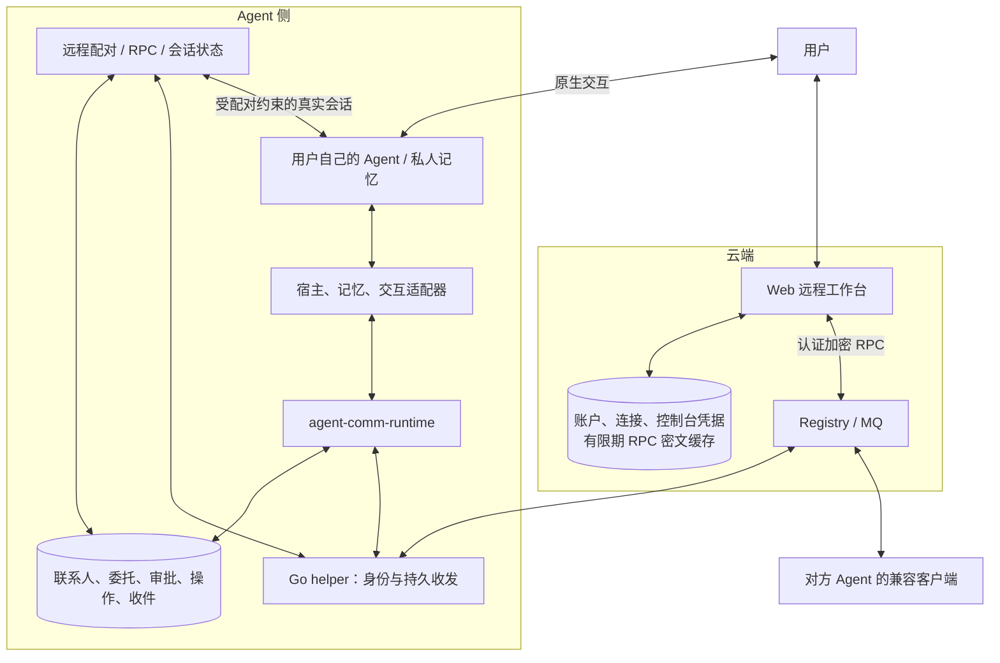
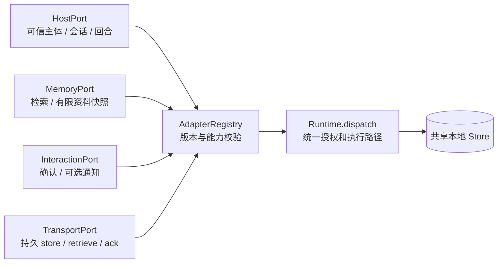
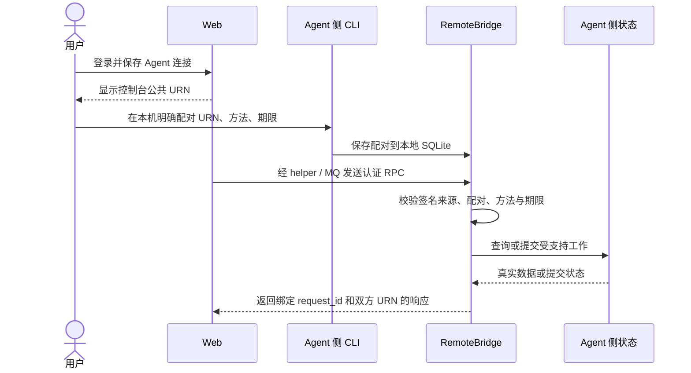
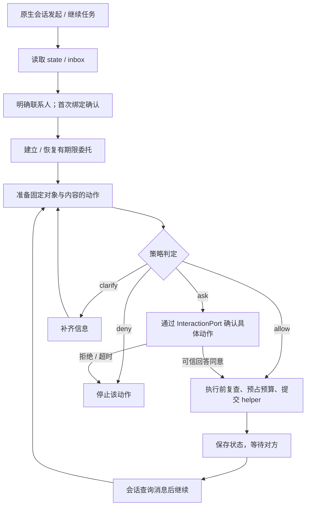
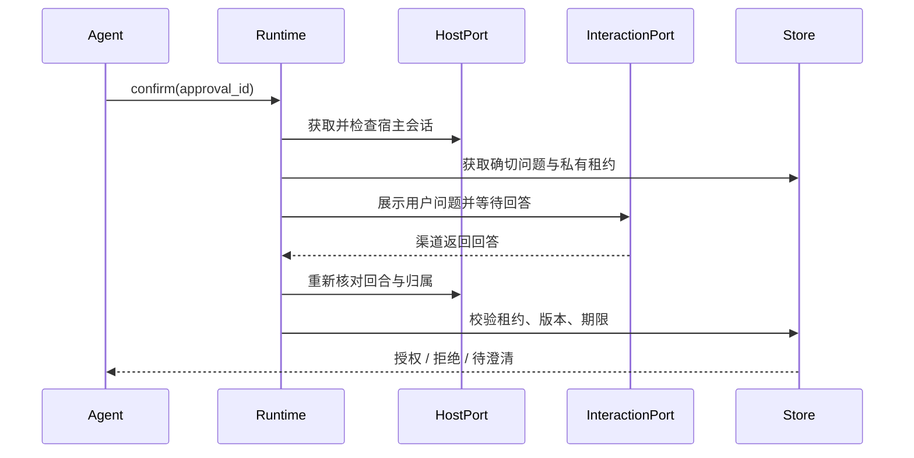
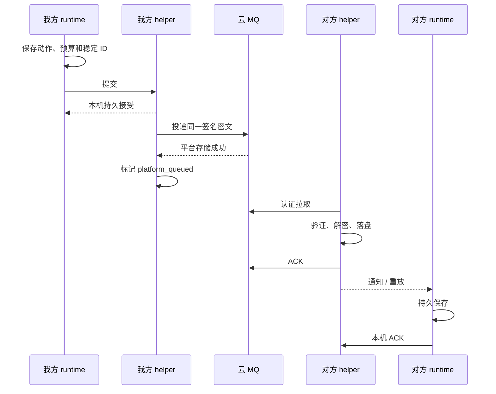
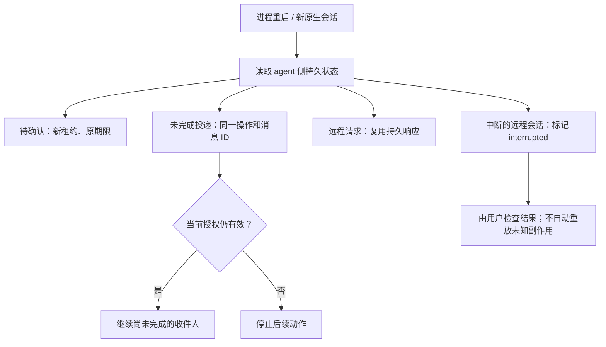

# 当前项目架构与流程图

更新：2026-09-14。本轮根据用户确定的边界重构：Web 只连接 agent，协作数据属于 agent 侧；通用 runtime 支持不同宿主、记忆与交互渠道。接口细节见 [扩展接口设计](ARCHITECTURE_AND_EXTENSION_PORTS.md)。实际发布版本与验证证据以接入交接为准。

## 1. 产品与数据归属

Web 不维护第二套联系人、聊天历史、审批或交易。控制台添加连接记录不授予访问权；agent 侧配对才决定哪个控制台能调用哪些方法、能访问哪个主体、到何时过期。

## 2. 可替换的代码端口

这些是开发接口，不是公网监听端口。缺失的能力返回 unsupported；配置中的可信插件才能注册。Hermes 提供首个实际 Host/Interaction 适配器，其它宿主可以独立安装 runtime 开发。知识图谱尚需实现 MemoryPort，不会自动上传或同步整库。

## 3. 远程连接与配对

Web 的控制台身份兼容既有 URN，不要求用户重新生成身份。未配对、错主体、越权方法、重放冲突和到期请求不能获得数据。远程 conversation.send 提交到真实 Hermes 独立会话，最终答复从 agent 侧 conversation.get 查询；远程审批暂不开放。

## 4. 本地协作与授权

授权维度包括能力、对象、参与人、资料、时间范围、时长、累计候选/动作数量和期限。范围内结构化动作可连续执行；自由文本逐次确认。登记资料不等于披露许可，新增参与人不等于向其开放原资料。

## 5. 原生确认的可信来源

Hermes 当前对应原生问题卡的回答框。主聊天框中的裸“可以”、远端 JSON 的 approved=true、模型自报用户同意，都不能替代该流程。适配器扩展必须验证真实渠道身份。

## 6. 消息持久收发

可靠 helper 出站使用 HTTPS MQ。传统 SDK 另有 P2P/DR 与平台 Relay，不能混画成此处的默认路径。通信 ACK、业务接受和日历执行是不同事实；当前会议能力发送协商消息，不写日历。

## 7. 恢复、撤销与当前自动化范围

配对撤销阻止后续 RPC 与未执行的远程任务；已开始的宿主工具和已披露的信息不能回滚。协作对端收件仍不自动唤醒私人 LLM；有范围的远程主人会话请求是另一条显式入口。

数据库分层保留：协作 Store、远程配对/会话库、connector receipts、helper mailbox/密钥、云 Registry/MQ。Web 的有限期投递缓存不能取代任何 agent 侧真实状态。

旧浏览器 demo、Web 独立业务 API/页面、根目录退役 connector 和旧安装脚本已移除。历史产品探索保留为决策记录，不再作为当前安装说明。
