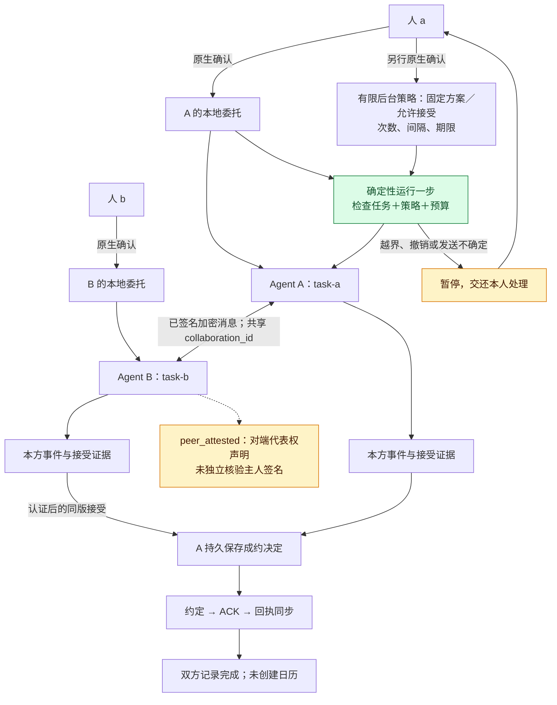
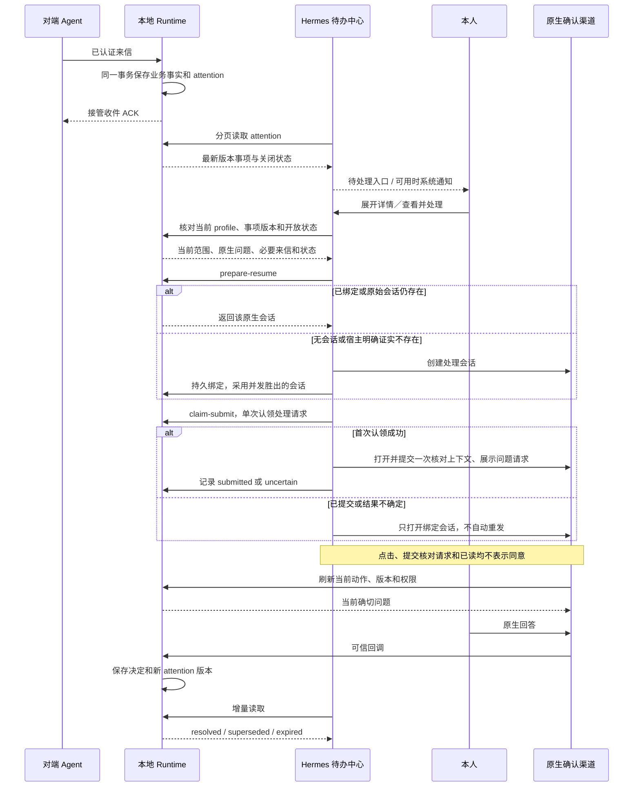
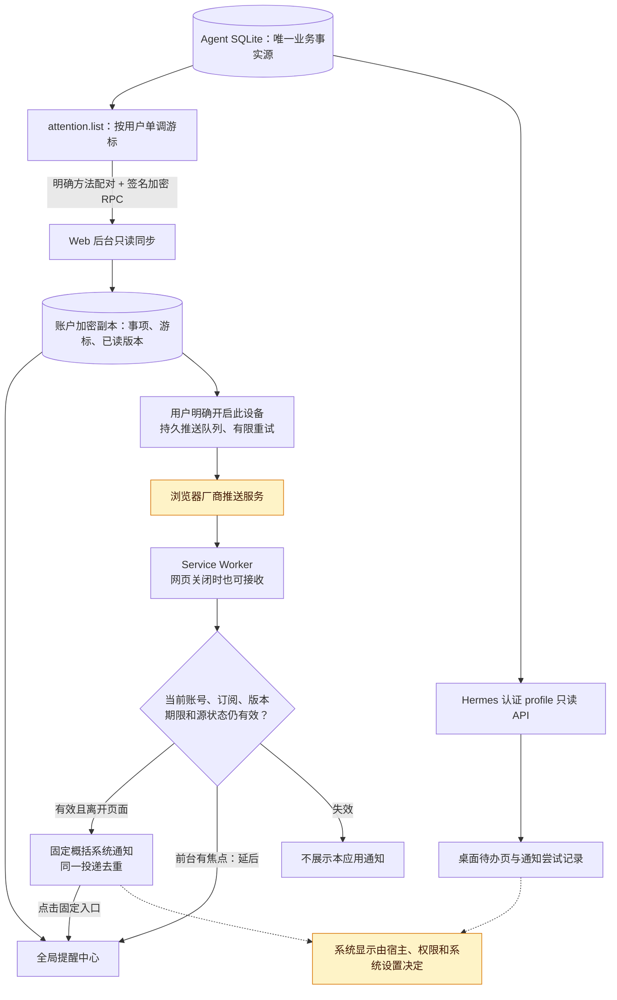

# 双边协作与用户提醒：M2 与通知闭环

日期：2026-09-15。本文描述当前源码实现；安装、部署和实机显示结果以[本轮验收记录](../verification/ATTENTION_COMPLETION_2026-09-15.md)为准。M1/N1 的历史验证保留在[首版记录](../verification/COLLABORATION_ATTENTION_2026-09-15.md)。总体方案及尚未实现的阶段见[双边协作设计](../planning/HUMAN_AGENT_COLLABORATION_V1.md)和[提醒设计](../planning/ATTENTION_AND_NOTIFICATIONS_V1.md)。

## 实现了什么

| 部分 | 当前能力 |
| --- | --- |
| 本地 runtime **0.1.2** | v2 双边协议、独立任务绑定、同版接受与约定、撤回/取消/恢复；持久 attention、本人详情、处理会话账本及有限确定性 worker |
| Hermes connector **1.5.3** | 真实原生确认及到期清卡、profile 身份隔离、后台定时推进、事项详情与处理会话 API、符合实际工具参数的交接提示 |
| Hermes companion **1.1.1** | 待办详情与当前版本刷新、恢复或新建持久处理会话、唯一会话标题、单次处理请求、未读/待处理计数、系统通知与诊断 |
| Web | 账户加密副本与提醒中心、持久已读版本、多窗口去重、失焦提醒、闭页 Web Push、订阅撤销及系统通知测试 |

当前业务完成标准仍是 **`agreement_only_complete`：双方确认并同步线上会议约定**。它不表示已创建日历、完成支付或履行其他交付。双方明确加入协作后，可以手动推进，也可另行原生确认一个有限后台策略。M2 已实现确定性推进，不包含开放式模型谈判、授权学习、再委托或平台声誉评分。普通消息接收、提醒和有限 worker 都不需要唤醒私人模型。

## 1. 两份委托，一份双方可核对的约定

图中绿色强调本轮实现的后台步骤，黄色标记需要本人介入、独立证据不足或由外部环境决定的边界。

`prepare_collaboration` 编译确切动作，`confirm` 只消费宿主原生回调，`dispatch` 使用稳定 operation/event/message ID。对端声明不能直接成为本方权限；本地联系人别名、主人会话和 task_id 不随共享条款披露。

v1/v2 业务动作共用原任务次数预算。提出方案与接受方案分别检查权限，旧版本待确认动作在条款更新后失效。双方接受都绑定同一条款摘要；A 的成约事务裁定先处理接受还是撤回，B 校验独立收到或本地发送过的证据。对方权限仍标注为 `peer_attested`，含义是对端作出代表权声明，未独立验证其主人的签名。网络签名证明 agent 端点来源；联系人绑定、平台通信白名单和远端方法配对分别解决身份映射、允许通信和接口访问，都不能直接推导本次承诺的主人授权。

原委托撤销会停止新的业务动作，已经成立的约定需要明确取消。邀请/加入时另行展示有限维护许可，最多 32 条固定协议消息、最多 7 天，用于回执和对账；可通过 `revoke_collaboration_maintenance` 单独撤销。原业务委托失效后，撤回/取消仍须重新展示一次性确切原生确认；不能借此恢复原委托。

消息归一化、业务事件和 attention 在同一本地事务内提交后，才 ACK helper 收件。协议维护项由确定性代码生成并持久保存，可由原生处理流程或已启用的有限 worker 发送；都须核对维护许可。发送结果不确定时保留原 ID 和已预占预算，避免重新创建业务操作。

仍有一项保守恢复边界：helper 已接收消息、本地结果事务提交前发生硬崩溃，而且恢复时原权限已经失效。此时保留未确定状态并生成恢复待办，不自动查询 helper 并重建业务结果，也不继续重发或宣称成功。有限维护许可耗尽、到期或被撤销后停止维护发送，不自动续权。

### 有限后台策略的实际范围

`prepare_worker_policy` 为一个已生效任务、一个双方已加入的协作准备确切原生问题，真实 `confirm` 回调后才启用。提议与接受分开选择：`allow_propose` 仅允许发起方发送原生问题里展示的固定第一版方案；`allow_accept` 明确允许接受符合原任务范围的任一当前结构化方案，不能从普通排会授权自动推导。

策略规定 `max_runs`（1–100）、`max_sends`（1–32）、`interval_seconds`（15–3600）和不晚于原任务的到期时间。Gateway 每轮最多推进一个任务步骤；等待也消耗运行次数，固定协议回执也消耗发送次数，业务动作仍计入原任务预算。发送先持久预占预算并绑定 policy/task revision，实际 helper 调用前再检查暂停、撤销、期限和当前权限。

worker 没有私人模型、记忆接口、原生确认回调或通用工具权限，不自动邀请/加入新协作、不发任意文本、不自行取消约定。越界产生具体原生审批待办并暂停；未知发送结果保留原操作并暂停，不自动重发。`pause_worker` / `revoke_worker` 停止后台推进；重新启用或修改策略需要新的原生确认。本人详情可查看策略、使用量、状态和等待原因。

## 2. 提醒与授权分别闭环

提醒分为新协作邀请、需要本方回应、需要本人授权、需要恢复、普通来信及完成信息。未读由“当前版本是否看过”决定；待处理由当前业务类型及是否仍 open 决定。因此已读但尚未处理的授权请求仍保留待处理计数。

系统通知只使用固定摘要；原文、私人资料和确认 token 不放进通知。Hermes 本人详情显示委托范围、确切问题、当前动作、协作条款、必要的对端原文和 worker 预算。详情 API 核验 dashboard token 与当前 profile，客户端不能选择 owner；远端 `attention.list` 仍是安全摘要接口，完整本机详情不会进入系统通知。

同一 task 的后续事项共用处理会话，联系人审批和无 task 来信也有独立映射。宿主网络错误不会被当成会话不存在。创建、绑定和提交分别记账；每个持久恢复请求最多自动调用一次 `prompt.submit`，不宣称模型必然收到或执行一次。超时、崩溃和未知结果只重新打开绑定会话，等待核对，不自动补发。只有当前事项版本变化或宿主确认绑定会话已不存在后建立替代映射，才产生新的恢复请求。

展开详情会刷新当前版本，prepare/claim 再核对事项仍开放且版本一致。版本改变、过期或撤销要求先刷新；恢复请求账本与原生确认 lease 分开。恢复请求只要求核对上下文并展示当前问题，不调用业务 dispatch；实际同意仍来自当前原生确认的可信回答。

## 3. 持久性和多端同步

每个 attention_id 对应一项稳定事实，变化才增加 revision。接口返回各事项的最新版本，因此 revision 可以跳号；客户端按 cursor 继续分页并保留终态。没有出现在一页中的事项不会因此被当成已解决。业务投影与 feed 都不接受对端自报的 owner、approval 或通知内容。

Web 从认证响应生成加密副本，并原子保存事项和游标。闭页推送使用加密持久化的 VAPID 与设备订阅，载荷只有随机投递 ID、订阅绑定及期限；worker 展示前通过当前登录会话重新核验，标题和正文始终为固定概括。页面可见但失去焦点属于离开状态，有焦点时普通系统提醒延后。页面和 Push 共用设备认领；重复投递补回已存回执，关闭或切换账号会串行完成在途显示清理。

订阅最长 30 天、每账号最多 8 个活动设备，关闭提醒和退出登录会清除本机绑定并撤销订阅。每项最多 5 次发送尝试、最长 15 分钟；源端超过 2 分钟未重新核验时不展示旧状态。已读、过期或更新后的事项不会继续用旧版本展示。测试入口每设备每分钟最多一次，不创建协作、不批准授权；诊断区分排队、厂商接收、浏览器接收与浏览器接受显示请求，最后一种仍不证明本人看到了横幅。

### 平台边界

- Web Push 需要 HTTPS、常驻 Node 进程与 SQLite、厂商推送服务出站连接、通知权限及有效登录。关闭网页后仍依赖浏览器支持后台接收，不能保证已退出的浏览器被系统唤醒。
- 页面完全关闭时，已经显示的概括通知不能保证在源端终结后立即从系统通知栏撤回；再次打开会核验状态，点击始终进入当前提醒中心。
- 去重保证本应用不会对同一投递重复请求显示；浏览器可能因其可见通知要求补充自带概括提示。Hermes 也依赖桌面与后端运行、宿主权限及系统勿扰设置；最终横幅需要实机验证。

部署条件、厂商允许列表、诊断与回滚方式见 [Web Push 运维说明](../../agent-collaboration-web/docs/operations/WEB_PUSH.md)。源码与隔离测试不能代替[本轮安装及实机验收](../verification/ATTENTION_COMPLETION_2026-09-15.md)。

旧配对不会自动扩大为 `attention.list`。用户需在本机明确更新方法配对，Web 才能使用完整 feed；已有只读状态同步可提供保守的待确认/来信显示。Web 当前仍不提供远程批准按钮。

## 源码与启用

- [Runtime 合约与调用示例](../../agent-comm-platform/agent-comm/python/README.md)
- [协议实现](../../agent-comm-platform/agent-comm/python/agent_comm_runtime/collaboration_v2.py)
- [持久 attention 实现](../../agent-comm-platform/agent-comm/python/agent_comm_runtime/attention.py)
- [有限后台 worker](../../agent-comm-platform/agent-comm/python/agent_comm_runtime/worker.py)
- [本人详情与原生处理会话账本](../../agent-comm-platform/agent-comm/python/agent_comm_runtime/attention_resume.py)
- [Hermes companion 安装与启用](../../agent-comm-platform/agent-comm/connectors/hermes-platform/README.md)
- [早期接入脚本](../../tools/release/early_access/README.md)

升级保留 helper 身份、mailbox、现有 collaboration/remote 数据库、Web 账户副本及原密钥。实际更新的环境、版本和回滚证据只记入验收与发布记录。
