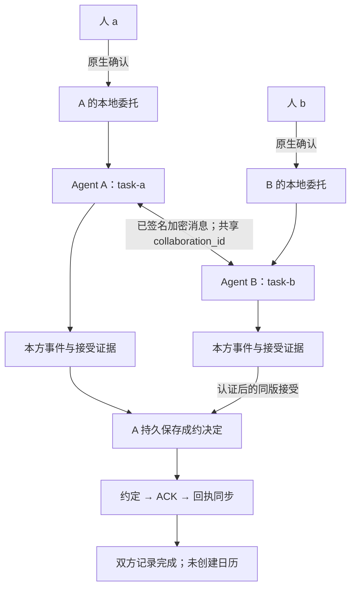
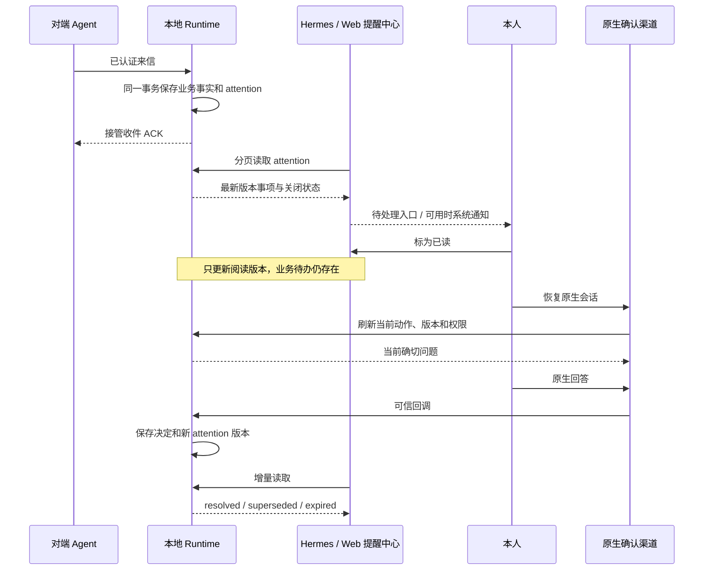
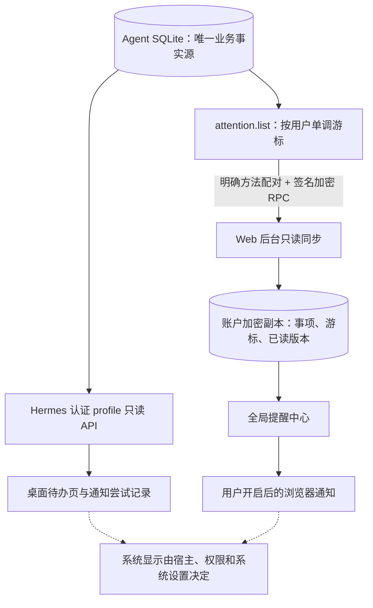

# 双边协作与用户提醒：首版实现

日期：2026-09-15。本文描述本地源码的 M1/N1 实现；部署状态与验收范围见[验证记录](../verification/COLLABORATION_ATTENTION_2026-09-15.md)。总体方案及后续阶段保留在[双边协作设计](../planning/HUMAN_AGENT_COLLABORATION_V1.md)和[提醒设计](../planning/ATTENTION_AND_NOTIFICATIONS_V1.md)。

## 实现了什么

| 部分 | 当前能力 |
| --- | --- |
| 本地 runtime 0.1.1 | v2 邀请/加入、双方独立任务绑定、连续版本方案、同版接受、约定与 ACK/回执、撤回、取消及同步恢复；持久 attention feed |
| Hermes connector 1.4.0 | 复用原生确认；附带桌面 companion 提醒页、未读/待处理计数、宿主与系统通知、恢复原生会话入口 |
| Web | 全局提醒中心、账户内持久已读版本、独立待处理计数、提醒源游标分页、浏览器系统通知与多窗口去重、双边状态展示 |

第一阶段只协调线上会议方案。它不写日历；`agreement_only_complete` 表示双方确认并同步约定。正常协商通过用户恢复宿主会话逐段推进，尚未引入受限后台协商 worker。普通消息的持久接收与提醒不需要唤醒私人模型。

## 1. 两份委托，一份双方可核对的约定

`prepare_collaboration` 编译确切动作，`confirm` 只消费宿主原生回调，`dispatch` 使用稳定 operation/event/message ID。对端声明不能直接成为本方权限；本地联系人别名、主人会话和 task_id 不随共享条款披露。

v1/v2 业务动作共用原任务次数预算。提出方案与接受方案分别检查权限，旧版本待确认动作在条款更新后失效。双方接受都绑定同一条款摘要；A 的成约事务裁定先处理接受还是撤回，B 校验独立收到或本地发送过的证据。对方权限仍标注为 `peer_attested`，含义是对端作出代表权声明，未独立验证其主人的签名。

原委托撤销会停止新的业务动作，已经成立的约定需要明确取消。邀请/加入时另行展示有限维护许可，最多 32 条固定协议消息、最多 7 天，用于回执和对账；可通过 `revoke_collaboration_maintenance` 单独撤销。原业务委托失效后，撤回/取消仍须重新展示一次性确切原生确认；不能借此恢复原委托。

消息归一化、业务事件和 attention 在同一本地事务内提交后，才 ACK helper 收件。协议维护项由确定性代码生成并持久保存；宿主恢复时发送这些已获有限许可的操作。发送结果不确定时保留原 ID 和已预占预算，避免重新创建业务操作。

仍有一项保守恢复边界：helper 已接收消息、本地结果事务提交前发生硬崩溃，而且恢复时原权限已经失效。此时保留未确定状态并生成恢复待办，不自动查询 helper 并重建业务结果，也不继续重发或宣称成功。有限维护许可耗尽、到期或被撤销后停止维护发送，不自动续权。

## 2. 提醒与授权分别闭环

提醒分为新协作邀请、需要本方回应、需要本人授权、需要恢复、普通来信及完成信息。未读由“当前版本是否看过”决定；待处理由当前业务类型及是否仍 open 决定。因此已读但尚未处理的授权请求仍保留待处理计数。

系统通知只使用固定摘要；原文、私人资料和确认 token 不放进通知。Hermes 点击先重新同步，再提供准确事项的恢复指令及原生会话入口。打开会话、复制指令和阅读通知都不产生同意。

## 3. 持久性和多端同步

每个 attention_id 对应一项稳定事实，变化才增加 revision。接口返回各事项的最新版本，因此 revision 可以跳号；客户端按 cursor 继续分页并保留终态。没有出现在一页中的事项不会因此被当成已解决。业务投影与 feed 都不接受对端自报的 owner、approval 或通知内容。

Web 从认证响应生成加密副本，并原子保存事项和游标；只有页面仍运行时才能请求浏览器系统通知，关闭页面后的 Web Push 属于后续阶段。Hermes 桌面插件依赖桌面与后端运行及宿主通知设置。通知发送尝试不等于系统显示或本人已读，持久提醒中心提供恢复入口。

旧配对不会自动扩大为 `attention.list`。用户需在本机明确更新方法配对，Web 才能使用完整 feed；已有只读状态同步可提供保守的待确认/来信显示。Web 当前仍不提供远程批准按钮。

## 源码与启用

- [Runtime 合约与调用示例](../../agent-comm-platform/agent-comm/python/README.md)
- [协议实现](../../agent-comm-platform/agent-comm/python/agent_comm_runtime/collaboration_v2.py)
- [持久 attention 实现](../../agent-comm-platform/agent-comm/python/agent_comm_runtime/attention.py)
- [Hermes companion 安装与启用](../../agent-comm-platform/agent-comm/connectors/hermes-platform/README.md)
- [早期接入脚本](../../tools/release/early_access/README.md)

升级保留 helper 身份、mailbox、现有 collaboration/remote 数据库及 Web 账户副本。此次源码实现不自动更新用户的 Hermes profile、线上 Web 或公共下载包。
