# 项目技术实现：从网页请求到 Agent 执行

源码核对日期：2026-09-15。本文讲解依据并行整理前锁定的部署配置和源码版本（见下表）；文中的“当前实现”均指这一核对基准。此次整合保留这份技术快照及其固定提交源码链接，并将本地文档和脚本链接适配到重组后的目录。图中的处理步骤适度合并，状态名称、数据归属和关键提交顺序对应该版本代码。

结构重组后的入口：[文档导航](../README.md)、[当前架构](OVERVIEW.md)、[流程图](FLOWS.md)、[部署指南](../operations/DEPLOYMENT.md)；发布和上线证据见 [发布索引](../releases/README.md) 与 [验证索引](../verification/README.md)。本文不作为此次整合后的生产验证记录。

## 阅读地图与版本

**整个系统的核心是：Agent 本机保存协作事实和授权，云端提供通信与远程工作台，Web 保存获准读取结果的账户副本。**

| 想了解什么 | 章节 |
| --- | --- |
| 仓库怎样分工、服务怎样部署 | 1、2 |
| 身份、配对和加密如何实现 | 3、4 |
| 网页发一句话到底经过什么 | 5、6 |
| 对外协作如何授权，确认为什么可信 | 7、8 |
| 断网后怎样避免丢消息和重复执行 | 9、10 |
| 数据落在哪里，怎样扩展宿主 | 11、12 |
| 安装、发布和目前的能力边界 | 13、14 |

原技术梳理任务的部署工作树子模块目录为空，因此核对使用同一电脑已有的干净源码检出；其 HEAD 与下列整合前 gitlink 完全一致。这里保留当时的核对基准，结构整合后的版本以仓库现有 gitlink 和对应发布记录为准。

| 仓库 | 整合前核对提交 |
| --- | --- |
| agent-collaboration-deploy | `e386928`（并行整理前） |
| agent-collaboration-web | `21608208a521ce08ede54a18091773592870c45d` |
| agent-comm-platform | `aced788f768f372269d482aa0314c8c54618f0f3` |
| agent-comm（platform 内嵌子模块） | `a2d06d0eb5c8a283328986ff7ae60ec13e125891` |

文末源码链接固定到以上提交。Apple 客户端不在这棵子模块树中；本文只说明本仓库可验证的客户端合约，不展开其内部实现。

## 1. 仓库与代码职责

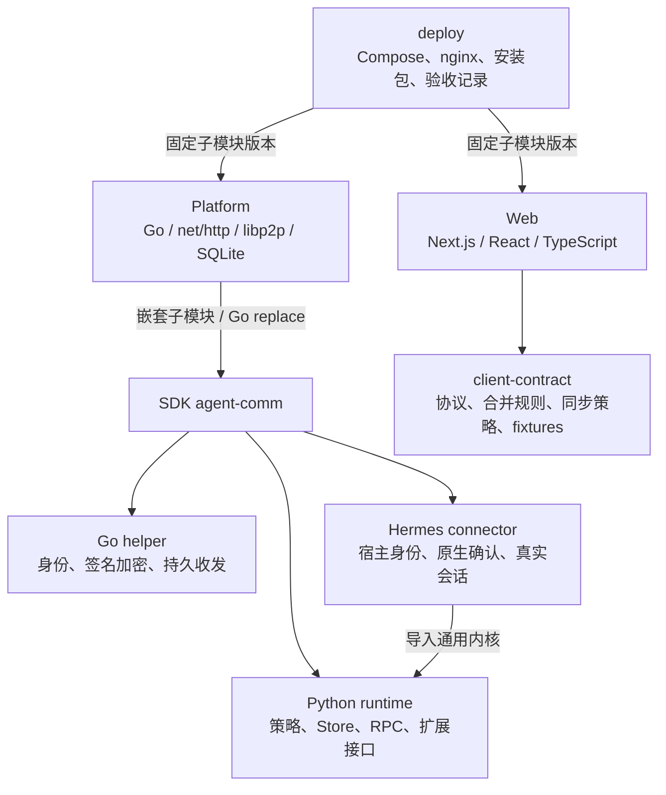

- **Web**：Next.js 14、React 18、TypeScript；NextAuth Credentials + JWT 会话；bcrypt 验证密码；Prisma 和参数化 SQL 访问 SQLite。依赖版本来自项目清单，不表示实际安装精确到某个补丁版本。
- **Platform**：`cmd/platform/main.go` 组装 Registry、MQ、Circuit Relay v2、HTTP API 和管理审计。它不运行用户的 Hermes 模型。
- **helper**：本机 Go 常驻进程。把 Python 的明文 IPC 请求转换为签名密文，并负责持久队列和网络重试。
- **runtime**：独立 Python 包，拥有联系人、委托、审批、操作与远程请求状态。Hermes 中旧的 policy/store/transport 导入层只是兼容导出。
- **client-contract**：独立 npm workspace，把协议关联校验、稳定请求 ID、合并与只读同步策略集中起来；不依赖 React、Next.js 或 Prisma。

源码：[Web 清单][w-package]、[认证][w-auth]、[Platform 启动][p-main]、[runtime 入口][s-runtime]、[客户端合约][w-contract]。

## 2. 真实部署拓扑与 HTTP 路由

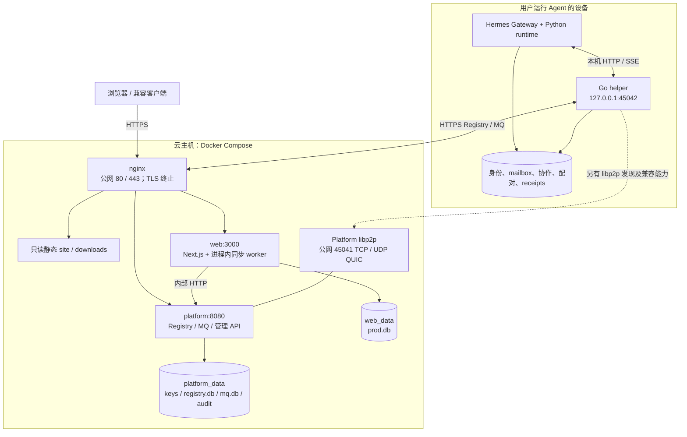

| nginx 请求匹配 | 实际落点 |
| --- | --- |
| HTTP `/.well-known/acme-challenge/` | Certbot 验证文件；其余 HTTP 301 到 HTTPS |
| HTTPS 精确 `/` | `/srv/site/index.html`，静态官网 |
| `/downloads/` | 只读安装包与文档，禁目录浏览 |
| 精确 `/healthz`、前缀 `/api/v1/`、`/admin`、`/docs` | Platform |
| 其余，包括 `/dashboard`、`/api/auth/*`、`/api/workspace*` | Next.js |

三个容器共用 `agent-net` bridge。3000 和 8080 没有宿主机公网端口映射；TLS 在 nginx 终止。同步 worker 在 Web Node 进程里，没有独立 worker 容器或 Redis。Compose 是单机部署，只有依赖顺序与重启策略，未配置健康探针或多副本自动切换。

**45042 是本机 IPC，45041 是平台 libp2p。** helper 的可靠出站在本部署使用 HTTPS MQ；不能因为项目含 libp2p 和 Double Ratchet 代码，就把当前所有消息画成直连或棘轮加密。

依据：[Compose](../../docker-compose.yml)、[nginx](../../deploy/nginx/nginx.conf)、[平台配置](../../deploy/platform/config.yaml)、[helper 启动及本机访问检查][s-daemon]。

## 3. 四种身份与授权不要混为一谈

| 概念 | 用途 | 由哪里决定 |
| --- | --- | --- |
| Web `User.id` | 登录与账户数据隔离 | Web 登录系统 |
| console URN | 发起远程控制 RPC 的密码学身份 | Web 服务端保存的控制台密钥 |
| agent URN | 通信路由与签名身份 | helper 的 Ed25519 密钥 |
| owner principal | 私人协作事实归属、真实宿主主体 | 本机 HostPort / Hermes profile |

URN 的指纹实现是 `base58(SHA256(Ed25519 公钥) 的前 16 字节)`。Registry 还保存 PeerID、X25519 公钥、签名和期限；客户端校验 URN、公钥、PeerID 以及登记正文签名的关联。

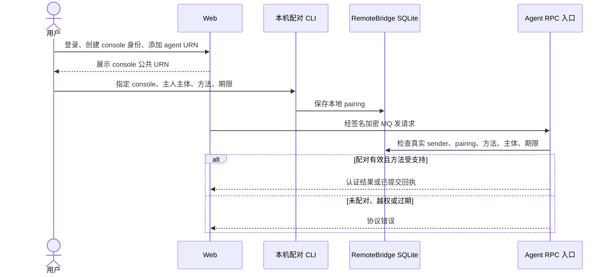

`Agent` 表记录“这个账户保存的连接”，并不是所有权证书。`allow_from` 是 connector 收件准入，pairing 是远程 RPC 方法授权，mandate 是对外协作范围授权，三者解决不同问题。

源码：[URN 校验][s-envelope]、[指纹][s-keys]、[Registry 登记][p-registry]、[配对与授权][s-remote]。

## 4. 消息怎样签名和加密，谁能看到明文

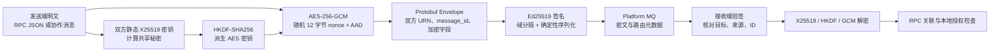

实际链路调用 `EncryptWithSharedSecret`。信封中的 `ephemeral` 字段是共享秘密的确定性 HKDF 输出，**不是每条消息新生成的临时 X25519 密钥对**；同一静态密钥对下，随机 nonce 提供消息级随机性。这条路径不应被描述为具备 Double Ratchet 或前向保密。

身份签名覆盖路由与加密字段；HTTP 存储请求另有签名认证。Registry 登记同时验证 HTTP 正文签名和登记信息自身的签名，避免仅凭声明的 URN 信任公钥。

远程工作台场景的加密端点是 **Web Node 服务与 Agent**。Web 持有控制台私钥并解密获准响应，浏览器通过登录 API 读取数据。Web 落库再用 AES-GCM 加密 payload，AAD 绑定 `userId、agentId、kind、id`。因此：Platform MQ 不需要读取 RPC 明文，Web 服务会处理明文；静态加密保护不能被说成“云端所有服务都不可读”。

源码：[消息信封构建][s-session]、[信封签名][s-envelope]、[Go 加密][s-ecies]、[Web 传输][w-transport]、[Web 加密][w-ecies]、[账户存储][w-store]。

## 5. 网页发送一句话的完整链路

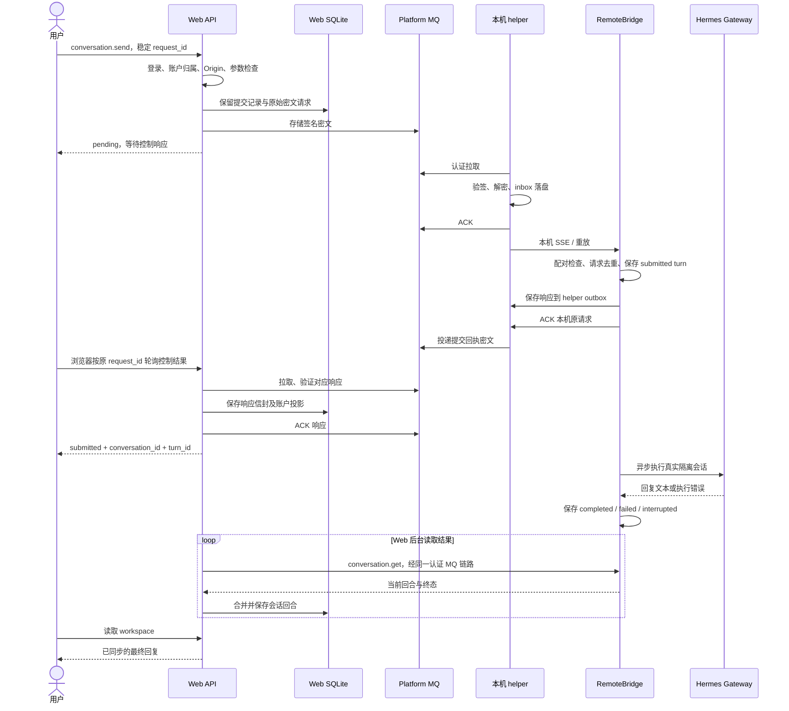

图中提交回执与 Hermes 执行可以交错发生；它们是不同的异步步骤。`conversation.send` 不等待模型最终回复。协议 `agent-comm-control/v1` 绑定 `request_id、agent_urn、console_urn、method、deadline`，请求参数纳入内容指纹；响应须经过身份和关联验证。

| 状态出现在哪里 | 真正含义 |
| --- | --- |
| helper `accepted` | 本机 outbox 已持久接受 |
| helper `platform_queued` | Platform 已接受密文 |
| Web 控制请求 `complete` | 已取得 RPC 响应；仍须检查 `response.error` |
| 会话 `submitted` | Agent 已持久登记模型回合 |
| 会话 `completed` | 模型回合已结束，有最终输出；内容正确性和外部效果仍要看实际证据 |

源码：[Web 控制服务][w-control]、[RPC/会话内核][s-remote]、[Hermes 执行适配][s-hermes]。

## 6. 远程会话状态机与幂等

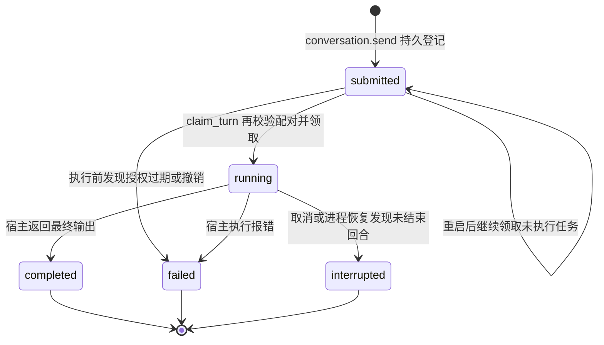

去重分多层实现，不能仅靠一个十分钟缓存：

1. Web 进程内合并同一请求的并发调用；数据库用 request ID 和内容指纹校验重试。
2. Web 在投递前保存 `WorkspaceSubmission`，保留结果不确定时的原始请求；已知提交的持久记录阻止缓存过期后把旧发送当成新动作。
3. helper 对相同 `message_id` 校验原始请求一致，并保存唯一的签名密文；重试复用该密文。
4. RemoteBridge 在事务里用 console + request ID 与指纹保存请求结果；重复的同内容请求返回原回执，内容冲突拒绝。
5. `running` 重启后标记 `interrupted`，因为进程无法证明中断前工具是否已经产生副作用。该回合不自动重跑。

新对话默认用 `request_id` 作为 conversation ID；turn ID 为 `turn-` 加 `SHA256(consoleURN + "\0" + request_id)` 的前 40 个十六进制字符。发送结果不明时，恢复流程可只读原会话并查找这个确定的 turn，不自动重发文字。

已有验收记录验证：相同 ID 同内容返回同一个 turn；不同内容 HTTP 409；已保存提交在十分钟缓存过期后重投返回 HTTP 410，引导查看原会话。**缓存有效期不等于业务去重期限。**

源码：[Web 控制服务][w-control]、[提交台账][w-store]、[RemoteBridge][s-remote]、[9/15 验收](../verification/HERMES_COOPERATION_TEST_2026-09-15.md)。

## 7. 本地协作：如何把一句意图变成受控动作

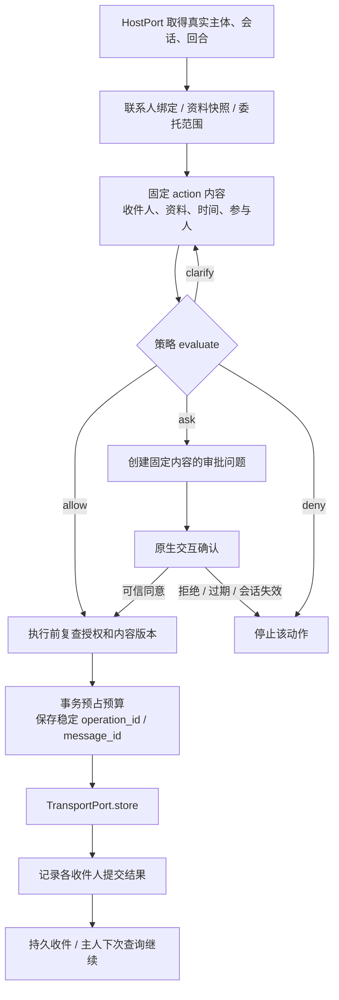

委托（mandate）把权限限定为：能力、联系人、参与人、资源快照、主题、时间范围、时长、候选数量、累计动作预算、截止时间。首次联系人绑定、建立委托需要确认；注册资料仅保存快照，不自动授权披露。

当前对外动作是 `share_slots、share_resource、propose_meeting、accept_meeting、send_text`。范围内的结构化动作可继续推进，`send_text` 逐次确认确切全文。单次例外只批准一个固定动作，不扩大整个委托。

`Store.dispatch` 重查当前权限、收件人绑定和资料版本，在事务内预占预算，再逐个提交 helper。故障恢复沿用原操作和各收件人的稳定消息 ID；授权撤销阻止后续提交，已被 helper 接受的消息无法召回。

源码：[Runtime.dispatch][s-runtime]、[策略][s-policy]、[Store.dispatch][s-store]。

## 8. 原生确认为什么不接受模型自报“用户同意”

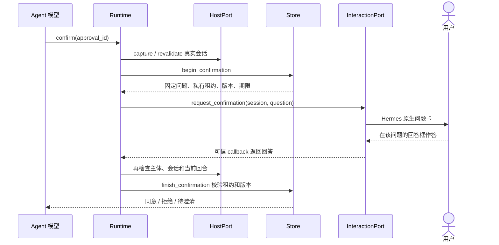

模型只能给出 `approval_id`，不能替自己提交私有租约或 `approved=true`。Hermes 适配器使用真实宿主上下文和对应回合的确认 callback；切换回合、失效的 callback、过期问题不能沿用授权。

普通聊天输入框的“可以”可能已开启新回合，不能批准旧问题。远程 `approval.respond` 当前不支持；远程对话权限也不等于原生确认权。这是组件的授权边界，宿主本身若另外授予任意文件和工具访问，仍需由宿主约束。

源码：[Runtime 确认调用][s-runtime]、[Store 确认与租约][s-store]、[Hermes 适配代码][s-hermes-adapters]。

## 9. 消息可靠性：为什么需要两次 ACK

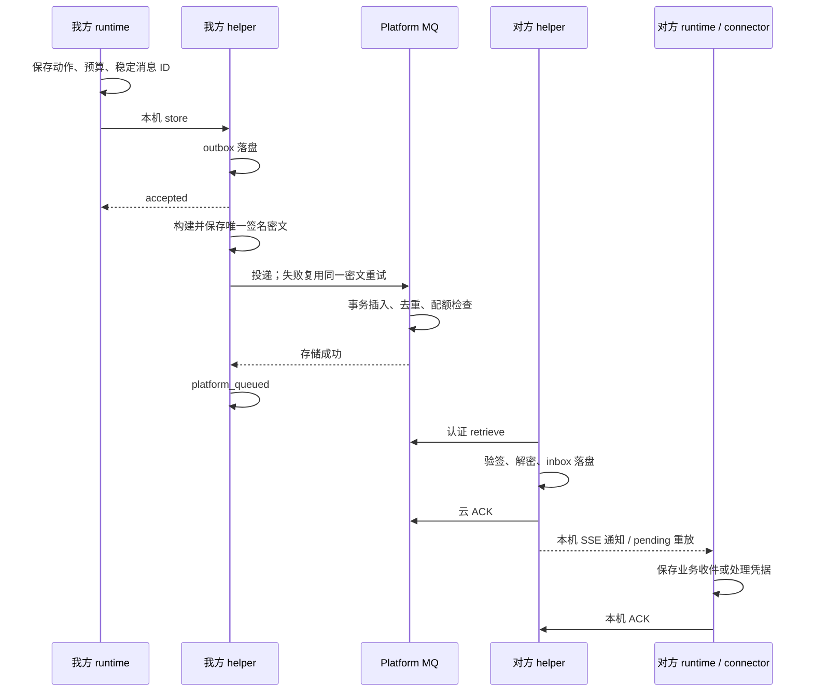

- **云 ACK**：确认对方 helper 已持久接管，connector 此时可以不在线。
- **本机 ACK**：确认 runtime/connector 已接管业务处理；断开 SSE 不会等价于消费消息。
- helper `mailbox.db` 使用 WAL、`synchronous=FULL`，outbox 保存请求、密文、状态、次数与下次重试时间。消息冲突不覆盖旧内容。
- 当前 helper 启动后立即拉取云 MQ，此后约每 5 秒轮询；本机通过 SSE 通知并重放未 ACK 消息。平台虽然也有 SSE 接口，不能据此推断这条 helper 云端链路使用 SSE。
- MQ ACK 更新 `read_at`，并非立即物理删除。默认消息 TTL 为 7 天、每 URN 最多 500 条待投递消息；已读历史另受 30 天清理期限约束，但消息 TTL 会先清除到期记录，因此不保证 ACK 后仍保留 30 天。队列满拒绝新投递，让发送端保留 outbox 重试。

这是“允许至少一次投递 + 各层稳定 ID 去重”的机制，不是跨 Web、MQ、helper、模型工具的一笔分布式事务，也不是所有外部副作用的 exactly-once 保证。

源码：[helper mailbox][s-mailbox]、[出站与 IPC][s-daemon]、[持久收件回调][s-durable]、[可靠投递][s-reliable]、[MQ Store][p-mq]。

## 10. Web 后台同步与失去租约的 worker

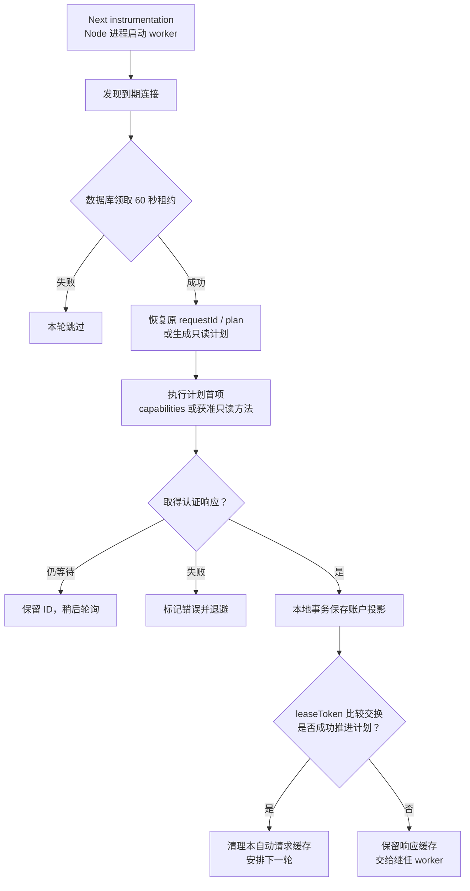

worker 常驻在 Web Node 进程内，无需用户打开网页。进程内 singleton 避免重复启动，SQLite 租约协调不同进程；**租约 token 就像本轮工作的领用凭据，继任者取得新 token 后，旧 worker 不能清理继任者所需的响应缓存。**

先同步 capabilities，认证并持久保存能力响应后才生成后续读取计划；按授权优先读 `collaboration.state` 并派生联系人、事项和 inbox，无法使用聚合读取时改用获准独立方法。会话追踪当前会话、未决发送所属会话及含待完成回合的已知会话，单次计划最多包含 5 个会话。

| 常量或限制 | 当前实现 |
| --- | --- |
| worker tick | 2 秒 |
| 一次 tick 取到期连接 | 最多 4 个，最多 2 个并发同步任务 |
| 单连接租约 | 60 秒 |
| 普通同步间隔 | 30 秒 |
| 有待完成回合或未决发送 | 5 秒周期 |
| capabilities 定期刷新 | 2 分钟 |
| 同步失败退避上限 | 5 分钟 |
| 单个 RPC 请求 deadline | 120 秒 |
| 控制信封缓存有效期 | 10 分钟 |
| 本地投影 SQLite busy 重试 | 最多 4 次尝试，间隔 40 / 120 / 300 ms |

最后一项只重试已回滚的**本地投影事务**，不包住网络投递或 ACK；仅匹配明确 `SQLITE_BUSY` 或 `P2010/meta.code=5`。泛化数据库超时 `P1008` 不在重试范围内。

已收到响应但落库失败时，恢复按响应缓存有效期继续保存；仅等待网络响应时才以原请求 deadline 为界。自动任务只调用读取白名单，不调用 `conversation.send`，也不自动重放结果不确定的发送。

源码：[同步 worker][w-sync]、[数据库租约与事务][w-store]、[同步策略和常量][w-contract]。

## 11. 数据模型与数据归属

下面是 Web **实际表关系的简化 ER 图**；字段只列关键部分。

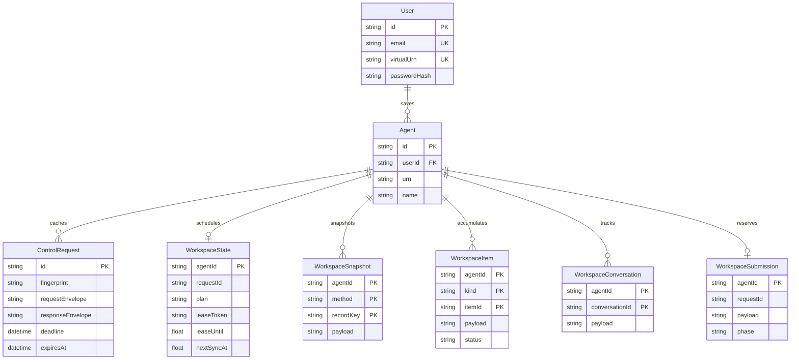

`Agent` 还有 `(userId, urn)` 联合唯一约束。同一个 agent URN 可以由不同账户各自保存连接。关系采用级联删除；删除某账户的连接不会删除 Agent 本机事实。

| 存储层 | 保存什么 | 更新语义 |
| --- | --- | --- |
| Web `ControlRequest` | 原始签名请求/响应信封 | 有限期投递缓存；过期不删除同步历史 |
| Web `WorkspaceSnapshot` | capabilities、联系人完整视图、协作状态等 | 依据原请求 `createdAt` 更新视图，同时间以 requestId 排序 |
| Web `WorkspaceItem` | inbox 消息、会话回合、已知提交记录等 | 以稳定 ID 累积/更新，窗口缺项不删除旧消息 |
| Web `WorkspaceConversation/State/Submission` | 已知及当前会话、同步计划、未决发送 | 刷新或换设备恢复 |
| Python 协作库 | 联系人、资源、任务委托、方案、审批、操作、预算、收件、审计 | `collaboration_records(kind,id,body)` JSON 记录；本地事务维护 |
| Python 远程库 | pairing、请求回执、turn 及其中的会话信息、收件游标 | `remote_records(kind,id,body)` JSON 记录 |
| connector receipts | 消费处理与回复去重凭据 | 跨重启恢复，避免重复消费 |
| helper `mailbox.db` | 明文本机请求/收件、签名出站密文 | `helper_inbox` / `helper_outbox` |
| Platform `registry.db` / `mq.db` | 登记与签名公钥、密文与路由/已读元数据 | TTL、配额、认证拉取与 ACK |

Python 业务对象不是一组对应名称的关系表，不能把逻辑对象关系误画成实际外键结构。其 Store 使用 `BEGIN IMMEDIATE`、WAL 和 FULL 同步维护同库原子性。

Web 副本持久保留已观察到的内容，但 SDK 无 `conversation.list`，`conversation.get` / `inbox.list` 只提供最近 100 项、无远端历史分页。Web 的本地分页只能翻已保存记录，无法补出从未同步的远端历史。

离线时展示的是最后同步内容；配对撤销阻止后续访问，不能召回已经同步的副本。备份恢复需同时保留 Web 加密所依赖的 secret 和各本机身份/数据库。

源码：[Prisma schema][w-schema]、[账户投影][w-store]、[协作 Store][s-store]、[RemoteBridge][s-remote]。

## 12. 扩展到其他 Agent 宿主的代码接口

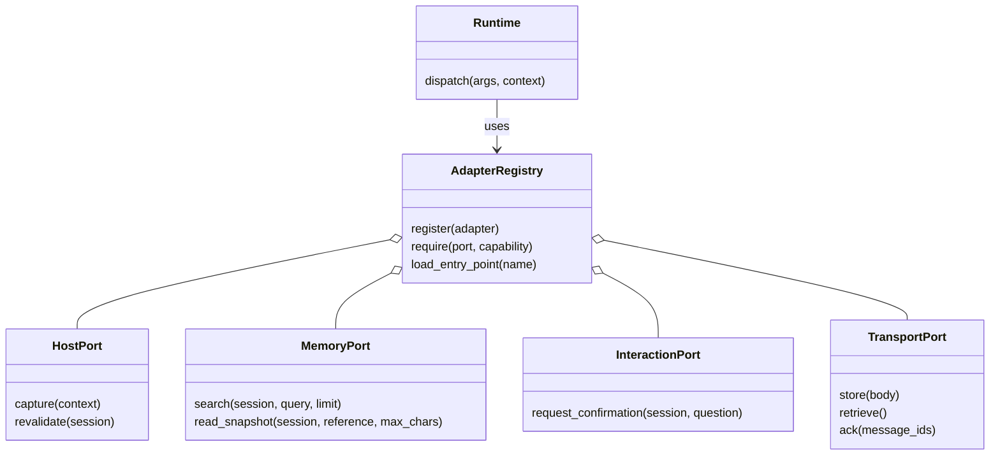

这是代码依赖图，四类 Port 是 Python Protocol，不是公网监听端口。适配器声明 `Descriptor(name, port, capabilities, api_version='1.0')`；注册时检查版本、能力名、必需方法和重复端口。只加载本机明确配置的 entry point，不接受对端或模型传来的任意 import 路径。

HostSession 的 `principal_id/session_id/turn_id/opaque` 来自宿主；MemorySnapshot 包含引用、标题、正文、来源和版本，搜索最多 20 项，单份快照最多 8000 字符。缺失能力返回 `unsupported`。可选 wake/notify 只有声明并实现才可调用，接口存在不等于启用了后台自动协商。

接入新宿主时，主要工作是证明真实主体、确认 callback 与会话执行的绑定，再复用 runtime 的策略和持久存储。Hermes 是已集成宿主；OpenClaw 基础消息 connector 不能直接等同于完成上述个人协作能力。知识图谱需要具体 MemoryPort 适配器。

源码：[Port 与注册检查][s-ports]、[Runtime][s-runtime]、[Hermes 适配][s-hermes-adapters]。

## 13. 安装与发布链路

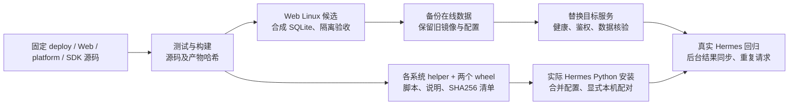

图描述已有发布记录中的流程，不表示存在一套统一自动 CI/CD。Web 启动执行增量 `remote-console.sql`，保留旧表及数据；正常程序回滚切回旧镜像并保留实时数据库。

接入包安装器校验路径、文件哈希、helper 和两个 wheel，使用 Hermes 实际 Python 环境。配置器检查 loopback helper `/info`、实际 profile，备份并原子合并配置；`--remote` 只开启远程入口，`--pair-console` 加明确未来期限才授予配对。

`install.py --check-only` 只验证接入包与 wheel 元数据；正式安装要求实际 Hermes Python 3.11+ 和已有依赖符合要求，用 `--no-index --no-deps` 安装两个 wheel。公开 Linux/macOS helper 为交叉编译产物，首次发布记录未宣称所有对应真实 Hermes 环境均已完成端到端验收。

配置文件与远程配对库是不同写入步骤，脚本会报告“配置已保存但配对失败”的部分完成情况。源码推送和对本机 Hermes 的定向更新也不等于公开安装 ZIP 已重新发布。

依据：[安装器](../../tools/release/early_access/install.py)、[配置器](../../tools/release/early_access/configure_hermes.py)、[打包器](../../tools/release/build_early_access.py)、[同步发布](../releases/WORKSPACE_SYNC_RELEASE_2026-09-14.md)、[9/15 验收](../verification/HERMES_COOPERATION_TEST_2026-09-15.md)。

## 14. 锁定版本的完成范围与证据

| 能力 | 当前状态 |
| --- | --- |
| Agent 身份、认证加密通信、离线队列 | 已实现，包含持久化与稳定 ID |
| 联系人、范围委托、原生确认、受控外发 | runtime 已实现，Hermes 已适配 |
| 网页远程多轮会话、真实回复 | 已实现；`send` 提交，`get` 查最终回合 |
| Web 账户副本与无需打开页面的同步 | 已实现，读取受本机 pairing 约束 |
| 会议提议和接受 | 是协商消息；未实现日历写入或创建会议链接 |
| 对端来信自动唤醒私人 LLM 并持续协商 | 当前个人协作模式未启用 |
| Web 远程批准原生审批 | 不支持 `approval.respond` |
| 自动发现全部旧会话、完整回补远端历史 | 协议没有相应列表/分页能力 |
| 多端共享协议 | 有 npm 合约、JSON Schema 和跨语言 fixtures；具体原生客户端实现不在本次审读范围 |
| 分布式高可用和任意副作用 exactly-once | 当前单机 Compose 与分层提交不提供此保证 |

核对时已有的 [2026-09-15 验收记录](../verification/HERMES_COOPERATION_TEST_2026-09-15.md) 记载 runtime 40、Hermes Connector 113、Web 114，共 267 项通过；另有 12 项真实 helper/platform 网络检查，以及上线后真实 Hermes 回显、重复提交和 workspace 自动保存结果验证。这些是已有验收记录，**原技术梳理仅核对源码，没有重新运行测试或访问生产确认在线状态；这些历史结果不代表本次整合后的部署验证**。

理解这个项目最有效的四个区分是：**连接记录与本机授权；通信接管与业务完成；有限期传输缓存与长期账户副本；模型完成输出与实际结果正确。**

<!-- 源码链接固定到部署锁定版本，避免分支更新造成讲解与源码漂移。 -->
[w-package]: https://github.com/BillShiyaoZhang/agent-collaboration-web/blob/21608208a521ce08ede54a18091773592870c45d/package.json
[w-auth]: https://github.com/BillShiyaoZhang/agent-collaboration-web/blob/21608208a521ce08ede54a18091773592870c45d/src/lib/auth.ts#L6
[w-contract]: https://github.com/BillShiyaoZhang/agent-collaboration-web/blob/21608208a521ce08ede54a18091773592870c45d/packages/client-contract/index.js
[w-transport]: https://github.com/BillShiyaoZhang/agent-collaboration-web/blob/21608208a521ce08ede54a18091773592870c45d/src/lib/control-transport.ts#L24
[w-ecies]: https://github.com/BillShiyaoZhang/agent-collaboration-web/blob/21608208a521ce08ede54a18091773592870c45d/src/lib/ecies.ts#L59
[w-control]: https://github.com/BillShiyaoZhang/agent-collaboration-web/blob/21608208a521ce08ede54a18091773592870c45d/src/lib/control-service.ts#L38
[w-store]: https://github.com/BillShiyaoZhang/agent-collaboration-web/blob/21608208a521ce08ede54a18091773592870c45d/src/lib/workspace-store.ts#L21
[w-sync]: https://github.com/BillShiyaoZhang/agent-collaboration-web/blob/21608208a521ce08ede54a18091773592870c45d/src/lib/workspace-sync.ts#L26
[w-schema]: https://github.com/BillShiyaoZhang/agent-collaboration-web/blob/21608208a521ce08ede54a18091773592870c45d/prisma/schema.prisma#L11
[p-main]: https://github.com/BillShiyaoZhang/agent-comm-platform/blob/aced788f768f372269d482aa0314c8c54618f0f3/cmd/platform/main.go#L30
[p-registry]: https://github.com/BillShiyaoZhang/agent-comm-platform/blob/aced788f768f372269d482aa0314c8c54618f0f3/internal/registry/store.go#L111
[p-mq]: https://github.com/BillShiyaoZhang/agent-comm-platform/blob/aced788f768f372269d482aa0314c8c54618f0f3/internal/mq/store.go#L88
[s-runtime]: https://github.com/BillShiyaoZhang/agent-comm/blob/a2d06d0eb5c8a283328986ff7ae60ec13e125891/python/agent_comm_runtime/runtime.py#L49
[s-ports]: https://github.com/BillShiyaoZhang/agent-comm/blob/a2d06d0eb5c8a283328986ff7ae60ec13e125891/python/agent_comm_runtime/ports.py#L53
[s-store]: https://github.com/BillShiyaoZhang/agent-comm/blob/a2d06d0eb5c8a283328986ff7ae60ec13e125891/python/agent_comm_runtime/store.py#L45
[s-policy]: https://github.com/BillShiyaoZhang/agent-comm/blob/a2d06d0eb5c8a283328986ff7ae60ec13e125891/python/agent_comm_runtime/policy.py
[s-remote]: https://github.com/BillShiyaoZhang/agent-comm/blob/a2d06d0eb5c8a283328986ff7ae60ec13e125891/python/agent_comm_runtime/remote.py#L57
[s-hermes]: https://github.com/BillShiyaoZhang/agent-comm/blob/a2d06d0eb5c8a283328986ff7ae60ec13e125891/connectors/hermes-platform/hermes_platform_agent_comm/platform.py
[s-hermes-adapters]: https://github.com/BillShiyaoZhang/agent-comm/blob/a2d06d0eb5c8a283328986ff7ae60ec13e125891/connectors/hermes-platform/hermes_platform_agent_comm/collaboration/hermes.py
[s-envelope]: https://github.com/BillShiyaoZhang/agent-comm/blob/a2d06d0eb5c8a283328986ff7ae60ec13e125891/crypto/envelope.go#L19
[s-keys]: https://github.com/BillShiyaoZhang/agent-comm/blob/a2d06d0eb5c8a283328986ff7ae60ec13e125891/crypto/keys.go#L46
[s-session]: https://github.com/BillShiyaoZhang/agent-comm/blob/a2d06d0eb5c8a283328986ff7ae60ec13e125891/session/session.go#L57
[s-ecies]: https://github.com/BillShiyaoZhang/agent-comm/blob/a2d06d0eb5c8a283328986ff7ae60ec13e125891/crypto/ecies.go#L100
[s-mailbox]: https://github.com/BillShiyaoZhang/agent-comm/blob/a2d06d0eb5c8a283328986ff7ae60ec13e125891/cmd/helper/mailbox.go#L89
[s-daemon]: https://github.com/BillShiyaoZhang/agent-comm/blob/a2d06d0eb5c8a283328986ff7ae60ec13e125891/cmd/helper/daemon.go#L61
[s-durable]: https://github.com/BillShiyaoZhang/agent-comm/blob/a2d06d0eb5c8a283328986ff7ae60ec13e125891/agent/durable_handler.go#L115
[s-reliable]: https://github.com/BillShiyaoZhang/agent-comm/blob/a2d06d0eb5c8a283328986ff7ae60ec13e125891/agent/reliable.go#L80
