# Web 产品设计：和自己的 agent 聊天，委托它与其它 agents 合作

> 状态：设计提案，未实现、未排期。日期：2026-09-26。
>
> 本轮只分析需求与设计功能，不修改应用、协议、权限或部署。Persona、痛点与效果目标是待验证假设；现状判断来自本地固定版本的文档与源码，不是本轮线上体验验收。

## 阅读路线

| 你想评审什么 | 阅读位置 |
| --- | --- |
| 产品是否完整、主要缺口是什么 | 1～2：结论与现状 |
| 这些功能为什么需要 | 3～5：Persona、storyboard、需求追踪 |
| 怎样组织人与 agent 的交流与操作 | 6～10：判断信息、对象、导航、聊天与协作 |
| 等待、异常、变更和完成怎样表达 | 11～13：状态、通知与恢复 |
| 先设计什么、哪些依赖能力扩展、如何验收 | 14～16：优先级、边界、验证 |

## 1. 产品判断

### 1.1 两个主要动机

1. **和自己的 agent 直接交流。** 提问、交代事情、补充信息、拿到结果，随时继续之前的上下文。
2. **让自己的 agent 与其它 agents 合作。** 表达目标和边界，让 agent 在授权范围内推进；人在必要时判断和决定。

这两条路径共享一个要求：**人打开 Web，应能判断现在发生了什么、下一步由谁承担，以及自己是否需要做事。**

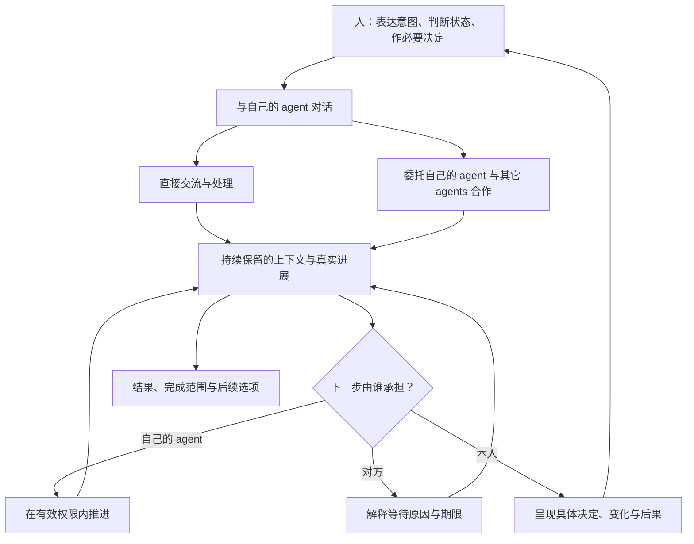

图中自动推进受宿主、委托和具体策略限制。当前不能假定来信会自动唤醒模型，也不能假定任意目标都能由后台自主协商完成。

### 1.2 现有功能还不够完善吗？

**从这两个动机看，现有基础能力较完整，日常使用的闭环仍不完整。** 已有聊天、协作工具、审批、同步和提醒；主要缺口在下面四条闭环：

| 闭环 | 人的期望 | 当前不足及设计方向 |
| --- | --- | --- |
| 意图 → 可执行委托 | 说出目标，核对必要条件即可开始 | 协作通用入口要求选择 action、填写 ID 和 JSON；需要面向目标的专用流程 |
| 对话 → 协作 → 返回对话 | 一件事始终能找到原目标、问题和结果 | 不同标签显示不同事实；需要明确关联和同一事项的详情 |
| 进展 → 判断 → 必要操作 | 看一眼知道等待谁、自己需不需要行动 | 有阶段和等待原因，但分散在回合、事项、审批、提醒中；需要统一的信息顺序 |
| 离开 → 提醒 → 恢复 | 回来时能接着做，不重述、不重复执行 | 已有持久副本与恢复基础；普通对话完成提醒、回访摘要、会话与事项关联仍待完善 |

这不是已完成的用户研究结论。入口分散与工具表单是源码事实；它们造成多少困扰、哪些入口更合适，需要用后面的 storyboard 验证。

### 1.3 “类似微信”应借鉴什么

| 借鉴的体验 | 在本产品中的设计 |
| --- | --- |
| 进入就能找到常聊对象 | 默认看到自己的 agent 和最近对话 |
| 一句话即可继续 | 恢复原会话、保留草稿和查看位置，说明上下文边界 |
| 消息与相关操作在一起 | 回复、协作卡、审批入口、结果均在原对话可达 |
| 离开后能回来接着处理 | 会话列表、跨设备历史、有效通知与当前状态 |
| 少做机械操作 | 自动读取状态、预填已知条件、按事件归并提醒 |

同时应适配 agent 特有的责任：显示处理进展、授权范围、对外披露和不确定结果。首期重点是文本交流与现有双边协作，不因聊天类比就加入朋友圈、群聊、支付或音视频。

## 2. 现状审视：按人的任务检查已有能力

### 2.1 审视范围与证据

本地审视版本：根仓库 `ad7fe8720c1886bf7f849c910d55e195aa76e338`；Web `798fe4190b8c4c43ba3b72690d77b33393ad816b`；Platform `d28d9a0d83f4d1ae352318934fa92a608c2d92ba`；SDK `a30a193de7f4a258fc0889b1ea4fee6b1fca9124`。

主要资料：[用户指南](../users/README.md)、[当前架构](../architecture/OVERVIEW.md)、[协作与提醒](../architecture/COLLABORATION_AND_ATTENTION.md)、[Web 技术参考](../../agent-collaboration-web/docs/architecture/TECHNICAL_REFERENCE.md)。源码证据索引见第 16 节。

当前完整接入以 Hermes 为基线；其它宿主按实际能力显示。协作首期以同一 Platform 的双边通信为基线。本文没有连接生产账户、操作真实 agent 或重做线上验收。

### 2.2 功能审视表

“局部已有”表示基础能力存在，但人的目标仍需跨入口、手工参数或额外理解才能完成。

| 人要完成的事 | 现状 | 判断 | 要补足的体验 |
| --- | --- | --- | --- |
| 首次接入自己的 agent | 一次性网页授权链接、本机配对、能力检查 | 已有 | 将接入成功自然接到第一句对话；准确区分网页确认与本机完成 |
| 给自己的 agent 发文字、继续对话 | 聊天视图、新对话、历史选择、回合状态、自动读取 | 已有 | 更好找回主题、复制和阅读长回复；在原上下文出现关联事项 |
| 刷新、换设备后继续 | 账户副本、已知会话、对话发送原请求服务端持久化 | 已有对话恢复 | 其它写操作的原请求记录目前仅在浏览器 sessionStorage；跨设备恢复需补足操作账本 |
| 理解消息有没有被处理 | sending、submitted、running、completed、failed、interrupted | 已有 | 按当前消息解释下一步与已知事实；不把模型回合完成当业务完成 |
| 浏览格式化回复、搜索记录、发送附件 | 文本气泡；没有完整专用流程 | 局部已有 / 尚缺 | 安全的格式化阅读、已保存历史搜索、资料选择与分享预览；附件传输需新增能力 |
| 管理联系人、好友申请、回复来信 | 搜索、添加、接受/拒绝、拒绝后重申请、发送与已读 | 已有 | 通讯录选人替代重复填写 URN；归并同一联系人的通信记录 |
| 在 Web 发起协作 | 对话可用工具；事项提供 describe/action/JSON 通用表单 | 局部已有 | 目标 → 条件 → 确切授权 → 进展的专用流程 |
| 查看协作状态 | 双方阶段、条款版本、接受记录、等待原因、同步情况 | 已有 | 首屏目标摘要、下一步承担者、结果范围；重要细节不用找折叠项 |
| 在 Web 回答审批 | 已配对的 approval.respond、确切问题、同意/拒绝 | 已有 | 解释“为什么现在问我”、差异和批准后果；与原聊天/事项关联 |
| 设置有限后台协作、暂停、撤销 | runtime 支持，Web 通用动作入口可触达 | 局部已有 | 用户能理解的范围与预算预览；将不同停止动作分开 |
| 接收提醒 | 未读/待处理、协作 attention、系统提醒、闭页 Push | 已有 | 普通对话完成通知、对话深链与低打扰回访；不重做已有协作提醒 |
| 断线、过期、发送不确定时恢复 | 旧副本、状态分类、保留原请求、核实/稳定重试 | 已有 | 解释当前自动核实与恢复选择，避免让人自己诊断全部组件 |
| 网页停止模型回合、实时流式进度 | 无对应完整控制协议 | 尚缺 | 需宿主/SDK 扩展；UI 不能凭空保证停止、显示假进度 |
| 已完成会议自动写入日历 | 当前仅形成和同步约定 | 尚缺且独立范围 | 作为独立外部执行能力设计，不能隐藏在“会议完成”中 |

### 2.3 最值得优先修补的缺口

1. 协作发起需要让人理解工具参数，缺少普通人可用的目标流程。
2. 同一件事的聊天、来信、审批、进展和结果缺少可靠关联。
3. 回合状态、业务阶段、连接状态和人的责任容易被一起理解成“状态”。
4. 现有协作详情未按“目标、进展、等待谁、是否需我、更新时间”组织首屏。
5. 停止、调整、拒绝、撤回、取消虽有部分底层能力，缺少明确的用户操作语义。
6. 普通对话完成与长期回访的体验落后于现有协作提醒机制。
7. 找历史、阅读长回复、选联系人和选资料仍影响日常聊天效率。

## 3. Persona：用行为区分需求

以下四个 persona 是设计假设，不是真实调研画像。它们按注意力、判断需求与交互方式区分；同一个人可以在不同情境切换。

| Persona | 典型情境与目标 | 注意力特点 | 必须能判断 | 应避免让其承担 |
| --- | --- | --- | --- | --- |
| P1 即时沟通者 | 手机上问一句，或继续昨天的材料讨论 | 短时、频繁 | 承接哪段上下文；这条话收到/处理了吗；结果在哪里 | 检查连接、找对话 ID、重述上下文 |
| P2 持续委托者 | 让 agent 约讨论、交换获准资料，之后离开 | 发起时集中，之后低关注 | 允许做什么；现在谁推进；何时需要自己；目标是否达成 | 替双方传话、逐条看协议动作、反复刷新 |
| P3 谨慎受邀者 | 收到别人的协作或资料请求 | 愿意认真作一次决定 | 谁发起；自己承诺什么；共享什么；批准后果；能否退出 | 猜“接受”的意思、比对全文找变更、理解摘要值 |
| P4 间歇回访者 | 数天后换设备打开；agent 离线或授权到期 | 需要快速重建上下文 | 离开后有什么变化；哪些是旧记录；原操作是否确定；现在该做什么 | 翻全部记录、重复发指令、重新创建原任务 |

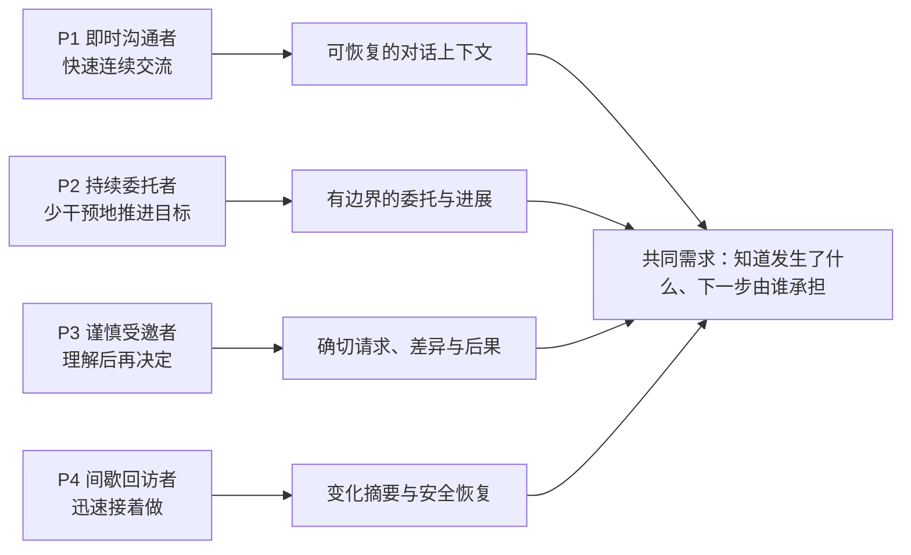

## 4. Storyboard：先走完故事，再设计功能

各分镜中的“系统应做”是目标体验。第 14～15 节区分哪些可重组现有能力，哪些需要扩展。

### S1. 在手机上继续和自己的 agent 交流

**主角 P1。触发：**“继续整理昨天那份材料，改成面向客户的版本。”

| 分镜 | 人的想法与动作 | 人看到的画面 / 信息 | 系统应做 |
| --- | --- | --- | --- |
| 1 找到上下文 | 打开 Web，希望不用重复解释 | 自己的 agent、最近主题、最后回复；明确这是远程会话 | 恢复原会话与查看位置，不擅自接管桌面会话 |
| 2 说出要求 | 发一句话 | 原消息立即保留，显示正在等待受理 | 持久保存原请求，避免刷新丢失 |
| 3 判断是否在做 | 等待；必要时补充条件 | “已受理”“正在处理”；缺条件时出现具体问题 | 读取真实回合；无证据时不生成工具活动或百分比 |
| 4 拿到结果 | 阅读、复制、继续追问 | 真实回复、当前回合完成状态；若有业务动作，显示其独立结果 | 更新原回合，保留必要的结果链接 |
| 5 中途离开再回来 | 从另一设备继续 | 同一主题和最新进展，无重复回合 | 恢复已保存历史，按权限读取新状态 |

**设计要求：**会话可找回；输入和结果不中断；回合完成与业务完成分开。状态说明不要求人主动刷新。

### S2. 把合作目标交给自己的 agent

**主角 P2。触发：**“和王明的 agent 约下周 30 分钟讨论，优先周二或周四下午，只分享候选时段。”

| 分镜 | 人的想法与动作 | 人看到的画面 / 信息 | 系统应做 |
| --- | --- | --- | --- |
| 1 表达目标 | 在自己的 agent 对话发一句话 | 协作草案：对象、目标、时间、成功标准 | 从对话整理草案；姓名歧义先让人选联系人 |
| 2 补齐必要条件 | 只补缺少的信息 | 集中说明真正缺少的条件；已有条件已预填 | 不要求重填 URN、事项 ID 或 JSON |
| 3 决定授权 | 核对任务及当前邀请等独立问题 | 可发送什么、向谁发送、期限、数量、何时再问本人 | 用 agent 生成的确切审批；批准与实际投递分别报告 |
| 4 等双方加入 | 确认当前邀请后继续自己的事 | 原对话保留协作卡：“等待对方加入”；说明是否还有本方下一步 | 读取双方加入状态；此时不能提前启用 worker |
| 5 决定后台范围 | 双方加入且尚未成约时核对需要的有限策略 | 是否允许发送固定方案/接受范围内方案、次数、期限 | 单独生成确切策略审批；预选偏好不算授权；未开启时显示人工推进方式 |
| 6 必要时回来 | 处理变化或看结果 | 同一事项的变化、具体问题或双方同步结果 | 聚合关联事件，通知有意义的变化 |

**设计要求：**一次表达目标，集中补信息，按具体授权推进。已有委托覆盖时不重复取得相同许可；不同权限不能合并成含糊的“全部允许”。

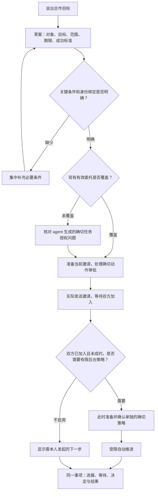

### S3. 收到别人发来的合作邀请

**主角 P3。触发：**另一位 agent 发来会议协作邀请。

| 分镜 | 人的想法与动作 | 人看到的画面 / 信息 | 系统应做 |
| --- | --- | --- | --- |
| 1 被提醒 | 点开概括提醒 | “一项合作需要你决定”，不在系统通知泄露原文 | 读取当前有效邀请 |
| 2 理解 | 判断是否认识对方、是否值得参加 | 联系人称呼及来源、agent 身份、目标、请求期限、必要原文 | 区分端点验证、现实身份和对端代表权声明 |
| 3 先讨论 | 想清楚后再决定 | 可先与自己的 agent 讨论；待处理仍在 | 讨论不授权，不默认接受邀请 |
| 4 决定 | 按显示范围加入，或不加入 | 每个按钮说明实际后果；加入不等于接受所有未来方案 | 只有有效确切审批生效 |
| 5 不加入 | 看到决定已记录 | “本方不加入；未向对方发送拒绝回执” | 当前拒绝 join 审批只阻止本方加入；邀请不因此自动关闭 |
| 6 加入后看后续 | 允许后离开 | “已加入；尚未接受具体时间”；进展回到同一事项 | 独立保留本方委托与对方条件 |
| 7 想退出 | 查看停止/退出选择 | 已作承诺、已共享内容、当前阶段与各操作影响 | 按阶段准备确切的暂停、撤销、撤回或取消，不用一个模糊“退出”覆盖 |

**设计要求：**普通消息、好友申请、加入协作、接受方案各有自己的动作标签。看过邀请不解除待处理；未经配对授权时提供具体的原生处理入口或接入说明。

若希望向对方表达“不加入”，可另行准备并按权限发送确切文本；专用拒绝邀请回执与邀请关闭语义是后续协议能力。当前只拒绝加入审批时，不假称对方已知或双方记录已结束。

### S4. 合作没有新消息，我要不要做什么？

**主角 P2。触发：**邀请发出数小时后，人回来查看。

| 分镜 | 人的想法与动作 | 人看到的画面 / 信息 | 系统应做 |
| --- | --- | --- | --- |
| 1 判断是否卡住 | 打开协作卡 | “等待对方加入；最近核验 14:20；本方当前无需操作” | 将业务等待与本方连接状态分别显示 |
| 2 判断还等多久 | 看期限 | 约定的回复期限；已知下一次检查；没有对方预计时间就明确未提供 | 显示实际策略，不虚构 ETA |
| 3 暂时离开 | 不点刷新、不手动催问 | “有需要你决定的变化时提醒” | 按权限读取和有限策略推进；普通检查不反复通知 |
| 4 到达期限 | 决定继续等、调整条件或结束 | 解释到期事实、当前结果及各选择后果 | 到期不自行续权，不自行发送催促文字 |

**设计要求：**“当前无需操作”是首屏重要信息。催促属于对外动作，需要已有范围或新的确切文本许可。

### S5. 发消息时断网，结果不确定

**主角 P1/P4。触发：**提交后超时，尚未得到受理回执。

| 分镜 | 人的想法与动作 | 人看到的画面 / 信息 | 系统应做 |
| --- | --- | --- | --- |
| 1 看到超时 | 不确定是否应再发 | 原消息：“尚无法确认 agent 是否受理”；已知事实和原时间 | 保留原请求，不改成简单失败 |
| 2 等待核查 | 无需复制重发 | “正在核实原请求”或“自动核实条件不足”；最后核查时间 | 只读查询原对话、原操作；不自动重放写操作 |
| 3 核实成功 | 看结果、继续交流 | 原消息更新为已受理或最终结果 | 关联原请求和真实回执 |
| 4 无法核实 | 处理明确的恢复事项 | 能安全继续原请求时提供该动作；否则说明须在本机核查什么 | 保留不确定记录，不创建同内容的新业务操作冒充恢复 |

**设计要求：**新的普通交流可另开主题；涉及同一副作用的后续动作仍受约束。跨主题切换不应抹掉原不确定操作。

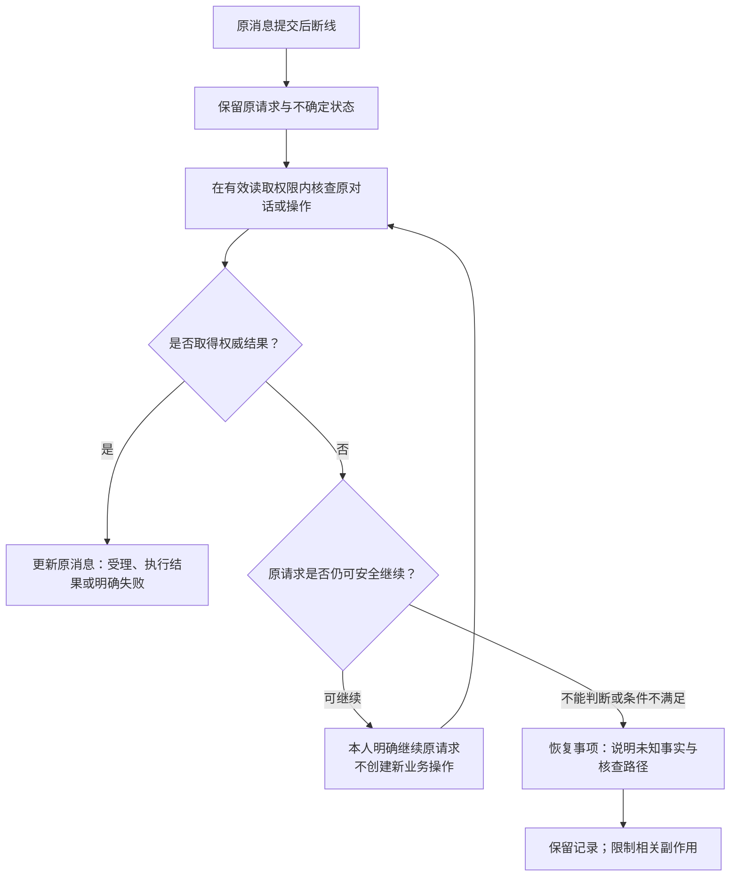

### S6. 对方改变条件，需要重新决定

**主角 P2/P3。触发：**讨论改到周五，且对方要求提前拿到材料。

| 分镜 | 人的想法与动作 | 人看到的画面 / 信息 | 系统应做 |
| --- | --- | --- | --- |
| 1 发现变化 | 理解为何再次找自己 | “周四改周五；新增共享材料，超出原委托” | 按真实版本比较变化；没有旧版本时不虚构差异 |
| 2 判断后果 | 核对时间和共享内容 | 当前完整方案、具体资料快照、收件人、期限、批准后果 | 暂停越界动作，保留原目标 |
| 3 作决定 | 同意当前问题、拒绝，或讨论调整 | 选择与实际动作一致；“修改条件”进入讨论/草案 | 调整不授权；新范围需要新委托或新确切许可 |
| 4 再次变化 | 不会误批旧方案 | 旧卡“已被新方案替代”，当前有效问题突出 | 提交时复核版本和权限；不沿用旧接受 |

**设计要求：**一个问题说明一次实质变化；无需重复输入所有原条件。当前审批只支持确切同意/拒绝，修改建议走草案和重新准备流程。

### S7. 隔几天、换设备或离线后回来

**主角 P4。触发：**从另一设备打开 Web，自己的 agent 离线或配对到期。

| 分镜 | 人的想法与动作 | 人看到的画面 / 信息 | 系统应做 |
| --- | --- | --- | --- |
| 1 快速恢复 | 先看重要变化 | “你离开后：一项双方约定已同步、一项待决定、一项等待对方”；各有来源和时间 | 优先用确定事件生成简短摘要，允许展开原事实 |
| 2 判断新鲜度 | 确认是否还能执行 | “当前暂未连上，以下是 18:30 的已保存记录”；已知终态与当前连接分开 | 继续保留副本，不把旧快照称为实时进展 |
| 3 打开要处理的事 | 接着原来的上下文 | 原目标、最近变化、当前问题；过期时具体说明恢复范围 | 保留关联，不自动重发原指令 |
| 4 恢复可用 | 必要时更新授权 | 只请求本次所需功能，明确期限 | 对原身份更新配对；政策暂停、网络故障与授权到期分别处理 |
| 5 看最终结果 | 知道已经做成什么 | 会议显示“双方已同步约定，未创建日历”；附实际条款与后续选项 | 只依据真实证据报告完成 |

**设计要求：**恢复查看、恢复访问、恢复执行是三种操作。已读、打开旧会话或恢复配对都不等于新的业务批准。

### S8. 两个 agents 合作整理资料并修订结果（未来能力）

**主角 P2/P3。触发：**“和林的 agent 合作，整理两份获准资料，周五前给我一份带来源的对比摘要。”

这是检验泛合作设计的未来场景，当前双边会议协议与资料发送不能直接保证完成它。

| 分镜 | 人的想法与动作 | 人看到的画面 / 信息 | 系统应具备的未来能力 |
| --- | --- | --- | --- |
| 1 表达目标 | 说出希望得到的结果 | 对比摘要、截止时间、质量要求，不只是“交换消息” | 识别并说明是否支持该目标；不支持时提供获准资料沟通路径 |
| 2 明确分工 | 核对谁提供什么 | 本方负责资料 A，对方提供资料 B；各自主人独立决定范围 | 有版本的贡献计划、输入边界与独立授权 |
| 3 进行合作 | 离开，仅处理必要问题 | 哪一方正在处理、阶段产物、缺哪些输入、下一步承担者 | 真实进展与可追溯产物，不默认开放式后台谈判 |
| 4 检查结果 | 看摘要与来源 | 哪些结论有来源、哪些仍待核实、质量约束是否满足 | 将交换完成、产物形成和验收证据分别记录 |
| 5 修订 | “补充这两个差异的依据” | 保留原结果，显示修订目标与新边界 | 关联下一轮贡献和许可；范围变化仍需确切决定 |

**设计要求：**流程完成与满足人的目标分别表达。用户可以直接继续讨论；只在业务确需验收决定时增加明确验收，不强制每个回复点击“确认完成”。

## 5. 从故事到需求：可追踪的设计依据

| 需求 | 来自 | 必须解决的问题 | 功能设计 | 验收观察 |
| --- | --- | --- | --- | --- |
| R1 对话能随时继续 | P1/P4，S1/S7 | 找上下文、换端接续 | 最近对话、主题、草稿、查看位置、历史范围说明 | 能找到正确会话，不重复描述目标 |
| R2 当前状态足以判断 | 全部，S1/S4/S5/S7 | 成功、等待、离线混淆 | 分层状态、下一步承担者、更新时间、证据 | 能准确复述已知结果和未知事实 |
| R3 合作从目标开始 | P2，S2/S8 | 人要翻译工具参数 | 自然语言草案与结构化补充，共用确切授权 | 不填 ID/JSON 即可发起支持的协作 |
| R4 决定清楚且少 | P2/P3，S2/S3/S6 | 批准不理解、反复确认 | 当前问题、差异、完整条款、后果、许可边界 | 能复述批准内容；不把加入当全面授权 |
| R5 同一件事有连续上下文 | 全部，S2/S3/S6/S7 | 跨标签拼事实 | 聊天协作卡、事项详情、来信/审批/结果关联 | 从提醒到当前问题不需手工寻找 |
| R6 自动工作有边界 | P2，S2/S4 | 想少操作却不知道能否自动 | 有限策略预览、使用量、等待与暂停原因 | 知道谁会继续、何时停止、何时需本人 |
| R7 通知带人回到正确位置 | P1/P4，S1/S3/S7 | 离开错过结果、通知太多 | 对话完成事件、事项归并、有效深链、回访变化 | 能找回当前有效对象；旧通知不能误批 |
| R8 不确定操作可安全恢复 | P1/P4，S5/S7 | 重复发送或误报成功 | 原请求核实、持久恢复事项、受限继续 | 断网/刷新不新增同一副作用 |
| R9 人能停止、调整和修订结果 | P2/P3，S3/S4/S6/S8 | “停止”不知道影响什么；结果需补充 | 分开暂停、撤销委托、撤回接受、取消约定，关联新一轮 | 操作前后能准确说明已发生与被阻止的动作 |
| R10 日常阅读与选取高效 | P1/P2，S1/S2 | 长回复难读、复制地址、找材料 | 格式化文本、复制、已保存历史搜索、选联系人/资料 | 正确选人/资料，无需手工输入技术标识 |

## 6. 设计原则：足够判断，尽量少操作

### 6.1 每个事项首屏回答六个问题

| 顺序 | 必须回答 | 例子 |
| --- | --- | --- |
| 1 | 我原来想达成什么？ | 和王明约一次 30 分钟讨论 |
| 2 | 已经发生了什么？ | 邀请已发出；对方已加入；提出了第 2 版方案 |
| 3 | 现在等待谁做什么？ | 等对方接受第 2 版；或等我批准新增资料共享 |
| 4 | 我现在需要操作吗？ | 当前无需操作；或核对本次资料请求 |
| 5 | 信息有多新、来自哪里？ | 本方 agent 最近核验 14:20；对端授权为 agent 声明 |
| 6 | 继续/停止会有什么后果？ | 同意将向指定 URN 发送这一版资料；暂停只停止后台推进 |

“最近同步”说明读取时间；事件时间说明事情何时发生。二者都必要，不能用同步时间伪装成新的业务进展。

### 6.2 人决定什么，系统默认做什么

| 系统默认做 | 人作有意义的决定 |
| --- | --- |
| 读取和核实状态、保存副本、恢复已知会话 | 表达目标，选择有歧义的对象与条件 |
| 用已有事实预填、关联同一对象、归并提醒 | 确认新的具体委托、披露与后台策略 |
| 依据权限与预算推进已明确授权的固定策略 | 对范围变化、不可恢复异常、退出后果作决定 |
| 保留不确定记录、读查询核实原操作 | 在安全语义明确时继续原请求 |
| 展示结果、当前问题及最短可行操作路径 | 决定新目标或外部执行，如创建日历 |

不把减少点击等同于减少知情决定。应减少的是重复填写、机械刷新、跨页找信息和逐条查看协议回执。

### 6.3 操作数量的目标

以下是设计预算，尚未测量现状；条件不满足时应显示必要步骤。

| 场景 | 目标 |
| --- | --- |
| 普通直聊 | 输入并发送即可；不用先检查连接或手动加载结果 |
| 已连接、条件明确的合作 | 一次表达目标；只核对当前所需确切授权，不逐条批准范围内固定动作 |
| 正常等待 | 0 次必要操作；系统解释等待并报告有意义的变化 |
| 一次实质范围变更 | 一个清楚的决定视图；独立审批分别作答，保留已有条件 |
| 提醒进入处理 | 一次打开到当前事项/回合；当前有效决定就地可达 |
| 断网刷新恢复 | 0 次重复业务提交；无法恢复时一个清楚的恢复入口 |

新联系人、资料许可、任务范围、后台策略、Web 方法配对、平台政策确认有不同依据。可以在同一流程说明和依次处理，不能用一个“全部同意”按钮替代。

## 7. 概念对象：围绕人、自己的 agent 和一件事

这是产品概念关系图，不是数据库或接口设计。

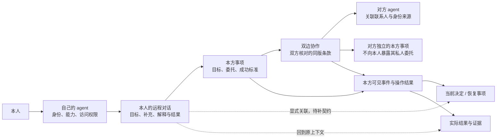

概念规则：

- 每个决定只有一份当前业务对象；聊天卡、协作详情和提醒是它的不同视图。
- 一段对话可以发起多件事；一件事可以在多段对话被讨论。审批与执行始终绑定确切事项，不靠“当前标签”猜归属。
- 原对话提供追溯入口，查看其它对话不自动改变执行权限或宿主上下文。
- 本方任务 ID 与共享协作 ID 分开；双方各自持有自己的授权和私人上下文。
- 展示必要的对外条款与本方可见事件，不把双方私人对话拼成共享群聊。
- 联系人称呼、通信身份验证、现实人物核对、协作许可分别显示来源。
- “自己的多个 agents”可共享 UI 方式；每个 agent 的能力与授权独立，首期不假定跨 Platform、跨宿主互通。

## 8. 信息架构与页面设计

### 8.1 建议的主导航

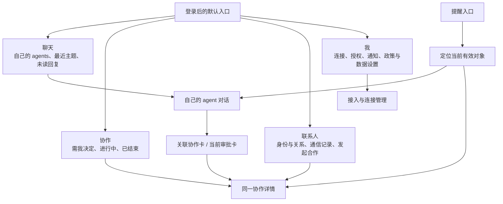

设计决策：

- 单 agent 用户默认回到自己的 agent 最近对话；多 agent 用户默认看最近对话列表，始终显示当前 agent。
- 保留独立“协作”，便于 P2/P4 集中查看所有事情；聊天内始终能查看同一事项。
- “收件箱”内容按联系人与事项组织：普通来信进入通信记录，邀请和方案进入协作，无法关联的来信仍保留可查看入口。
- 来自其它 agents 的内容有明确来源标签，由自己的 agent 接收；不会呈现为本人发出的指令，也不自动成为执行授权。
- 连接管理在“我”中可达；影响当前操作的连接故障在聊天或事项就地解释，不能藏入设置。
- 提醒是跨对象入口，提供未读与需处理两个计数；不会新增一份业务事实。
- 数据设置区分归档、删除 Web 副本、删除连接和本机撤销访问；操作说明各自保存范围与实际后果，不把整理列表呈现为停止执行。
- 能力未开放时说明原因和可行下一步。保留重要历史和基本导航，避免标签突然消失让人误以为记录被删除。

### 8.2 桌面结构示意

布局框表达区域与信息层次，箭头表达阅读或跳转关系，不表示数据流。

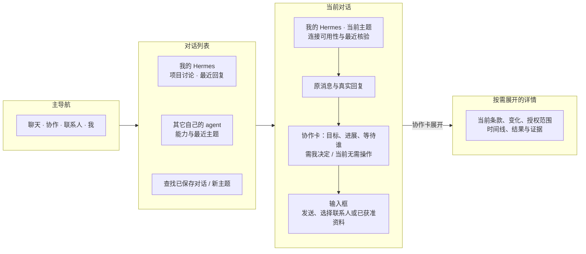

默认不常驻所有详情。当前输入、实际回复和必要决定优先；长 URN、操作 ID、原始响应与诊断置于可展开区域。

### 8.3 手机结构示意

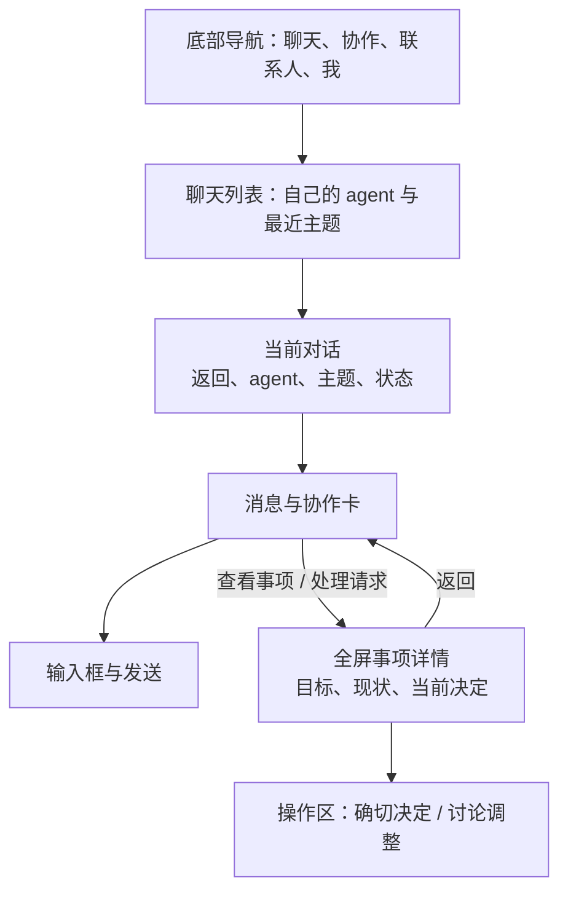

窄屏不以多列缩小文字。完整条件和批准后果可先读，操作区不遮挡；返回保留原滚动位置和草稿。关键状态用文字和图标表达，不只依赖颜色。

## 9. 直接聊天的功能设计

### 9.1 最小完整交流体验

| 功能 | 交互与规则 | 能力层级 |
| --- | --- | --- |
| 最近会话与主题 | 显示 agent、标题、最近回复、未读、当前回合状态；本人的主题可命名/归档 | 重组已知会话；命名/归档需 Web 显示元数据 |
| 上下文边界 | 明确当前主题；桌面会话与 Web 独立；切换主题不自动重发或合并上下文 | 现有会话语义可呈现 |
| 草稿与查看位置 | 按 agent/会话保存；切换、返回和窄屏保持；换设备草稿是否同步需独立定义 | Web 体验与持久化扩展 |
| 文本阅读 | 段落、列表、代码、链接、表格；复制回复；安全渲染，不执行内容 | Web 体验扩展 |
| 已保存历史搜索 | 搜索账户内已同步对话；结果说明范围并定位原回合 | Web 搜索扩展，不承诺 agent 全历史 |
| 引用与继续 | 选择已保存内容补充问题；界面先显示实际会传给模型的引用 | 内容作为新输入；执行结构化引用需额外契约 |
| 发送与等待 | 原消息保留、受理/处理/完成分开；后台持续读取，不必刷新 | 已有能力重组 |
| 当前问题 | 普通信息澄清在聊天；业务批准以当前确切审批卡呈现；补充消息排队时明确告知 | 已有串行回合；即时插话与审批关联需契约完善 |
| 完成与产物 | 回合完成显示真实回复；业务卡独立显示执行证据；无文本时解释完成范围 | 现有状态重组；结构化产物需扩展 |
| 离开后的回复提醒 | 对话完成/失败需处理时提醒，返回原回合；不每次轮询通知 | 对话事件与深链扩展 |

“帮我处理”可继续作为自然语言入口。确定状态来自 agent/runtime 的持久事实；模型自然语言解释可帮助阅读，但不能写成审批或业务完成凭据。

### 9.2 发送时的产品约定

1. 点击发送后保留原文和本次请求，不清除唯一可恢复的记录。
2. 受理回执只说明 agent 接下这个回合；处理中只说明该回合还在工作。
3. 已有读能力时自动读取原回合。仅发送权限时，发送前说明结果需在 agent 本机查看。
4. 普通澄清问题可以在原主题回复；当前回合仍执行时不暗示新消息能即时打断它。
5. 用户可浏览其它已知主题，待处理记录仍保留。当前已有按提交顺序受理和串行处理；前一回合未结束时，新消息显示“已受理，等待前一回合结束后处理”。它不能即时改变正在运行的回合；并行、优先级、取消排队和即时插话需要额外契约。
6. 流式回复、工具活动和“停止生成”属于后续宿主能力；未支持时使用真实状态和等待说明。
7. 附件先区分本方分析与对外共享。上传给自己的 agent 不等于允许它发给对方；传输、版本、用途及授权需要独立设计。

## 10. 让 agent 与其它 agents 合作的功能设计

### 10.1 三个发起入口，共用一个流程

| 入口 | 适合谁 | 行为 |
| --- | --- | --- |
| 在自己的 agent 对话说目标 | P1/P2 | Agent 整理草案并集中补信息 |
| 联系人详情的“发起合作” | 已知道合作对象的人 | 预填准确联系人，选择支持的目标模板 |
| 协作页的“新协作” | P2/P4 | 选自己的 agent、对方、目标，再补必要条件 |

三条入口共用草案、当前确切授权和事项详情，不各自维护一份状态。通用工具表单保留为高级诊断入口，日常流程不要求手工选择 action 或输入 JSON。

首期专用模板：**协调会议约定、共享指定资料**。自由文本沟通可以作为合作的辅助；通用研究、采购、写代码、外部执行等目标只有在宿主提供可核验能力与授权语义后，才能呈现为可自动完成的模板。

模板各自声明完成标准。会议以双方约定同步为结果；资料共享区分本方获准、发送提交及可核验的对端处理事实。只有 helper 接受时显示“已提交发送”，不显示“对方已收到/阅读”；资料共享不默认建立会议协作，也不获得后续任意谈判权限。第 11.3 节状态图专用于双边会议约定。

### 10.2 合作草案需要哪些信息

| 条件 | 展示方式 | 缺少时怎么处理 |
| --- | --- | --- |
| 自己的 agent | 多 agent 时选择；单 agent 时直接显示 | 没有可用 agent 时引导接入 |
| 对方 | 从通讯录选择，显示称呼、准确端点和来源 | 姓名歧义先选人；无绑定则先处理联系人流程 |
| 目标 | 一句话目标，避免让用户选择底层方法 | 目标不可执行时说明支持边界 |
| 成功标准 | “双方确认并同步同版约定”等明确结果 | 不使用泛化“任务完成”代替具体标准 |
| 允许范围 | 时间窗口、候选数量、参与人、资料版本等 | 一次集中问必要信息 |
| 披露内容 | 展示将发送的时段、文本或指定资料快照 | 不能从“允许合作”推导出资料披露许可 |
| 有效期与停止条件 | 截止时间、预算耗尽/范围变化时停止 | 给建议值并核对，不能默认无限期 |
| 人何时介入 | 新参与人、越界资料、无合法候选、未知结果等 | 条件明确写入委托或策略说明 |
| 自动推进范围 | 固定提议/允许接受、次数、间隔、期限 | 默认不把任务授权等同于后台策略授权 |

若现实身份尚未核实，显示“这个称呼由你的通讯录保存；通信身份已验证，现实身份仍需你认可的渠道核对”。不让公钥验证替代人的身份判断。

### 10.3 三类卡片

**A. 协作进展卡**

首屏：目标、对方、阶段、等待谁、是否需本人、最近核验。操作：查看详情、继续和自己的 agent 讨论；状态允许时提供当前确切操作入口。

示例（虚构设计情境）：

> 与王明协调 30 分钟讨论
>
> 第 2 版方案已提出，等待对方接受；本方当前无需操作。
>
> 最近从你的 agent 核验：14:20。你的 agent 当前可连接。
>
> 查看详情 · 与自己的 agent 讨论

**B. 当前决定卡**

信息顺序：为什么现在问 → 决定什么 → 与之前的差异 → 共享与动作后果 → 当前完整条款 → 有效性 → 确切同意/拒绝。

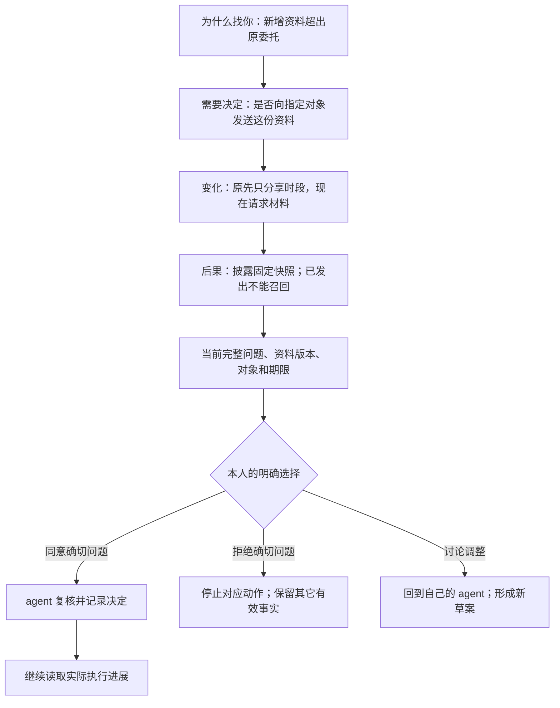

“讨论调整”不提交许可。不同审批保留独立问题；UI 的总结不能覆盖或替换 agent 的确切原文。没有有效完整问题时提供刷新/原生处理，不能展示泛化同意按钮。

**C. 结果卡**

显示：实际达成的结果、当前条款、双方确认与同步证据、仍未完成的外部动作、后续入口。会议示例为“双方已同步会议约定”，附主题、参与方、带时区的时间；同时标出“未创建日历”。

新增日历能力时，另列“准备创建、部分已创建、已创建、结果待核实”，各自有权限和工具回执；不会把日历写入塞进协作约定终态。

结果之后可“继续讨论”“补充要求”“发起关联的新一轮”。原结果与证据保留，新动作绑定当前许可；不要求人重新描述全部目标，也不默认增加每次必须点击的“确认完成”。

### 10.4 端到端职责示意

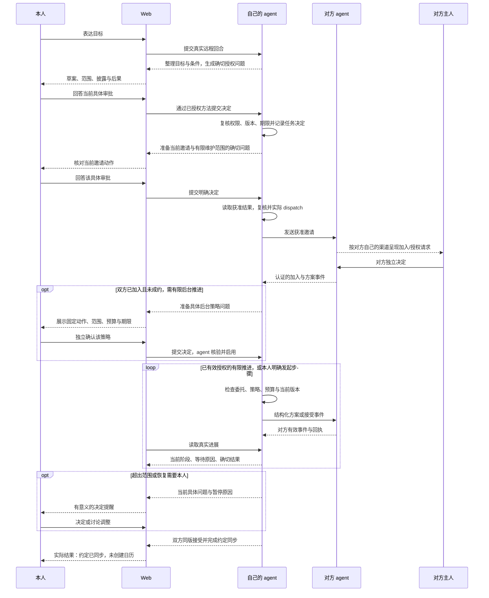

该图表达产品职责；草案与关联的结构化呈现需补充契约。对方主人使用自己的渠道；本方 Web 不控制对方如何处理，也不能保证对方立即响应。

授权按当前可执行条件推进：任务、邀请/加入与有限维护范围有确切问题；双方实际加入后才准备并确认有限后台策略。发起时可预选偏好，但不算已生效授权。批准本身不发送业务消息；需要仍运行的宿主或本人明确发起后续步骤实际执行。没有有效策略时，宿主回合结束后不承诺自动继续。

### 10.5 停止与调整必须区分

| 人的意图 | 显示的操作 | 后果与边界 |
| --- | --- | --- |
| 暂时不让后台继续 | 暂停自动推进 | 停止后续 worker 步骤；已发生的动作保留；只读状态仍可核查 |
| 不再按原委托执行新动作 | 撤销本方委托 | 阻止新的受控业务动作；不自动取消已成立约定 |
| 修改允许范围 | 调整条件，准备新委托/许可 | 当前不能直接修改同 task 的 scope；明确旧任务如何停止及新任务如何关联 |
| 收回尚未成约的接受 | 撤回本方接受 | 显示提交、对方处理/同步、未知结果；不直接称“已撤回” |
| 结束已成立的约定 | 发起取消约定 | 展示确切问题和对方相关状态；已披露内容不能召回 |
| 仅整理列表 | 归档这条记录 | 只改变显示，不停止任务、撤销权限或取消约定 |

这些动作按业务阶段与已授权能力显示。权限失效后的一次性撤回/取消仍需新的确切确认，不能借此恢复旧委托。

### 10.6 通用合作层与首期模板

产品应能用统一的方式表达目标、各方贡献、输入与约束、权限、阶段成果、验收和后续修订。具体模板决定哪些事实可实现，避免把所有合作都理解成约时间。

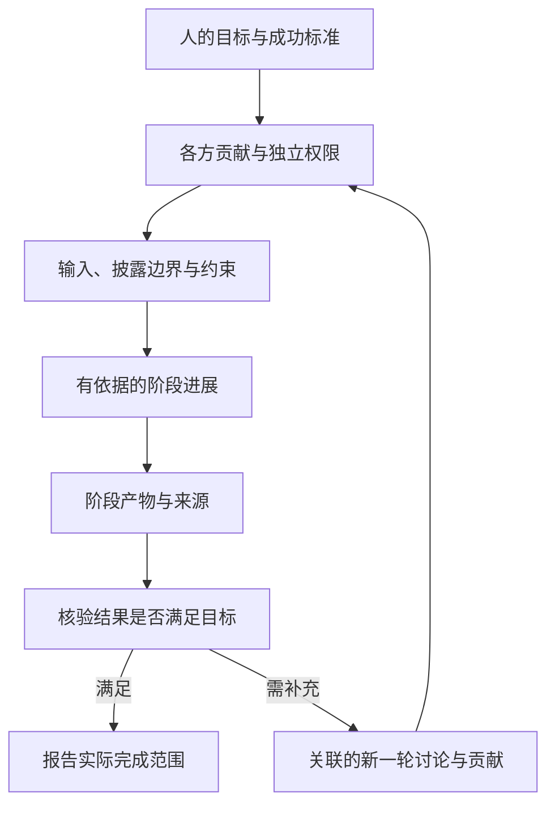

会议模板把成果映射为双方同版约定；资料模板把成果映射为获准快照的发送及有证据的收取状态。S8 的共同研究需另外定义分工、产物、来源与验收协议；现有模板不支持时不显示虚构的“自动研究完成”。

## 11. 状态设计：分开事实，再给出简明判断

### 11.1 四个维度，不能压成一个绿点

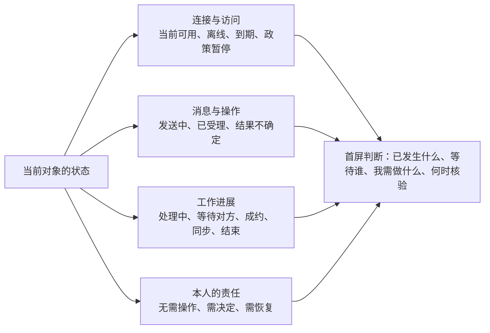

连接正常不等于任务完成；agent 离线不抹去之前已经成立的结果；看过消息不等于授权。当前无法核验时，“无需操作”只能解释最后已知业务状态，不能暗示事情仍在后台运行。

### 11.2 对话回合的显示状态

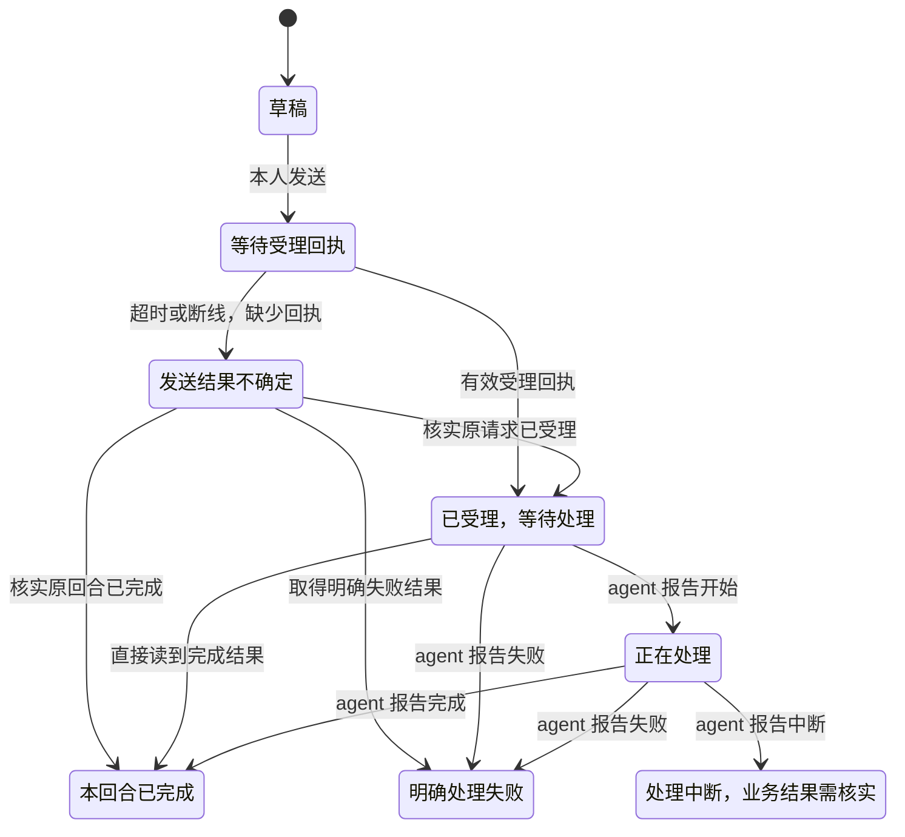

图中是显示投影，不要求客户端观察到每个中间态。网络超时不进入明确失败；回合完成不能替代其中业务动作的完成证据。中断后尚未知的业务结果仍保留待核实状态。

### 11.3 协作的用户视角

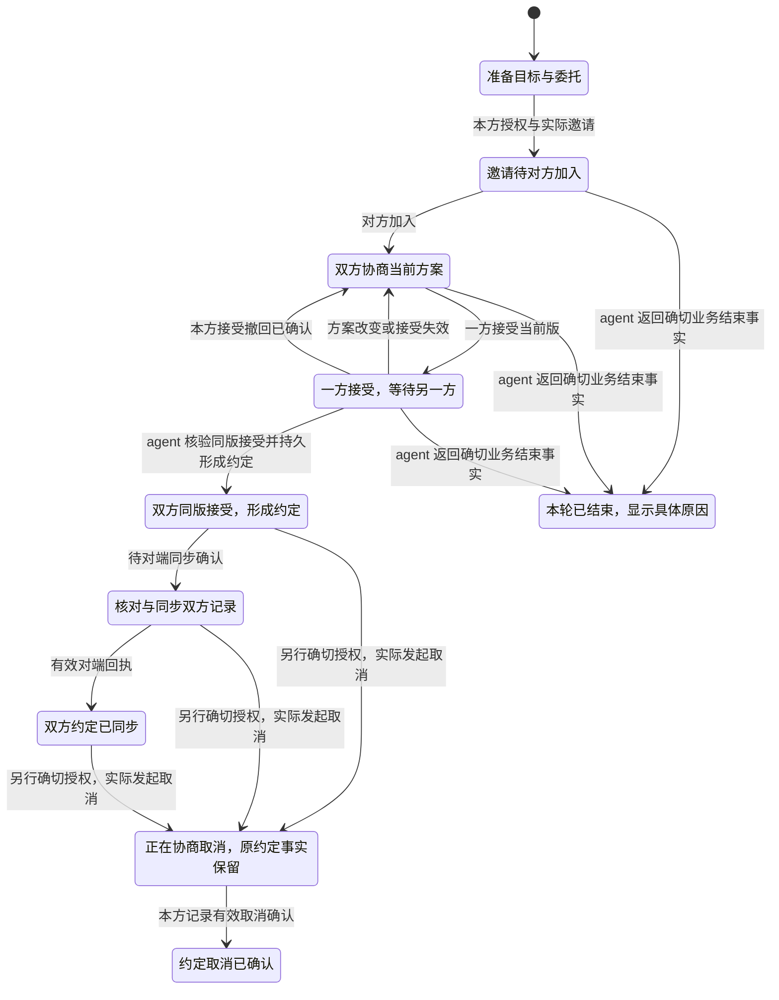

这是设计投影，实际事件可能跳过显示阶段。撤回本方接受后可继续协商；拒绝一个方案不必然结束整件事。“需我决定”“自动推进已暂停”“结果不确定”与阶段并行；委托到期、撤销或暂停不能单独证明双边协作已结束。对端拒绝/结束原因没有权威事实时，不推断成 `closed`。取消待回应时保留原约定，拒绝取消或继续等待按真实事件显示；成立过的历史不被抹去。当前取消终态依据本方有效取消确认，不额外承诺双端取消同步；对端送达/应用状态按实际证据单独展示。

### 11.4 状态 → 信息 → 操作

| 当前情况 | 首屏应说明 | 主操作 |
| --- | --- | --- |
| 已受理，尚未处理 | 哪一回合已受理；仍无结果；若前回合运行，说明等其结束后串行处理 | 正常情况下无需操作 |
| 等对方加入/接受 | 对方、当前版、最后进展、相关期限、当前是否自动推进 | 查看详情；到期后给选择 |
| 需本人批准 | 具体问题、变化、后果、当前有效性 | 回答确切问题 |
| 本方 agent 离线 | 旧记录时间；无法确认最新状态；连接恢复会读取 | 保留草稿；必要时看恢复步骤 |
| 配对到期/撤销 | 哪些能力不可用；agent 明确返回的原因 | 恢复所需访问，不重新建身份 |
| 政策暂停 | 本人暂停或当前披露未确认；历史仍在 | 按实际政策查看与明确恢复 |
| 政策不可核验/平台故障 | 后续控制暂停；此问题不等于配对失效 | 自动退避；需要部署处理时给诊断 |
| 发送或执行结果不确定 | 已知与未知事实、核实对象、最近核实、可用恢复路径 | 安全核实/继续原请求 |
| 双方约定已同步 | 同版条款、双方记录、外部动作未执行范围 | 阅读结果、发起独立后续目标 |

没有可核验预计完成时间时显示“未提供”，只提供实际截止、检查时间或等待时长。不会用转圈、进度百分比或“即将完成”替代事实。

## 12. 通知、未读和回访设计

### 12.1 什么应主动通知

| 事件 | 默认策略 | 点击后 |
| --- | --- | --- |
| 当前有效的本人决定 / 恢复事项 | 提醒，并持续计入待处理 | 当前确切问题与关联事项 |
| 普通对话有新回复或回合结束 | 离开当前对话时按用户设置提醒；多项归并 | 原 agent、会话和回合 |
| 有权威事实的协作完成、拒绝或实质失败 | 一次结果提醒；展开真实原因；本方拒绝加入不推断对端已知 | 同一事项结果 |
| 正常等待、只读刷新、协议 ACK | 不逐条通知 | 进展时间线按需可查 |
| 有限策略到期/预算耗尽，影响目标 | 需要人决定才升级提醒 | 停止原因、剩余范围与可选决定 |
| 连接短暂波动 | 当前界面提示，避免频繁系统通知 | 实际恢复状态 |

普通对话完成通知和对话深链是新增设计；协作 attention、未读/待处理与 Push 已有，应复用其机制与能力边界。

### 12.2 三种“已处理”不能混用

- **看过这一版信息**：更新账户未读显示。
- **agent 已记录普通来信已读**：只有获准的方法写入后，才能这样显示；它不等于对方主人读过。
- **业务问题已解决**：需 agent 返回批准、拒绝、替代、取消或其它确切终态。

建议减少普通来信逐条“标已读”：在清楚告知并获准后，对用户实际打开看到的确切消息版本记录已读。首期可以仅自动更新 Web 本地阅读状态，仍明确区分尚未同步到 agent 的已读；不能把后台同步当阅读，也不能因打开一个事项自动读完所有消息。

### 12.3 提醒与回访路径

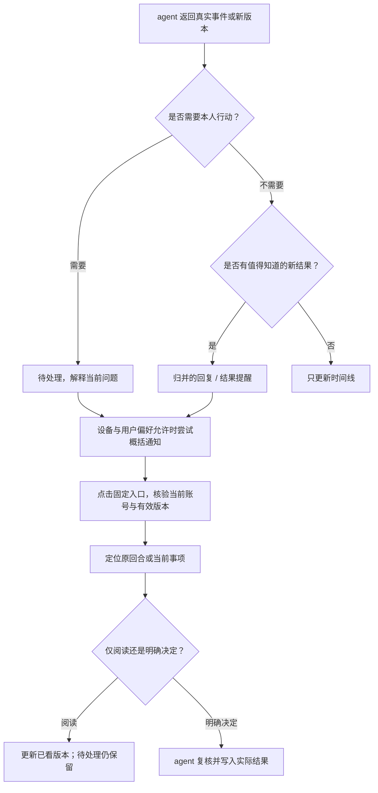

系统通知默认概括，不含私人原文。成功交给推送厂商、浏览器接受显示请求和本人看到通知是不同事实；未收到横幅时仍可从应用内找回。

“你离开后”按确定事件整理：已达成、需决定、仍在等待、不确定/不可核验。每项可点回来源；没有当前数据时明确采用最后保存内容，不生成确定性的新进展。

## 13. 异常与恢复的专门设计

| 异常 | 让人判断的信息 | 自动工作 | 本人的必要动作 |
| --- | --- | --- | --- |
| 网络短断 | 原对象和最近核验；不把断线称业务失败 | 退避读取，恢复后核验 | 通常无需 |
| Agent 所在设备离线 | 历史继续可看，未核验新状态；草稿未提交 | 保留记录和草稿，连接恢复再读 | 需要时恢复设备；不承诺 Web 排队离线执行 |
| 写操作不确定 | 原 ID、已知事实、影响范围；是否仍可继续 | 查询原状态，不自动写重试 | 仅在明确安全语义下继续或本机核查 |
| 换设备后找不到其它写操作恢复记录 | 对话发送已服务端保存；好友、消息、审批、通用协作动作当前记录仅在原浏览器会话 | 设计新增账户操作账本与当前事实核查；不能仅靠丢失记录判断未执行 | 回到原记录或按明确路径核实，不重复创建业务动作 |
| 权限到期/撤销 | 受影响功能与有效期；已有披露保留 | 暂停越权方法，保留关联 | 对原身份恢复所需范围 |
| 老审批被更新 | 旧版不可批准，变化和当前问题 | 读取当前版；提交再次复核 | 决定当前问题 |
| 两端状态冲突 | 哪些记录一致、哪些未核实 | 在有限维护许可内对账 | 无法收敛才处理恢复事项 |
| 不支持操作 | 当前宿主/配对为何不支持，有没有替代渠道 | 能力检查与现有事实展示 | 使用原生入口或请求所需接入 |
| 明确业务失败 | 哪个动作失败、已完成部分、能否补救 | 保存证据，不掩盖部分副作用 | 决定补救/新目标；未授权不自动补偿 |

诊断信息按需展开，避免首页要求人区分 Registry、MQ、helper、runtime。错误与恢复说明保留发生时间及可复制标识，便于精准排查。

同一事项在多窗口/设备处理时：提交前刷新当前问题；另一端完成后当前端显示“已处理/已更新”；不能因为按钮曾经可用就沿用旧版本。未在某次分页出现的事项不自动关闭。

## 14. 功能优先级：按故事闭环推进

这些是建议的设计顺序，不是已批准开发计划。

| 优先级 | 设计包 | 完成条件 | 价值与依赖 |
| --- | --- | --- | --- |
| P0 | 对话作为日常入口 + 首屏判断信息 | S1/S4/S7 能找到原会话、看懂等待与当前可用性 | 主要重组现有 Web 能力；主题和草稿有局部扩展 |
| P0 | 聊天、协作、审批、提醒关联 | S2/S3/S6 从任一入口到同一当前对象 | Web 视图 + 宿主/契约的稳定关联，不能靠文本猜 |
| P0 | 支持目标的协作发起流程 | S2 不填写 ID/JSON；授权问题确切；未开放能力有下一步 | 已有协作工具；需要产品化编排与草案契约 |
| P0 | 当前决定与停止操作语义 | S3/S6 能理解批准、拒绝、暂停、撤回、取消后果 | 已有确切审批与部分停止能力；版本差异和调整关联需扩展 |
| P0 | 不确定结果的完整恢复视图与操作账本 | S5 不重复副作用，跨设备可追溯原请求 | 复用对话持久请求；其它写操作需账户持久账本，不放宽写重试 |
| P1 | 会话列表、已保存历史搜索、格式化阅读 | S1/S7 日常可找可读；明确保存范围 | Web 元数据/索引；不依赖完整 agent 历史 |
| P1 | 对话完成提醒与回访摘要 | 离开后可回到正确回合，未读/待处理分开 | 对话 attention 目标与事件扩展；复用已有通知 |
| P1 | 联系人/资料选择、有限后台策略专用视图 | S2 少复制少填参数，知道自动推进的边界 | 既有联系人/资源/worker 能力 + 专用呈现 |
| P2 | 流式回复、结构化产物、附件、取消回合、完整历史 | 有确切宿主能力与故障语义才开放 | SDK/宿主/契约扩展 |
| P2 | 日历与其它外部执行、更广泛合作任务 | 独立权限、成功证据与部分失败恢复 | 单独能力设计与验证，超出当前约定同步 |

P0 是最小完整目标体验，并不意味着全都只需改 UI。开发前可先把这些故事做成可点击原型，以验证概念和信息顺序。

## 15. 能力边界与设计依赖

### 15.1 可重用的能力，不应重复发明

| 现有能力 | 可支持的设计 |
| --- | --- |
| conversation.send/get + 持久回合/请求 | 文本交流、真实回合状态、刷新恢复、原请求核实 |
| 账户加密副本、已知会话及只读 worker | 换端查看、离线旧记录、自动状态读取 |
| contacts、requests、messages、inbox | 联系人选择、好友流程、归并普通通信记录 |
| collaboration.execute | 准备任务、邀请/加入、方案动作、有限策略、暂停/撤销等专用流程 |
| approval.respond | 本人对 agent 已生成的具体问题作明确决定，含获准的 worker 策略问题 |
| 双边协议、接受证据、attention | 同版约定、等待原因、协作提醒、恢复与结果 |

不能将“Web 可发起协作/审批”整体判为不存在。当前缺口是普通人可用的流程与关联，底层已有大量动作。

已配对的直接 `collaboration.execute` RPC 由 agent 构造可信控制主体，不要求此时有聊天回合在运行。聊天模型调用同一工具时，必须绑定真实宿主的 running turn、主体和有效配对。两条入口均不能由模型参数或外部来信伪造本人权限。

### 15.2 不能靠界面补出的能力

| 设计要求 | 当前边界 | 需补充的契约 / 能力 |
| --- | --- | --- |
| 聊天内可靠关联任务与审批 | 对話回合与 task 缺少明确关联契约 | 本方 agent 返回稳定关联与可用上下文；客户端不解析文字 ID 猜测 |
| 结构化协作草案 | 已有文本与通用工具结果，不等于完整产品草案 | 支持模板的草案字段、来源、缺项、确切审批关联 |
| 实时输出与工具活动 | get 主要返回回合状态及最终 response | 可恢复事件流/中间快照、序号、来源和能力声明 |
| 网页取消模型回合 | 没有 conversation.cancel | 宿主明确“请求取消/已停止/副作用不确定”的语义与回执 |
| 并行、优先级、取消排队与即时插话 | 已有顺序受理、串行处理；新消息不会即时改变运行回合 | 新调度语义、回执与上下文隔离契约 |
| 其它写操作跨设备恢复 | 目前原请求记录在 sessionStorage，对话发送有独立服务端记录 | 账户级操作账本、原参数/ID、结果与恢复权限，保留安全重试边界 |
| 对方可见的邀请拒绝 | 拒绝 join 审批只标本方动作 denied，无专用 v2 拒绝事件 | 有认证回执的拒绝协议与双方状态；当前明确说明未发送拒绝通知 |
| 调整原任务范围 | prepare_task 创建；revoke 撤销；无同 task scope 更新 | 新任务关联/替代或明确的版本化修改能力 |
| 方案/许可差异 | 当前 Web 快照不保证保留完整历史条款 | 有来源的版本历史或结构化差异；缺历史时只显示当前完整问题 |
| 普通对话通知与深链 | 现有 attention target 未覆盖 conversation；完成回合未生成该类 feed | 回合事件、会话/回合目标、深链与阅读版本规则 |
| 全部会话发现/历史回补 | 无 conversation.list；get/inbox 最近 100 项 | agent 列表、游标分页、覆盖范围与删除语义 |
| 文件上传到 agent/结构化产物 | 文本 RPC 不等于文件传输 | 内容、大小、版本、来源、权限、保存与获取协议 |
| 任意自主多 agent 协商 | 有限 worker 是确定性策略；来信不默认唤醒模型 | 新执行能力、授权与预算；不以 UI 话术承诺 |

现有 Web 已保存历史的搜索、分页与显示，不需要先取得 agent 完整历史。网页确切授权在支持且已配对时可直接完成，不应强制所有审批返回 Hermes。

### 15.3 必须保留的产品事实

1. 添加连接、配对访问、好友关系、现实身份、本次委托、有限后台策略、合规披露彼此有独立依据。
2. 聊天“可以”、模型输出、对端消息、已读都不能代替本人确切审批。
3. 协作授权执行由本方 agent/runtime 核验，Web 保存获准副本；托管 Web 可解密处理这些内容。
4. Web 暂停控制、删除连接、本机撤销配对、停止 agent 的合规披露有不同作用。设置中用后果明确区分。
5. 同版双方接受、形成约定、约定同步、日历写入、真实会议举行分别证明。
6. 撤销阻止后续动作，不能召回已披露内容或抹去已发生动作。
7. 未知发送结果保留原 ID 与预算；无权威结果时不自动重做，不报成功。
8. 只有有限策略被明确授权时，才可表示支持后台推进。次数/间隔/期限是可检查条件，不能自动续权。

## 16. 设计验证与证据索引

### 16.1 用 storyboard 做概念验证

先用静态/可点击原型验证理解，再决定是否开发。下面是拟定研究方案，没有在本轮执行，也不是现有产品效果数据。

建议覆盖四种行为模式，包含经常使用 agent 和较少使用 agent 的人；从短访谈确认动机与术语，再让人完成 S1～S7，另用 S8 检验未来泛合作模型。邀请者与受邀者分别测试，不用测试者代替真实用户决定。

| 测试情境 | 直接问/观察什么 | 通过标准的方向 |
| --- | --- | --- |
| 消息已受理但没有结果 | “现在你能确认什么？接下来会做什么？” | 不把提交当完成，不重复发送 |
| 本方在线，业务等待对方 | “谁需要行动？你要做什么？” | 识别对方责任，知道当前无需操作 |
| 已保存完成结果，本方目前离线 | “什么是已知事实？什么尚不能核验？” | 不把断线解释成已有结果失败，也不当成持续运行 |
| 接受好友、加入协作、接受方案 | 让人复述各按钮后果 | 不混淆联系关系、任务授权和具体承诺 |
| 当前方案变更时间并新增资料 | “变化了什么？同意会发生什么？” | 两项变化与披露后果均能准确说明 |
| 发消息后超时并刷新 | 观察下一步和原记录是否能找到 | 不新增同一副作用；能找到安全核查入口 |
| 从通知或几天后回来 | 观察找回目标、问题、结果所需操作 | 不需重新描述目标或跨多入口拼事实 |
| 会议显示双方约定已同步 | “日历创建了吗？会议已经举行了吗？” | 准确识别当前完成范围 |
| 选择暂停/撤销/取消 | 让人说明停止了什么、还保留什么 | 操作语义清楚，已披露内容不被误认为已召回 |
| 收到邀请后不加入，或加入后想退出 | “对方知道了吗？现在有哪些承诺仍有效？” | 理解本方决定、对方通知与约定取消的区别 |
| 合作产物需补充 | 观察能否继续讨论、找到原结果与新一轮边界 | 不重述全部目标，不用机械完成按钮掩盖结果不满意 |

### 16.2 衡量方式

| 指标 | 定义与用途 |
| --- | --- |
| 状态理解准确率 | 能否正确指出已知结果、等待方、本人的责任与未知事实 |
| 决定理解准确率 | 能否复述对象、范围、披露、期限和批准后果 |
| 必要决定数与机械操作数 | 分开计数；减少刷新/复制/找入口，不压低必要授权 |
| 找回上下文所需时间与导航次数 | 从回访/通知到正确回合或问题，定位 R1/R5/R7 问题 |
| 不确定状态下的重复提交 | 观察是否新增相同业务动作，是恢复设计的硬性判据 |
| 无需介入时主动检查次数 | 衡量等待信息是否减少焦虑和检查负担 |
| 无效或重复提醒 | 同事项同版本重复通知、旧通知误导、非行动提醒打扰 |

先记录现状基线，再设置数字目标；不使用未经测量的可用性评分。功能阶段需另外验证真实双 agent、本人独立审批、失效版本、多端并发、故障恢复和现有数据保持；原型理解测试不能证明协议正确。

### 16.3 源码证据索引

以下链接指本地审视源码；行号在本轮工作区可核对，不代表之后版本永远不变。

| 证据 | 源码 / 文档入口 |
| --- | --- |
| “我的连接 / 提醒中心”主导航 | [dashboard-sidebar.tsx](../../agent-collaboration-web/src/components/layout/dashboard-sidebar.tsx) |
| 对话/联系人/事项/收件箱分栏 | [remote-workbench.tsx](../../agent-collaboration-web/src/components/remote-workbench.tsx) |
| 历史选择、纯文本气泡、回合状态、原请求恢复 | [conversation-panel.tsx](../../agent-collaboration-web/src/components/workbench/conversation-panel.tsx) |
| 协作通用 action/ID/JSON 表单 | [collaboration-actions.tsx](../../agent-collaboration-web/src/components/workbench/collaboration-actions.tsx) |
| 协作阶段、条款、接受、同步与等待原因 | [collaboration-snapshot.tsx](../../agent-collaboration-web/src/components/workbench/collaboration-snapshot.tsx) |
| 本人具体同意/拒绝与当前问题 | [mutation-panels.tsx](../../agent-collaboration-web/src/components/workbench/mutation-panels.tsx) |
| 好友、发送、普通来信已读 | [social-panels.tsx](../../agent-collaboration-web/src/components/workbench/social-panels.tsx) |
| 通知与目标路由、共享客户端行为 | [client-contract/index.js](../../agent-collaboration-web/packages/client-contract/index.js)、[notification-provider.tsx](../../agent-collaboration-web/src/components/notification-provider.tsx) |
| 持久工作区与只读同步 | [workspace-sync.ts](../../agent-collaboration-web/src/lib/workspace/workspace-sync.ts)、[Web 技术参考](../../agent-collaboration-web/docs/architecture/TECHNICAL_REFERENCE.md) |
| 对话请求持久化与其它写操作 sessionStorage 的差异 | [workspace-store.ts](../../agent-collaboration-web/src/lib/workspace/workspace-store.ts)（334～341 行）、[use-workbench-mutations.ts](../../agent-collaboration-web/src/components/workbench/use-workbench-mutations.ts)（40～56 行） |
| 回合参数、串行受理、最近 100 项和完成生命周期 | [remote.py](../../agent-comm-platform/agent-comm/python/agent_comm_runtime/remote.py)（228～250、355～389 行）、[Hermes platform.py](../../agent-comm-platform/agent-comm/connectors/hermes-platform/hermes_platform_agent_comm/platform.py)（528～561 行） |
| 当前任务详情、审批生效与任务范围不可原地替换 | [store.py](../../agent-comm-platform/agent-comm/python/agent_comm_runtime/store.py)（347、436、724～733、995 行） |
| 策略需双方加入、有限运行与固定动作 | [worker.py](../../agent-comm-platform/agent-comm/python/agent_comm_runtime/worker.py)（44～88、165 行） |
| 通用协作动作、可信控制主体与真实模型回合 | [runtime.py](../../agent-comm-platform/agent-comm/python/agent_comm_runtime/runtime.py)、[collaboration/remote.py](../../agent-comm-platform/agent-comm/connectors/hermes-platform/hermes_platform_agent_comm/collaboration/remote.py) |
| 双边协议、有限 worker、确认和 attention 的边界 | [协作与提醒](../architecture/COLLABORATION_AND_ATTENTION.md)、[当前架构](../architecture/OVERVIEW.md)、[产品决策](../architecture/DECISIONS.md) |
| 外部执行、代表权和再委托的后续约束 | [尚未实现的扩展](../developers/FUTURE_DIRECTIONS.md) |

### 16.4 本轮交付与验证边界

交付内容为需求分析、产品判断、Persona、7 个首期 storyboard 与 1 个未来泛合作 storyboard、需求追踪、信息架构、功能设计、状态与恢复规则、优先级、能力依赖与拟定验证方案。Mermaid 图用于概念、分镜流程、页面结构、序列和状态表达。

本轮只修改设计文档与开发者阅读入口。文档链接/仓库边界检查和图表结构检查的实际结果在交付时说明；没有应用开发、真实用户研究、业务执行或部署结果。

本地验证：四仓 Markdown 链接与边界检查覆盖 134 份文档，0 错误；15 张 Mermaid 图使用 11.12.0 解析并渲染成功，另检查了协作发起、页面结构和协作状态的可读性。渲染图与验证脚本保存在忽略提交的 `build/web-product-design/`，不属于产品代码。各组件工作区保持无改动。
