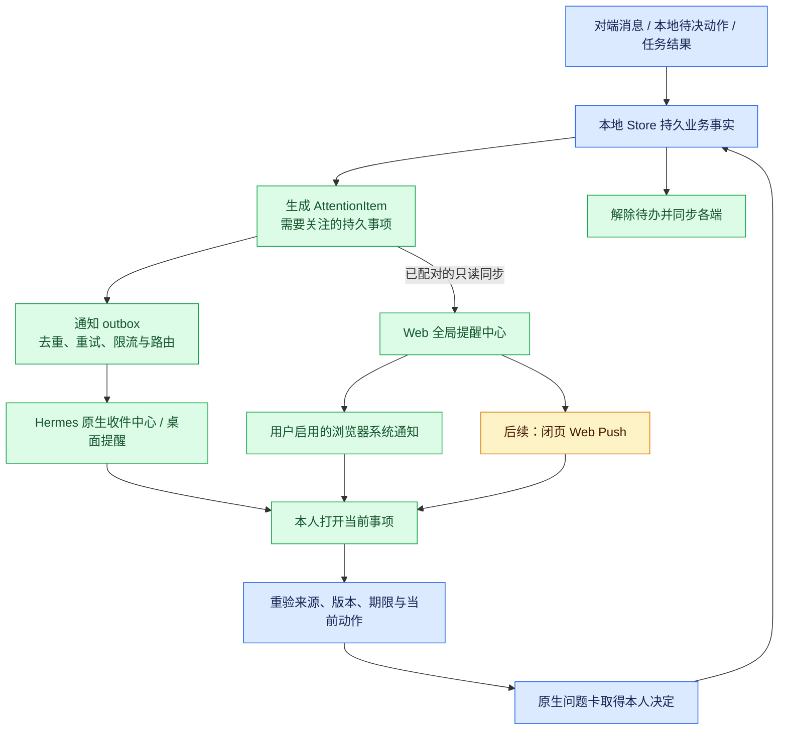
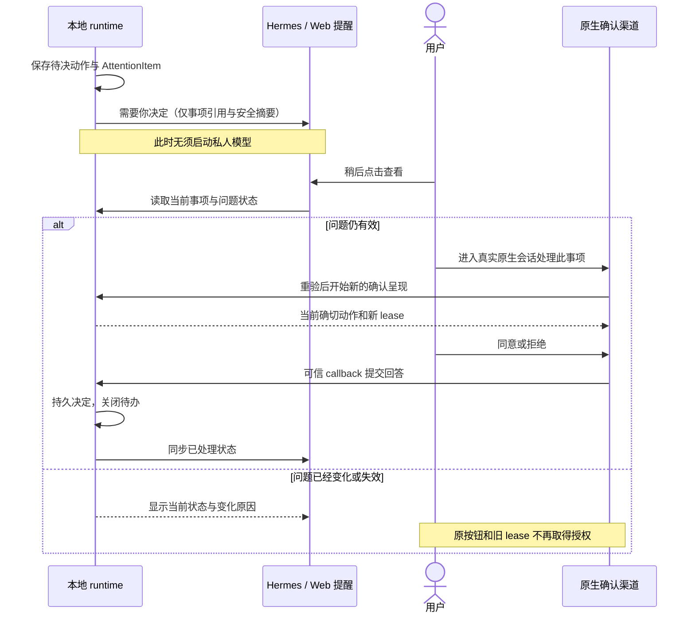

# 面向用户的提醒与授权待办设计 v1

状态：2026-09-15 的补充设计；N1 首版已落实到本地源码，承接已获用户认可的[双边协作设计](HUMAN_AGENT_COLLABORATION_V1.md)。本文保留设计时缺口和分期；当前能力及限制见[实现说明](../architecture/COLLABORATION_AND_ATTENTION.md)，实际验证范围见[验收记录](../verification/COLLABORATION_ATTENTION_2026-09-15.md)。闭页 Push 等后续阶段尚未实现。

## 1. 结论：应当把提醒纳入第一阶段

**用户的观察符合当前协作模式实现：agent-comm 收到消息后会持久保存，但没有接通专门的用户提醒。Web 持续同步数据，也还没有全局通知中心。** 因此用户可能不知道有新的协作邀请或待决定动作，任务就一直等待。

应补齐“业务事实 → 持久待关注事项 → 用户渠道提醒 → 打开当前事项 → 可信确认 → 关闭待办”的链路。提醒不需要先唤醒私人模型，也不依赖后续自动协商 worker 完成。

### 当前证据

| 位置 | 已核实行为 | 缺口 |
|---|---|---|
| [Hermes platform.py](../../agent-comm-platform/agent-comm/connectors/hermes-platform/hermes_platform_agent_comm/platform.py) 的 `_consume` | collaboration 或 remote 开启时，普通 peer 消息调用 `Store.ingest_message`，记录处理结果并 ACK，随后 continue | 该分支没有用户提醒和私人模型回合；非协作模式另有模型处理路径，不能一概称所有模式都不会唤醒 |
| [ports.py](../../agent-comm-platform/agent-comm/python/agent_comm_runtime/ports.py) | 注册框架有可选 `interaction.notification/notify` 和 `host.wake` | 可选接口不代表宿主已实现，也没有自动投递策略 |
| [HermesInteractionPort](../../agent-comm-platform/agent-comm/connectors/hermes-platform/hermes_platform_agent_comm/collaboration/hermes.py) | 只声明 `confirmation`，依赖真实原生会话 callback | 未实现通知能力；后台不能直接借用活动会话的审批权限 |
| [Store](../../agent-comm-platform/agent-comm/python/agent_comm_runtime/store.py) | approval 已持久化；`begin_confirmation` 可在同一主体的新原生会话重新呈现仍有效的问题 | 缺少把用户带回待决问题的入口与通知；不必从零重写确认存储 |
| [Web snapshot-views.tsx](../../agent-collaboration-web/src/components/workbench/snapshot-views.tsx) | TasksSnapshot 展示“需要你确认”，InboxSnapshot 展示来信 | 用户主要在对应详情页才能看见，没有全局未读/待办提示 |
| [workspace-sync.ts](../../agent-collaboration-web/src/lib/workspace/workspace-sync.ts)、[use-workbench.ts](../../agent-collaboration-web/src/components/workbench/use-workbench.ts) | 服务端持续同步，页面轮询读取保存结果 | 同步不等于提醒；未发现 Notification API、Web Push、SSE 通知、通知中心和持久已读模型 |

公开宿主源码补充核查位于本机 `C:/Users/zhang/AppData/Local/hermes/hermes-agent`：已有前端通知相关能力，但 connector 尚未桥接。接入前需验证具体宿主版本和生命周期；不得把名称为 session notification、实际上会提交模型回合的机制当作纯提醒接口。

## 2. 三件事分别处理

1. **提醒用户**：有一件事值得看，或需要本人决定。由程序从可信业务状态生成。
2. **唤醒 agent**：需要模型继续理解或协商。使用主设计中的受限 TaskRunContext。
3. **获取授权**：本人在可信界面看到当前确切动作并作决定。继续使用原生确认，未来才接 Web 确认渠道。

通知中的“查看”“稍后提醒”“标记已读”均不表示批准。关闭系统通知也不表示已读、已拒绝或任务完成。

### 图 1：通知的完整链路

蓝色为已有基础，绿色为本版补充，黄色为后续扩展。



## 3. 什么事件应该提醒

| 类型 | 产生依据 | 建议默认体验 |
|---|---|---|
| `owner_decision_required` | 本地 runtime 已准备确切动作，产生仍有效的待确认记录 | 立即进入全局待办；用户启用的主渠道提醒 |
| `new_collaboration_request` | 已确认对端发来新协作请求，经本地身份/内容校验 | 收件中心新增未读；开启来信提醒后可合并提示 |
| `peer_message_received` | 已获准展示给该主体的来信 | 同事项聚合；常规往返不逐条弹窗 |
| `needs_recovery` | 本地核验失败、业务结果未知或必须人决定恢复 | 持久待办，说明已发生的步骤和当前问题 |
| `task_completed` | 有主设计要求的完成证据 | 合并完成摘要；不用单条 peer “完成了”代替 |
| `connection_action_required` | 本方配对到期/撤销等已核实的连接状态 | 一次提醒，状态不变不重复弹出 |

普通入站消息只能产生“对端来信/请求”的事实；对端正文声称“主人必须立即授权”不能直接生成高优先级的本地批准请求。邀请的期限、优先级先受本地规则约束。陌生或无法归属的消息进入隔离/待认领入口，不发给猜测的主人。

`control.request/response`、后台读取、ACK、网络重试和普通进度不产生逐条用户通知。消息重放、Web 再次同步和页面刷新不会创建新 AttentionItem。

## 4. agent 侧实现

### 4.1 AttentionItem 与投递分别持久化

新增逻辑记录，沿用 agent 本地 SQLite 和事务机制：

```text
AttentionItem {
  attention_id, principal_id, kind,
  source_type, source_id, source_revision,
  task_id?, approval_id?, peer_binding_id?,
  title_template, safe_summary, target_ref,
  created_at, updated_at, business_deadline?,
  state: open | resolved | superseded | expired,
  resolution_reason?, revision
}

NotificationDelivery {
  attention_id, attention_revision, route_id,
  delivery_state: queued | handed_off | failed | uncertain,
  attempts, next_attempt_at, lease_token?, last_error_code?
}
```

`attention_id` 来自本地业务事实的稳定标识；同一 source/revision 唯一。通知正文由固定模板和经过披露检查的少量字段生成，不把完整原文、审批全文、密钥或模型指令放入锁屏通知。`target_ref` 是本地允许的事项引用，不接受 peer 提供的任意跳转 URL。

入站先落业务事实和 AttentionItem，再 ACK；通知发送失败不阻塞已持久接管的消息，也不重新执行业务。通知 outbox 自己重试。若新邀请尚不能确认属于哪个本地主体，则只持久化待归属事实，确认归属之后再生成对应主体的提醒。

所有可见性与现有 inbox/contact/principal 规则一致。不能因为 helper 收到了发给某个 URN 的消息，就通知共享机器上的全部用户或全部 Web 账户。

### 4.2 宿主渠道

实现可选 `InteractionPort.notification`，为它补充明确的版本化参数合约。通知用由可信宿主产生的 `NotificationContext`，绑定主人 profile、路由和受限载荷；不要求正在运行的私人模型，也不伪造 NativeContext。

Hermes 接入由 connector + 原生 UI 桥共同完成：

- 原生 UI 有全局“协作收件与待办”入口、未读/待决数量，即使当前没有活动对话也能发现事情。
- 有前台连接时推送轻量 UI 事件；UI 再读取持久列表。事件只是唤醒提示，漏掉事件可以重连补取。
- 桌面原生通知通过实际支持的前端/桌面接口转发；只实现 Python 方法或 UI toast 不能声称桌面通知已经可用。
- 无 UI、远程服务器或不支持通知的宿主：保留本地待办，通过已配对 Web 通道提醒；通知能力明确标记 unsupported/unavailable。
- 渠道地址和用户归属由本人本地配置/配对确定。不能把通知送到来信对端，也不默认向邮件、即时通信等第三方渠道转发内容。

旧的 `host.wake` 不是实现提醒的前提；任何会把通知变成私人模型新回合的宿主 hook 都不用于此路径。

本机 Hermes 公开源码已经提供可复用的接缝（以下路径相对于上述 Hermes 根目录，须做版本探测与真实集成验收）：

| 接口及代码 | 接入方式与限制 |
|---|---|
| `apps/desktop/src/sdk/index.ts:632` 的 `host.notify` | 前台应用内 toast；待办仍由持久中心保存 |
| `apps/desktop/src/contrib/plugin.ts:43` 的 `ctx.os.notify` | 经用户 Plugin notifications 偏好控制，在离开 Hermes 时发送 OS 通知；返回 void，不能认定用户已看到 |
| `apps/desktop/src/contrib/plugin.ts:85` 的 `ctx.rest/ctx.socket` | 新增协作前端插件向按 profile 鉴权的后端读取待办；socket 加速，保留轮询和断线补取 |
| `apps/desktop/src/store/native-notifications.ts:311` | 当前插件通知使用 plugin 级 tag；应合并摘要并由中心保留各条详情，不能依赖每条 OS 通知都独立保存 |
| `apps/desktop/src/sdk/index.ts:849` 的 `host.openSession`，以及 `:1213` 的 `host.newChat` | 可恢复已保存的同 profile 会话，或打开同 profile 新会话；须保存可信会话映射，不根据来信指定 session |

`tui_gateway/contracts/events.py` 的 `notification.show` 通常只是 UI toast，不能等同于桌面系统提醒。`tui_gateway/session_notifications.py:157` 的 `_notif_submit` 会调用 `_run_prompt_submit`，不选用它实现纯提醒。

### 4.3 从提醒回到原生确认

通知按钮只打开/定位事项。Hermes 插件通知的 activate 可以打开插件页面，因此先接新增协作待办页，再用 `host.openSession` 恢复原生对话；旧会话不存在则 `host.newChat`。当前还没有协作待决直达 `confirm` 的现成入口，应同时提供明确恢复说明和可复制的事项引用。其它宿主没有受信导航接口时采用说明入口，不能伪造已支持的深链。

现有 `begin_confirmation` 已能在主体相同、底层任务/动作仍有效时重新呈现问题，生成新 token 和有限期 lease。当前实现准备问题通常使用最多 15 分钟的期限，呈现 lease 最长 6 分钟；重新呈现受底层委托到期时间限制。**呈现期限结束、业务任务到期和授权撤销是三种状态。** 通知过时后点击，应重新读取当前事实，而不是用缓存的按钮或旧 callback 答复。

如果条款、资源、参与人或权限已改变，原问题被标记 superseded/expired，并重新准备相应动作；原审批令牌永不经通知或 Web 同步传递。当前宿主要求真实活动原生回合才有确认 callback，首版导航引导本人恢复该回合；“直接在全局原生收件中心批准”也要另接可信 UI 回调后才支持。

### 图 2：晚些看到提醒时如何处理



## 5. Web 侧实现

### 5.1 可以先上线的增强

在当前持久同步基础上加入**账户级提醒中心**：全局 Bell/待办入口、跨 agent 未读数、需要本人决定列表、来源、最后核实时刻和截止信息。任何工作台页面都能看见，不必先进入具体 agent 的任务页。

第一小步可以从已经认证并保存的 `collaboration.state` / `inbox.list` 快照派生提醒，无须新增 agent 业务权限：

- 在保存快照的同一数据库事务中，幂等 upsert 提醒投影和源版本。
- 初次建立基线时显示已有待决事项；旧收件历史不作为刚到的新消息批量弹窗。
- 不能因一张不完整快照或最近 100 条窗口没有旧记录，就宣布旧待办已解决。没有明确终态时保留“需刷新核对”。
- 这一过渡方案只能提醒实际同步到的数据，不能保证捕获两个轮询之间出现又结束的短暂事件；可靠性目标需等 agent 持久 attention feed 落地。

随后增加带 cursor、tombstone 和单调 revision 的 `attention.list` 只读协议及共享客户端 schema/fixtures。按 agent 真实授权新增配对方法范围，不自动扩大已有 pairing。Web 在一事务中保存页数据与 cursor，重连/重试不会跳过未保存事件。

服务端同步的 agent 数据一旦保存，全局 UI 可沿用现有页面轮询；SSE 可作为后续低延迟改进。**SSE 仅改善 Web 服务端到已打开页面的传播，不消除 agent 到 Web 的同步延迟。** 若未来改为 agent 主动上送变化，需单独设计被授权的订阅绑定与签名事件校验。

### 5.2 系统通知和闭页提醒

- 页面打开时，可让用户点击“开启系统提醒”，在支持的浏览器和 HTTPS 环境下请求权限；拒绝或不可用时继续提供站内提醒中心。[Notifications API](https://developer.mozilla.org/en-US/docs/Web/API/Notifications_API/Using_the_Notifications_API)
- 页面关闭后的提醒需另外增加 Service Worker、Push 订阅和服务端投递；浏览器支持和系统运行策略会影响到达，不应承诺必达。移动端显示通知需使用适合的平台接口。[Push API](https://developer.mozilla.org/en-US/docs/Web/API/Push_API)
- Push 只携带不含业务正文的唤醒信息和允许的站内定位引用；打开后登录并重新读取当前事项。Push 订阅 endpoint/key 属于账户敏感数据，加密存储、注销/解绑后停用，并限制服务端可访问的推送地址，防止利用注册接口请求任意内网地址。
- 服务端已同步到提醒后，即使 agent 随后离线仍可提示“上次同步时有待办”；不能把缓存当作此刻仍有效的批准依据。agent 一直离线且从未上传的新事件，Web 无法知道。

第一版 Web 按钮提供“查看详情”和“去原生渠道处理”，不添加通知内“同意”。以后在 Web 直接确认，必须实现独立的可信 InteractionPort；不是给普通 `conversation.send` 加一个“同意”文本。

## 6. 已读、多端、安静时段与可靠性

### 状态语义

| 记录 | 谁维护 | 含义 |
|---|---|---|
| `AttentionItem.state` | agent 的当前业务状态；连接类提醒由 Web 自己的连接状态产生 | 这件事是否仍需处理 |
| `seen_at/snoozed_until` | 当前用户的提醒偏好存储 | 用户看过或希望稍后提醒，不改变批准状态 |
| `NotificationDelivery` | 各投递渠道 | 已排队、交给渠道或失败；不证明用户看到 |
| 审批决定 | 可信原生确认/未来独立确认渠道 | 确切动作被批准或拒绝 |

Web 已读按 `(account, connection, attention_id, source_revision)` 保存，保护账户隔离；同账号多浏览器通过服务端同步。内容有实质变化的新版本重新变成未读。点“已读”不能减少仍待决定的数量，点“稍后”不能延长业务 deadline。

Hermes 和 Web 第一版可各自维护已读，不能声称已经跨系统同步。若要一处处理后所有地方消除红点，以 agent 发出的已处理业务终态为准；若进一步同步“看过”，新增受限的 `attention.seen` 通道与相应配对，绝不能借已读接口批准动作。

### 提醒策略

- 用户选择主提醒渠道，默认对“需要决定”和“需要恢复”积极提醒；普通来信按事项聚合。静音和关闭外部通知始终保留站内待办。
- 支持免打扰时段、按联系人/事项静音、稍后提醒。临近截止是否打破免打扰由用户提前选择，peer 自报 urgent 不生效。
- 对同一版本初次提醒一次；允许用户选择在业务截止前再提醒一次。固定上限和退避防止长期无人回应时不断弹窗。
- 同浏览器多标签用稳定通知 tag、可用的 tab leader 机制和服务端投递记录减少重复。进程恰好在展示后崩溃时不能保证 OS 通知严格一次；持久提醒中心保证不靠弹窗保存唯一事实。
- 对已读普通消息不重复弹窗；尚未决策的任务仍留在待办区域。源事项解决、替代或到期时停止旧版本重试，尽力关闭已展示通知。

## 7. 代码落点与交付步骤

| 阶段 | agent / Hermes | Web | 验收重点 |
|---|---|---|---|
| N0 可见性补强 | 复用现有 inbox/approval 数据和原生确认 | 全局提醒中心、待决数、已读与通知偏好；现有快照派生 | 换页面/刷新仍能发现待办，不能由已读产生授权 |
| N1 可靠提醒，纳入主设计 M1 | AttentionItem、事务 outbox、持久 cursor feed、Hermes 纯提醒桥、原生事项恢复入口 | 认证同步 attention feed，系统通知按用户开启，多端源状态收敛 | 不唤醒私人 LLM 也能提醒；离线/重启不丢待办；旧卡不能批准新动作 |
| N2 闭页送达 | 保持事实与权限检查在本地 | Web Push、订阅生命周期、频道偏好与回执观察 | 目标浏览器实测、解绑停发、锁屏摘要、丢推送仍可从中心补取 |
| N3 直接确认 | 实现并验证新的可信确认适配器 | Web/Apple 展示当前动作并提交专用确认凭据 | 主体/问题/版本/nonce/期限绑定；普通通知点击与聊天无法代批 |

建议代码位置：

- runtime：`store.py` 的入站/approval/操作终态事务生成 attention；新增 attention 规则和队列模块，权限检查继续复用当前实现。
- Hermes：`platform.py` 的协作持久接管分支接入记录；Interaction 适配器与宿主 UI 插件桥负责投递，不调用 private LLM notification queue。
- Web：`src/lib/workspace/workspace-store.ts` 保存提醒投影；后台同步 worker 补拉 attention feed；新增账户提醒 API/表、全局 Provider 和中心组件。
- client-contract：版本化 AttentionItem 投影、分页/已读契约、来源状态和 fixtures。数据序列化不携带原生 callback token。

新增验收至少覆盖：消息重复不重复提醒；纯控制轮询不提醒；陌生 sender 不触发主人审批；未开启私人 LLM 也能提醒；通知失败不丢业务消息；离线恢复；同主体跨原生会话重新呈现；旧问题失效；待办已读仍待决；不同账户隔离；单一正常事项不因多标签反复弹窗；注销/配对撤销后不再向对应渠道推送新的业务内容。

**本轮结论：N0/N1 应成为双边协作 M1 的一部分。完整授权机制必须让用户及时发现并重新进入待决事项；这比优先扩展自动协商更基础。**
