# 人—Agent—Agent—人的协作与授权设计 v1

状态：**总体设计已获用户认可，M1/N1 首版已落实到本地源码**。日期：2026-09-15。当前能力与限制见[实现说明](../architecture/COLLABORATION_AND_ATTENTION.md)，验证及部署范围见[验收记录](../verification/COLLABORATION_ATTENTION_2026-09-15.md)。本文的“当前基础”保留设计时基准；M2/M3 与后续探索仍为规划，不代表全部实现或上线。提醒与授权待办需求见[补充设计](ATTENTION_AND_NOTIFICATIONS_V1.md)。

## 1. 结论与项目适配

**引用讨论的方向合理，而且与项目“agent 侧持有事实和权限”的架构高度契合。建议在现有本地授权内核上补齐双边协作协议，再增加受限后台协商和外部执行。**

需要修正一个起点：项目已经精细设计并实现了一部分人→agent 授权。尚未闭合的主要是 A↔B 之间的事项关联、双方承诺、代表权证据、异步推进和履约核验。

### 1.1 当前基础与实际缺口

源码基准：部署仓库 `e7f0cee69074b84199ab9745b4084e250a0a5ac0`；固定 Web `ea736ec4c21f902f2529a3a9ba225957cc9ba4f9`、Platform `a91d99f756f38af2a5323e4f7084b74fd447699c`、SDK `d47f0a559bb4fe41a9f0a9b2ee359928ddf09ae5`。

| 能力 | 当前证据 | 本设计补充 |
|---|---|---|
| 端点身份与消息来源 | [TRUST](../../agent-comm-platform/agent-comm/docs/architecture/TRUST.md)、[信封校验](../../agent-comm-platform/agent-comm/crypto/envelope.go)：URN、公钥、签名、目标收件人校验 | 端点代表谁、对本次承诺有何依据；网络身份不能替代代表权 |
| 人→本地 agent 授权 | [policy.py](../../agent-comm-platform/agent-comm/python/agent_comm_runtime/policy.py)、[store.py](../../agent-comm-platform/agent-comm/python/agent_comm_runtime/store.py)：5 类动作、范围、时段、期限、数量、固定资料快照、逐次自由文本确认 | 将现有委托投影为可解释的授权关系，补充权限版本和后台运行边界 |
| 真实确认来源 | [runtime.py](../../agent-comm-platform/agent-comm/python/agent_comm_runtime/runtime.py)、[ports.py](../../agent-comm-platform/agent-comm/python/agent_comm_runtime/ports.py)：HostSession、确认 callback、执行前重验 | 保留原生确认；后台事件不能伪造主人会话 |
| 重试与恢复 | Store 的 `prepare_action`、`dispatch`：稳定 operation/message ID、预算预占、持久状态 | 增加协议事件去重、接收回执、乱序处理、双边状态恢复 |
| 会议提议与接受 | `agent-comm-collaboration/v1`、`import_proposal`、`accept_meeting` | 当前表达接受并发送消息，但没有双方接受集合、可核对的约定记录和完整闭环；也不写日历 |
| 双方事项关联 | 现有双 owner 测试事先为双方创建同名任务 | 新建共享 collaboration_id；双方各自映射到不同 local_task_id 和本地委托 |
| 自动协商 | 入站消息持久化；当前不自动启动私人模型 | 增加限于既有任务授权的调度器和受限 worker |
| Web / 平台 | [当前架构](../architecture/OVERVIEW.md)：Web 保存获准的加密副本；Platform 提供 Registry/MQ/Relay | Web 展示双边状态和证据；平台声誉只能基于另行获准的数据 |
| 真实验收 | [Hermes 协作验证](../verification/HERMES_COOPERATION_TEST_2026-09-15.md)验证一个已绑定 Hermes 的建议、修订、远程会话和同步 | 仍需两个独立主体、两个 agent 的完整验收；既有测试未创建会议或联系真实他人 |

### 1.2 对引用讨论的取舍

1. **接受“已知双方、善意合作”作为首版场景。** 双方仍有利益差异，模型和工具仍会出错；继续保留签名、权限、重放、注入和恢复检查。
2. **权限按动作组合。** 信息披露、协商、承诺、执行、补救、再委托分别表达；产品可以提供预设，底层不能用单一等级代替。
3. **授权图有价值。** 首先将已有记录投影成有类型的关系；不必引入图数据库，也不通过图的可达性推导权限。
4. **A 对 B 的了解值得尽早建设。** 优先保存可追溯事实和沟通偏好，再产生有限的关系判断。
5. **平台声誉后置。** 云 MQ 的密文和 Web 的某个账户副本都不是可自由汇总的履约数据。公开评分需要同意、证据、申诉和抗操纵设计。
6. **业务承诺需要显式协议。** 在自然语言里说“接受”已经可能让人产生依赖；系统必须同时记录接受了哪个版本、哪部分责任，不能仅靠聊天文字驱动状态。

外部规范支持这些边界，但不替我们完成应用设计：A2A 明确把任务内授权的范围、有效性与撤销语义交给实现方；因此采用 A2A 也仍要实现本文的规则。[A2A §7.6.4](https://a2a-protocol.org/latest/specification/#764-in-task-authorization-scope)

AP2 对交易约束、可信确认界面和回执的处理可作参考；其 agent 间再委托及具体争议处理仍在当前规范范围外。本项目首版只借鉴这些原则，不声称实现 AP2。[AP2 规范](https://ap2-protocol.org/ap2/specification/)

信任、职责、验收与动态恢复也出现在研究框架中；这支持我们考虑这些维度，不能证明某套声誉评分已获验证。[Intelligent AI Delegation](https://arxiv.org/abs/2602.11865)

## 2. 首版目标与信任假设

**示范事务：两位已确认联系人，各自授权自己的 agent，交换指定空档和资料，接受同一个 30 分钟线上会议方案，双方能核对结果。** 第一批交付以“方案达成”为完成标准；日历创建属于后续明确启用的执行能力。

场景假设：

- a 与 b 已通过可信渠道确认彼此的 agent 端点；本地联系人绑定保留确认来源和时间。
- 双方信任自己安装的 runtime、确认渠道和 helper。对端消息始终作为外部输入，不成为主人命令。
- 第一阶段接受“可信联系人所属端点声明自己已获授权”的有限保证，界面标为**对端声明**，不标为“已独立验证本人授权”。
- 一件事的双方是独立委托人。A 请 B 协作，不等于 a 把自己的权限转授给 B；B 使用 b 的授权决定如何回应。
- 每方数据、偏好和授权保留在本地；只有双方批准披露的内容跨边界发送。

颜色用于标记工程状态，与引用讨论的颜色含义有所调整：**蓝色=当前已有基础；绿色=本版拟新增；黄色=后续扩展；粉色=尚待验证；灰色=人或外部系统。** 无颜色的时序图、ER 图与状态图均为提案。

### 图 1：总体职责与四方边界

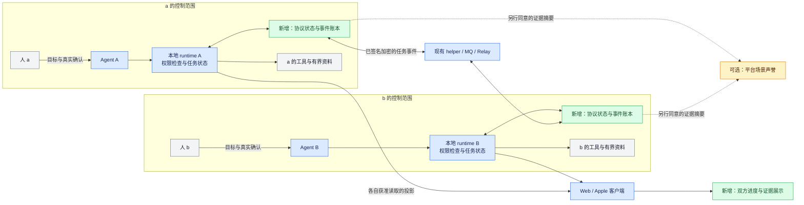

## 3. 委托与权限：每个人只授予自己能授予的范围

### 3.1 产品预设与机器权限

| 产品预设 | 实际能力组合 | 仍须单独检查 |
|---|---|---|
| 帮我交换信息 | 披露获准空档、固定资料快照、询问必要字段 | 接收者、字段、快照版本、数量和目的；不能附带私人原因 |
| 帮我谈出方案 | 上述能力 + 提议 / 请求修改 | 提议不是接受；变更参与人不得顺带扩大资料接收者 |
| 范围内替我确认 | 上述能力 + 对固定方案作出承诺 | 主题、参与人、时间、责任、版本、有效期 |
| 替我执行 | 另授外部适配器的具体动作 | 工具账号、资源、金额或次数、幂等、验收、补救范围 |

`send_text` 继续逐次确认确切全文。自动协商使用固定 schema 和程序生成的文案；让 LLM 给任意文本标上“仅协商”不足以阻止它泄露信息或作出额外承诺。新的结构化字段也必须通过披露检查。

业务能力分组是产品解释层，现有 `share_slots/share_resource/propose_meeting/accept_meeting/send_text` 保留其实际边界。`calendar.create`、`calendar.cancel`、`delegate` 等名称在本文中仅指未来能力，当前 API 不接受它们。

### 3.2 本地 Grant（授权记录）

将现有 task scope 保留为授权事实来源，逐步增加以下字段；授权图从这些记录生成。

| 字段组 | 必需内容 |
|---|---|
| 来源 | `grant_id`、`principal_id`、`agent_urn`、原生确认记录引用、`policy_version` |
| 绑定 | `local_task_id`、联系人绑定版本、用途说明；共享 `collaboration_id` 只在成功 join 后绑定 |
| 动作 | 明确 capability 集合；资料披露按接收者分别授权 |
| 数据 | resource ID + 固定快照 / hash、字段 allowlist；完整资料授权不能解释为无限衍生披露 |
| 约束 | 已有 UTC 时段、时长、主题、人数、累计候选和动作数量；扩展 worker 回合/费用上限 |
| 时效 | 生效时间、到期时间、`active/revoked/expired/superseded`、撤销版本 |
| 再委托 | 首版固定禁止；未来才启用父 grant、受让方、衰减范围、最大深度 |

用途是给人理解的说明，不能代替机器条件。例如“工作日下午”必须转换为用户时区下的实际日期区间，再规范化为 UTC，展示时同时保留当地时间和时区。

确认范围变大时生成新版本，并使绑定旧版本的未执行准备记录失效。单次例外绑定确切 action digest、收件人、资料版本、方案版本、有效期；不改变常规 Grant。已经过期、撤销或耗尽预算的委托需要新委托，不能靠例外绕过。

### 图 2：一次动作怎样取得执行资格

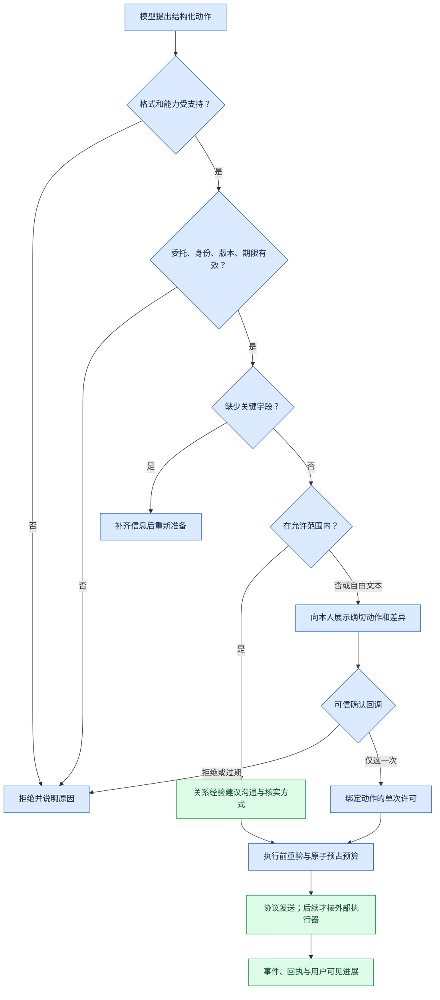

授权检查产出 `allow/ask/clarify/deny`，沿用当前含义。经验判断可以增加核实、暂停或建议请示；不能把 `deny/ask` 变成 `allow`。可靠性下降时收紧自动执行也应符合用户批准的监督规则，而非秘密修改授权事实。

## 4. A↔B 协议：为同一件事建立可恢复的双边记录

### 4.1 协议版本与身份映射

建议新增 **`agent-comm-collaboration/v2`**，通过现有签名加密传输承载；不扩展 `agent-comm-control/v1` 成对端控制接口。v1 解析是严格字段校验，不能原地添加字段并期待兼容。

双方成功协商 v2 后才发送其业务事件。没有共同版本时保留旧消息交流，显示“对端不支持结构化约定”，不推导自动接受或协议完成。

- `collaboration_id` 由发起方生成，绑定发起方 URN 和随机 ID；接收方不得将它直接当本地 task_id。
- 邀请经过本地联系人路由，b 在可信渠道批准该项新任务后，才能建立 `collaboration_id → local_task_id → principal_id → grant_id` 绑定。M1/M2 每个新邀请均取得本项原生委托；自动衍生新任务的常驻规则另期实现。
- `join` 只表示愿意处理此任务，不代表接受最终方案；双方无需使用相同 local_task_id。
- 对外参与人用端点 URN 与协作内 `actor_ref` 表达，本地别名、contact_id、profile principal 和授权全文不发送。`self` 必须先转换为明确的参与方，避免在对端改变含义。
- 首版一项双边事务只允许每个端点绑定一个已确认的代表身份。共享多用户端点若无法通过本地确认绑定到明确主体，就停在待选择，不从对端传来的 owner 字段推断本地身份。

### 4.2 事件结构

以下是拟新增的逻辑 schema，不是现有工具可直接提交的请求：

```text
CollaborationEvent {
  protocol: "agent-comm-collaboration/v2",
  collaboration_id, event_id, kind,
  sender_urn, recipient_urn,
  sender_sequence, previous_event_id,
  in_reply_to, created_at, expires_at,
  terms_revision?, terms_digest?,
  payload, payload_digest
}
```

`sender_urn/recipient_urn` 必须等于 helper 已验证的信封身份。序号按该发送者在该事项中递增，不构成双方共享的全局时钟。时间均为带时区 RFC3339；有效性采用接收方可信时钟，并定义允许偏差与过期处理。

v2 采用 [JCS（RFC 8785）](https://www.rfc-editor.org/info/rfc8785/)作为规范 JSON 编码合约，限制 schema、深度、长度、数值和 Unicode，提供 Python/Go/TypeScript 相同输入的 digest fixtures。原有本地 `canonical()` 不因此自动成为跨语言协议标准。公共 `terms_digest` 只计算双方相同的公共条款；现有 `action_hash` 包含本地联系人、资料和任务信息，不能拿来跨端比较。

| 事件 | 含义与前置条件 |
|---|---|
| `invite` / `join` / `decline` | 建立事务关联；invite 的主题和说明也受 a 的披露许可约束；join 需要 b 的本地依据 |
| `information` / `question` | 受控资料、空档或有限字段请求；不能夹带新执行指令 |
| `proposal` / `change_request` | 固定版本的完整条款，或要求发起方生成下一版本；不自动构成接受 |
| `accept` | 对确切条款和本方责任作出接受，绑定条款 digest 和授权依据 |
| `agreement` / `agreement_ack` | 携带双方接受证据的约定记录，及对该记录的接收确认 |
| `pending` / `decline` | 只披露获准的等待或拒绝信息，不透露私人审批原因或隐藏偏好 |
| `withdraw` / `cancel_request` / `cancel_ack` | 达成前撤回本方接受；达成后请求结束约定，分别处理 |
| `receipt` / `sync_request` / `sync_response` | 事件接收与遗漏事件补取，不作为业务成功凭据 |
| 后续 `execution_result` / `verification_result` | 声明外部执行结果与验收证据；第一批能力清单不启用 |

这些协议发送也经过 allowlist 和预算检查；不能新增一个可绕过 `send_text` 审批的任意 `send_event`。控制回执由程序模板生成、只返回已知事项的最少元数据。重投同一事件不再次消费业务动作预算；网络重试仍受总次数/流量限制。回执不为回执递归生成回执。

### 4.3 幂等、乱序与 ACK

- 验证来源、格式和摘要后，先使用 `(local_principal, collaboration_id, sender_urn, event_id)` 查询去重记录；同键同 digest 返回原处理结果，同键不同内容拒绝并记录冲突。已应用事件即使现在过期，重放也只返回历史结果，不重新消费权限或执行。
- 首次到达的事件才检查是否仍可产生新的业务决定；过期事件持久记录 rejected 并 ACK。同步可恢复已形成决定的历史证据，但不能给旧事件换时间、ID 或重新取得执行资格。`accept.valid_until` 是协调者形成约定的最晚时刻；已形成约定的履行期限和取消规则由 Terms 单独定义。
- 收到事件先验证、事务内持久化事件与状态投影、写入必要的回执 outbox，再 ACK 本地 inbox。发件箱按稳定 message_id 投递；崩溃后重投相同事件。
- `receipt` 表示对端 runtime 已持久接收并给出处理状态，必须区分 `applied/buffered/rejected`；不表示人同意、外部执行或全局完成。
- 依赖尚未到达时保留为 buffered，按前驱和条款版本补取；超过时限进入人工可见的恢复状态。冲突事件不采用“最后一条消息获胜”。
- 不以 MQ TTL、Web 缓存 TTL 或收到时间决定业务去重期限。事件正文可按保留策略清理，但只要旧事件仍可能被接受，就保留去重 tombstone；已关闭事项拒绝重新开启的历史事件。

本地接收、记录、查询既有事实不依赖业务 Grant 仍有效。对外的最小状态同步和维护回执使用单独的 `ProtocolMaintenancePermit`：在原生任务确认时明确展示并授予，固定事项、对端、模板、数量与期限（建议任务结束后最多 7 天）。它只允许查询/回传已有状态、接收回执与权限停止通知，不允许新资料披露、模型协商、接受新条款或执行补救。用户选择完全停止联系时也撤销该许可，界面保留“对端状态尚未同步”。真正的撤回、取消约定及补救另按其决策权限处理。

### 图 3：双方独立委托、建立事项并达成约定

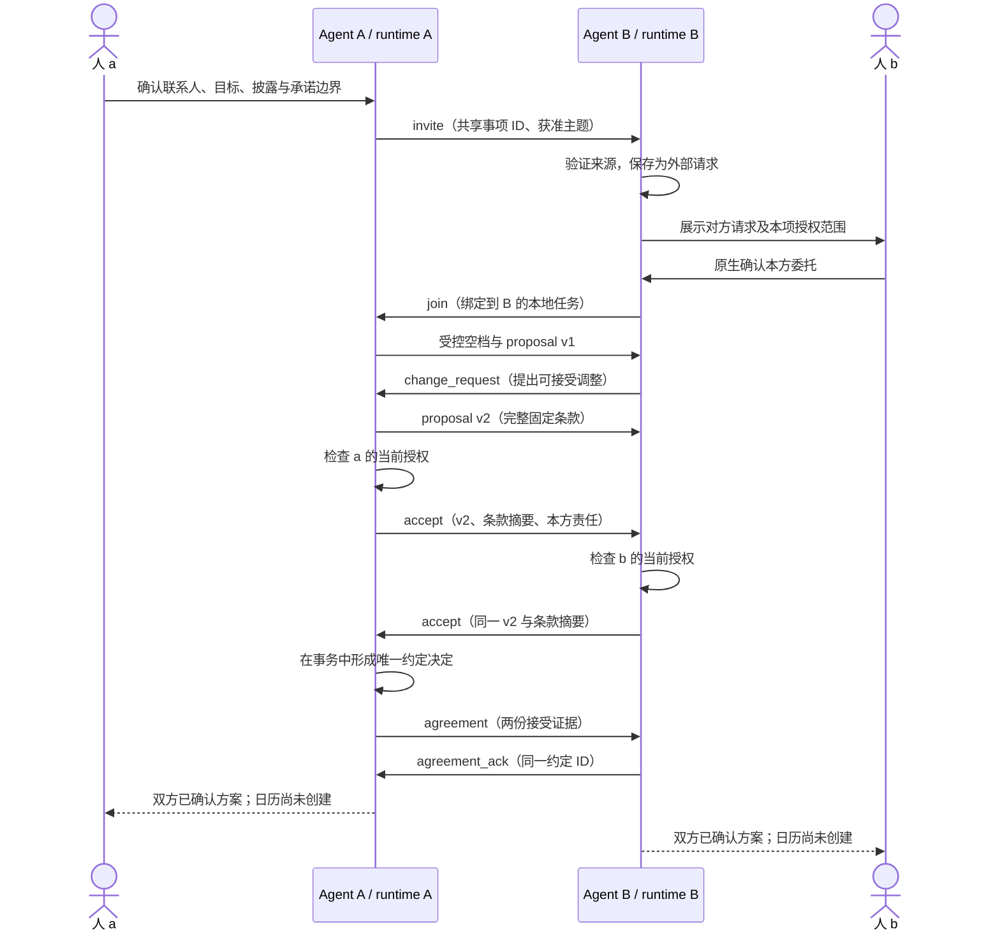

上图的业务消息受各方自己的权限约束。M1 通过宿主主动恢复逐段驱动；M2 完成受限 worker 后，范围内的往返可自动推进。

## 5. 承诺与代表权：对方到底证明了什么

### 5.1 Terms、Acceptance、Agreement

Terms 至少固定：类型与版本、双方参与身份、主题、时间与时区、时长、地点/线上方式、各自责任、完成标准、截止时间、取消规则，以及下述由发起方串行处理成约与撤回的规则；资料共享单独列出精确接收者和资料引用。首版会议条款必须明确 `fulfillment_mode=agreement_only`，不能包含“已创建会议”的暗示。

发起方 A 是本事务唯一条款版本发布者。B 发 `change_request`，A 发布带前版引用的新版本，避免双方同时写不同 v3。A 不因协调角色获得 b 的决策权。发起方失联时等待、超时关闭或另开事务，首版不做协调者自动选举。

`accept` 与 proposal 分开，即使 A 自己提出的方案也要经过 commit 权限检查。接受证据绑定 `(collaboration_id, terms_revision, terms_digest, actor_ref, own_obligations, authority_basis, valid_until)`。字段改变必须新版本和重新接受；不沿用旧确认。

本地同时具备两份接受记录时，可显示“已观察到双方接受”，尚不自行宣布成约。**唯一成约点是协调者 A 在单一本地事务中写入不可变 formation 决定**：两份接受均匹配当前条款、在成约期限内、未被先处理的撤回失效。此事务同时保存 Agreement 和发送 outbox。A 只执行双方已接受的裁定规则，不能替 b 作出接受。

Agreement 固定 `agreement_id`、`formation_decision_id`、`formed_at`、`terms_digest`、两份接受事件摘要和已处理双方事件游标；同 ID 不同内容拒绝。B 核验并保存后 ACK，A 收到 ACK 后显示“双方已同步约定”。ACK 只确认保存决定，不形成第二次接受。B 保存而 ACK 丢失时约定仍存在，双方靠同 ID 重放和查询收敛。

Agreement 引用的每份 Acceptance 必须匹配**本地已持久保存、经实际发送者来源校验的入站事件，或本方不可变的出站记录**；不能把 A 载荷中嵌入的“B 原文”直接当作 B 的有效接受。缺失记录时 buffered，并向该记录的实际发送方补取。双方核验 actor 绑定、完整条款摘要、本方责任、有效期和依据类型。聚合两份端点声明不会升级代表权等级。

同一版本一旦发出本方 accept，就不能静默改版。撤回以 A **应用 withdraw 的事务是否早于 formation 事务**为裁定点：在前则接受失效，在后则返回已成约证据，必须另行处理 cancel_request。B 发出 withdraw 就暂停本方执行，显示“撤回待核对”，直至获得决定；不能立即显示“已撤回”。发现事件缺口或冲突则进入 `reconciling`。

超过 accept 的成约期限才首次收到 Agreement 时，B 可通过同步记录核查 A 是否在期限内已经形成约定；这只是恢复历史事实，不能据此重启过期的执行许可。首版在善意且已确认的端点假设下依赖 A 的 formation 时间与记录声明，不声称它是独立可信时间证明。已经形成的承诺不因本地 Grant 后来撤销或 accept 凭据到期而消失。

### 5.2 代表权保证级别

| 级别 | 对端可核查什么 | 首版用途 |
|---|---|---|
| `peer_attested` | 已绑定端点签名发送了此接受事件，并声明本地检查通过 | 已知联系人、低风险方案协商；本版默认 |
| `authority_verified` | 另有被接受的授权签发者，签发者与本人关系经独立确认；凭据绑定受众、具体动作、时效、撤销版本 | 后续组织部署或独立可信确认服务 |
| `execution_verified` | 特定执行事实有工具回执或约定验收依据 | 是执行证据维度，不能用来替代前两种代表权判断 |

普通通信密钥签署一句“我被授权了”，只提供 `peer_attested`。现有原生确认记录是本地依据，不是外部可独立验证的人类签名。第一阶段依赖对熟悉主体及其运行环境的信任；如果业务要求强代表权证据，就暂停该业务，直到相应签发与验证体系落地。

对端只接收本次 action 的必要依据，如 `basis_type`、随机的对外依据引用、`action_digest`、判定时刻和有效期；不发送完整 grant、审批对话、私人日历或隐藏底线。简单 hash 不能隐藏可穷举的偏好，不把私有策略 hash 当隐私方案。

### 图 4：本地授权证据与对外声明的区别

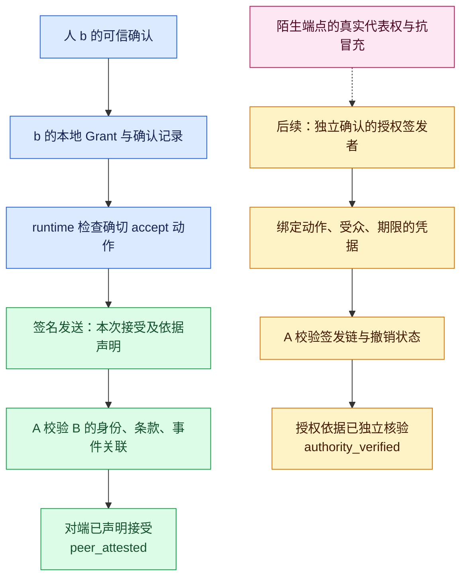

## 6. 状态模型：分开权限、约定、投递与履约

至少保存四个独立状态维度，UI 按证据组合文案：

| 维度 | 示例 |
|---|---|
| Grant | active / revoked / expired / superseded |
| Collaboration | invited / negotiating / partially_accepted / agreed / reconciling / closed |
| Delivery | queued_local / peer_persisted / buffered / rejected |
| Execution（后续） | not_requested / planned / running / uncertain / verified / compensating / needs_manual_recovery |

`waiting_reason` 作为独立字段：owner_decision、peer_response、missing_event、tool_reconciliation、budget、offline。一次人类例外不会抹掉原有协商阶段。`closed` 同时保存 closure_reason（declined、expired、cancelled、agreement_only_complete、fulfilled），并保留历史。

### 图 5：约定状态机

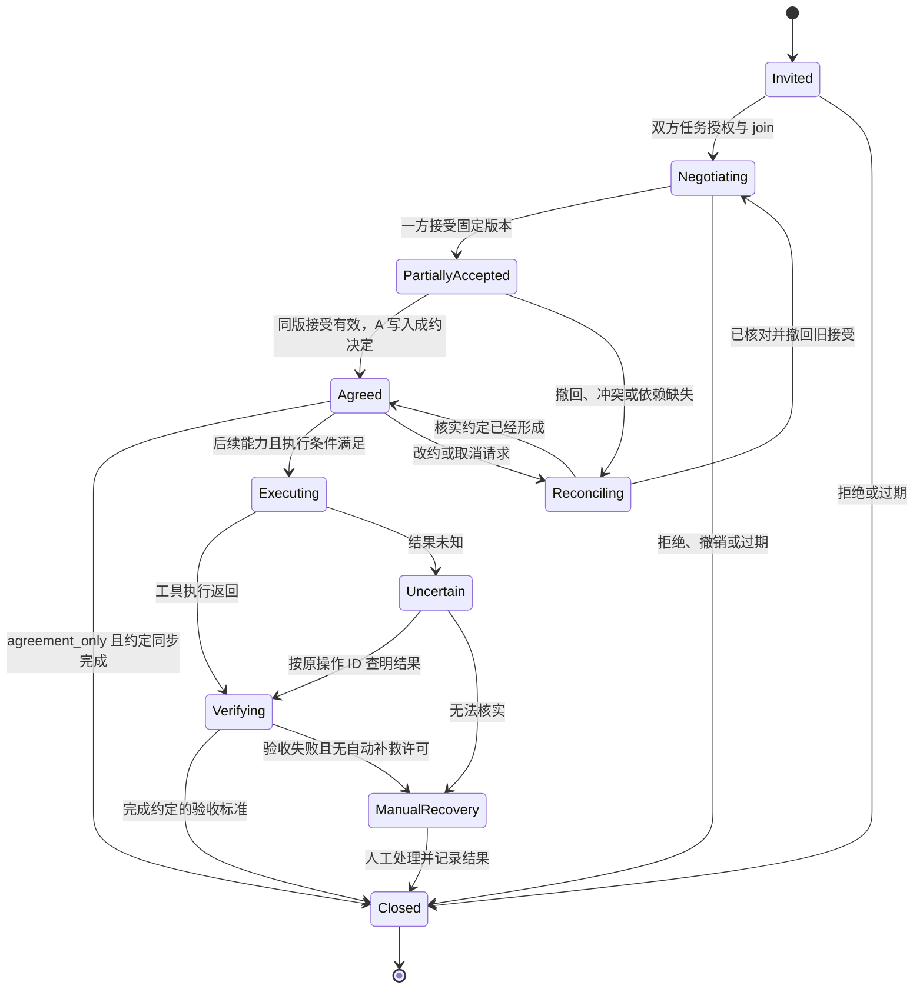

已关闭事务收到迟到或重复消息，只更新必要证据/去重记录，不恢复可执行状态。已完成方案要改期，另开带 `supersedes_agreement_id` 的修订事务，经双方明确接受后替代旧约定。

## 7. 主动推进：受限任务运行上下文

当前 HostPort 证明的是实际宿主会话；不能为了后台协商把 peer sender 伪装成 owner，或凭空制造 NativeContext。

建议新增 host 内部的 `TaskRunContext`，由可信调度器在事务中依据当前有效 Grant 和已确认绑定生成，包含 principal、local_task、grant version、运行期限、可调用工具及预算。它走独立的内部 `dispatch_task_run/revalidate_task_run` 入口，复用同一套策略与 Store，不塞进现有 HostSession。它不是模型参数，也不能提交 `confirm`、联系人绑定或修改授权。

运行路径分两种：

1. **无需模型的协议处理**：校验、去重、保存、状态合并。已绑定任务即使授权过期/撤销仍能接收事实；对外模板回执须有独立有效的维护许可，不读取新私人资料。
2. **需要理解或协商的处理**：在有效业务 Grant 下唤醒受限 worker，只给本任务获准快照和结构化工具。缺少资料、超出授权或预算就暂停，持久保存待决动作并通知本人。后台不调用依赖原生活动会话的确认 callback；本人进入真实原生回合后，走既有 `confirm`，重新检查动作和版本，再签发新的 TaskRunContext 恢复工作。

不能直接唤醒拥有终端、原始 helper、通用邮件和日历工具的无限制私人 agent，再仅靠 skill 文案要求遵守边界。首版自动 worker 必须有独立工具 allowlist；如果宿主不能约束这些入口，就保留手动恢复，不宣布自动执行可用。这里信任宿主代码与配置，不声称在恶意宿主中实现隔离。

建议初始上限：每次运行最多 3 个模型回合、每任务最多 12 个出站业务事件；任务级总运行/费用预算由宿主配置并显示，模板 ACK 与重试另设限额。达到上限进入 waiting，不循环唤醒。具体数字可配置，首版必须是有限值。

### 图 6：入站消息如何安全地触发下一步

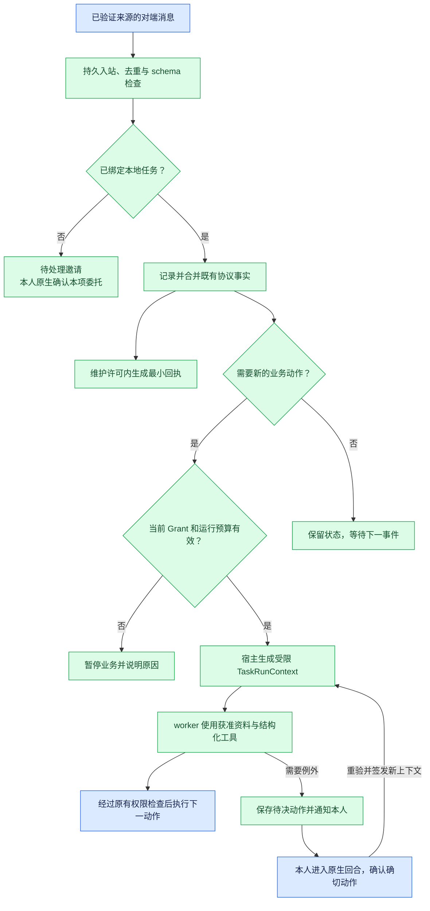

## 8. 外部执行与恢复：后续启用，首版先把合约留好

拟增加独立版本的 `ExecutionPort`，与现有 TransportPort 分开。每个适配器必须声明固定 capability，并提供 `prepare`、`execute`、`query_result`；可撤销业务再提供 `compensate`。不能让对端传入任意工具名、URL 或函数路径。

ExecutionPlan 固定：agreement_id、plan_digest、步骤 DAG、每步执行方、工具账号和动作摘要、幂等键、前置条件、资源版本、截止时间、成功证据、补救许可与上限。双方接受的是同一执行计划；方案达成许可不自动包含日历操作许可。

会议场景只指定一个组织者创建会议；另一方在自己的账号接受/确认，避免双方各建一个邀请。步骤依赖工具的现实语义；不能承诺跨两个日历原子提交。

- 执行前重新读取可用时间或资源版本，取得短时 `ready` 记录，并复验本方权限、约定与计划版本。
- 在本地事务中预占 action budget，写 operation 与外部幂等键；调用工具后保存回执并查询实际状态。
- 工具超时先标 uncertain，按原幂等键/业务 ID 查询；没有幂等或查询能力的工具不作盲目重试。
- 本方授权撤销立即阻止尚未跨越本方发送/执行边界的新动作；已发送消息、在途调用、对方已执行动作无法同步召回。取消通知是新的持久协议事件。
- 短时 ready 和状态复验能缩小竞态窗口，不能保证远端瞬间获知撤销。产品说明应展示哪些已停止、哪些仍待对端确认。
- 补救是新动作，必须已有补救许可或再次询问本人。撤销业务委托后，只有仍有效的独立恢复许可才能自动补救。
- 收到工具返回不立即宣称成功；按事先约定的条件核查。对方给出的工具回执若不能独立查证，注明“对端提供的结果证据”。

### 图 7：执行一半失败时的恢复

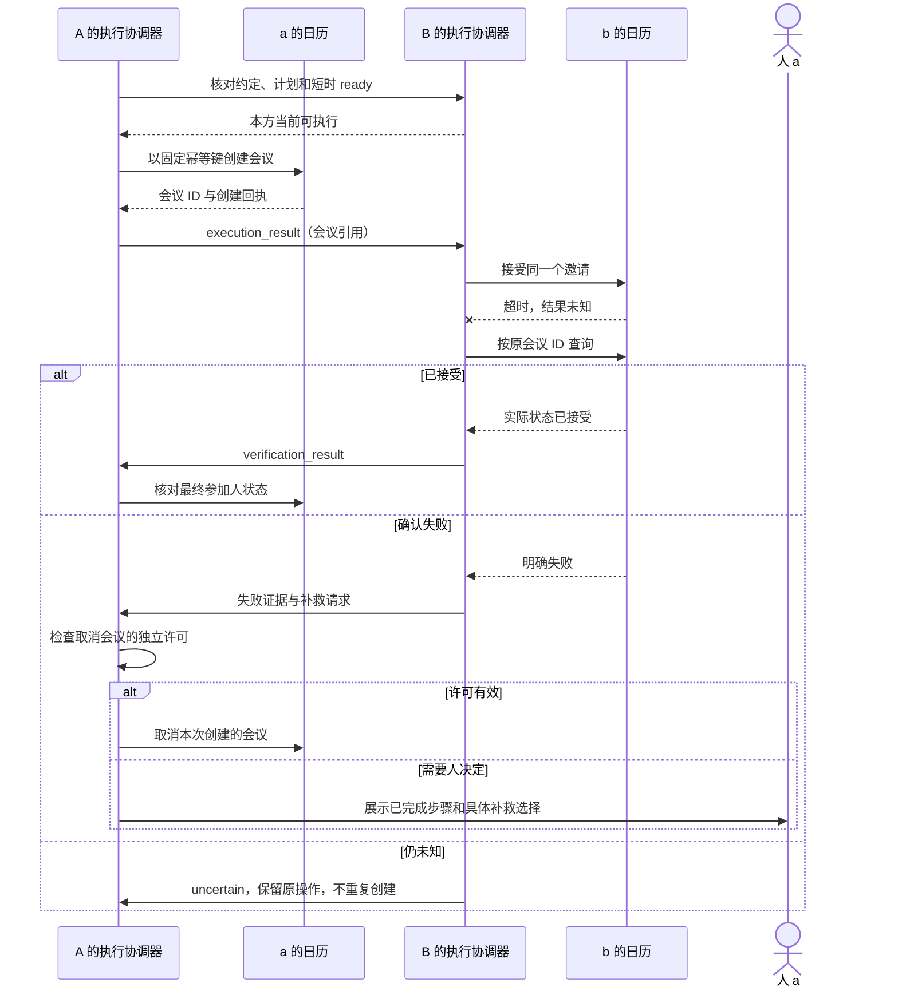

## 9. 授权图、关系记忆、平台声誉

### 9.1 图的语义

同一个产品视图可以展示不同类型的边，底层必须区分其来源和用途。

| 边 | 写入依据 | 可以影响什么 |
|---|---|---|
| `represents`：人→端点 | 本地可信绑定或独立签发者证明 | 代表身份选择；不自动授权具体动作 |
| `grants`：人→agent→任务动作 | 明确批准的 Grant、有效期与撤销记录 | 本方是否可行动 |
| `observed`：A→与 B 的事件 | 实际交互、回执、纠正、工具查询 | 形成证据 |
| `assesses`：A→B 的场景画像 | 带 provenance 的推断规则 | 沟通方式、核实、暂停建议 |
| `reputation`：平台→B | 经同意共享和验证的证据聚合 | 选择与监督参考 |
| 后续 `delegates` | 父 grant 明确允许、子权限取交集 | 有限再委托；首版不启用 |

`a grants A` 加上 `A cooperates B` 不能推出 `a grants B`。将来再委托也要校验每跳签发依据、受众、期限、深度、环路和根撤销；图查询路径本身不是许可。

### 图 8：授权和经验怎样共存

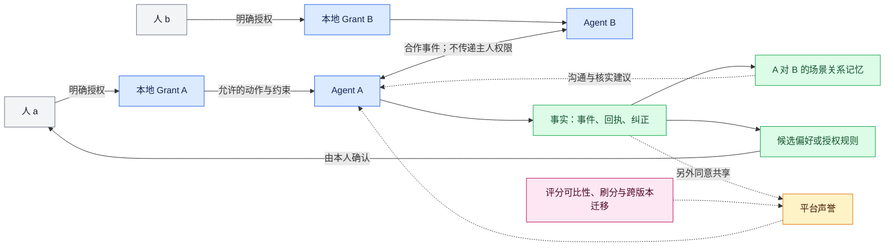

### 9.2 关系记忆的第一版

按 `(observer_principal, peer_binding, task_type, peer_version_context)` 保存：

- **事实**：在某次任务中，B 于何时回复、是否给出同版接受、结果是否核实；附 event/receipt 引用和证据等级。
- **声明**：B 自述需先拿到参与人名单；未观察验证时保持 peer_claim，不能变成事实或授权。
- **推断**：先给两个候选可能减少往返；保留样本数、反例、置信度、最近观察时间和适用范围。
- **使用**：改变提问顺序、使用对方支持的格式、增加结果核对；不改授权，不用旧术语习惯覆盖当前协议。

首版用可解释计数与案例，不压成一个总分：按时回应次数/样本数、同版承诺履行数/可核验样本数、误报和边界事件、恢复结果。用户不满意、利益冲突、对方失约、模型错误和第三方工具故障分开记录。新 agent 显示证据不足。

M1/M2 的规则建议先用于下一次任务的可审核模板，仍逐项确认。若以后支持“这类邀请自动接入”，须独立引入经本人批准的 AdmissionRule，包含匹配条件、可派生权限、派生任务总数/共享预算、版本、期限和撤销关系；不能拿一次 task scope 自动创建后续委托。

版本信息若仅由对端自述就标明来源；没有版本号也保留 unknown。端点换主人/换绑定必须重新确认，历史只做可选择的引用，不继承权限。模型/工具变化后降低相关推断权重、重新积累证据，不机械清零或全额继承。

默认仅自己可见；保留期限、删除和导出由本方控制。事实删除后相应推断应重算或失效；用于重放保护的最小 tombstone 与可展示关系记忆分开管理。

### 9.3 平台声誉的后续边界

只能在新增的明确同意机制下上传最小证据包。履约证据优先用双方确认的任务摘要，保留评价主体与适用范围；单边报告标为未核实，争议不直接计为对方失败。联系人关系图、私人原文和授权详情默认不上传。

在满足样本规模、反刷分、申诉、更正、隐私与撤回处理之前，不上线公开排行榜或通用信用分。平台可以先提供各用户自己可见的场景统计；那仍是账户私有视图，不等于公共声誉。

## 10. 存储、模块和接口落点

### 10.1 本地存储

现有 SQLite `collaboration_records(kind,key,body)` 可继续承载 v1 记录。建议为 v2 增加有版本的表或等价受约束记录；以下是逻辑模型，是否拆物理表由迁移实现确定。

| 记录 | 关键字段与约束 |
|---|---|
| `grant_versions` | principal、task、version、scope、approval_ref、status；版本不可变，状态变更留审计 |
| `collaborations` | local_principal、local_task、共享 ID、peer binding、协议版本、当前阶段、waiting_reason |
| `collaboration_events` | 原始已验证事件、digest、sender sequence、processing state；唯一去重键 |
| `terms_versions` | 发布者、revision、parent_digest、完整条款、digest；同版本不得换内容 |
| `acceptances` | 本方/对方 actor、terms_digest、依据等级、有效期、撤回状态 |
| `agreements` | 两份接受证据、同步状态；修订和取消引用旧约定 |
| `execution_steps` | 后续计划/步骤/工具引用/幂等键/回执/结果是否确定 |
| `relationship_observations` | 观察者、对象、上下文、事实/声明/推断、证据引用、保留策略 |
| `grant_suggestions` | 来源样本、候选规则、pending/accepted/rejected；不得由策略评估直接读取为授权 |

### 图 9：核心数据关系

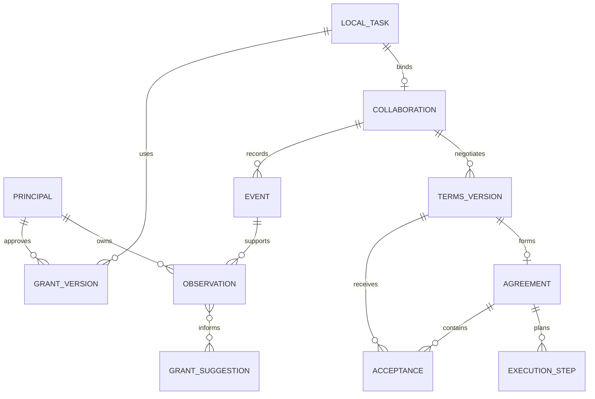

每项授权相关读写、事件映射和投影都检查 principal；不能只凭全局 ID 读取记录。跨端同步只导出脱敏视图，不导出本地确认令牌或可伪造权限的对象。

### 10.2 分仓实现清单

| 归属 | 具体改动 |
|---|---|
| SDK Python `agent_comm_runtime` | 新增协议编解码与校验模块、双边状态 reducer、授权依据模型、受限运行上下文、关系事实投影；扩展 Store 事务和 outbox；policy 保持唯一动作校验实现 |
| SDK Hermes connector | 原生邀请/例外卡、可信 TaskRunContext 签发、受限 worker 与生命周期恢复；不得复制另一套授权策略 |
| SDK Go helper | 优先复用已验证传输；只有协议承载或新证据签名确有需要时扩展明确接口，不把业务策略放进 MQ |
| Web `client-contract` | 新增可选 capability 与 projection schema/fixtures；旧 `collaboration.state` 行为保留；新增独立的 `collaboration.get` / `collaboration.events` 只读方法需配对授予 |
| Web UI / 同步 worker | 同步本方双边状态；用持久 cursor 分页读事件，避免最近 100 条窗口丢失历史；展示等待原因和证据来源 |
| Platform | M1/M2 无需保存私人委托、承诺或关系图；未来声誉服务单独评审 |
| Deploy | 协议 fixtures、双宿主集成验收、固定依赖版本、发布与回滚记录 |

拟新增的本地 runtime 命令包括 `prepare_invitation`、`join_collaboration`、`prepare_acceptance`、`collaboration_state`；每个命令使用固定字段 schema，并通过已有 prepare/confirm/dispatch 管线。名字是实现建议，不能以任意字符串转发到函数。`revoke` 继续支持本地立即停止，并新增独立的取消/恢复操作。

### 10.3 兼容、迁移与上线顺序

1. 增加新 schema、协议 fixtures 和 capability flags，旧任务仍按 v1 处理；不将旧文本里的“接受”迁移为 v2 Acceptance。
2. Additive migration 备份并升级 collaboration DB，保留 helper 身份、mailbox、remote pairing 及旧记录。新索引和唯一键在事务中建立，不以删库完成升级。
3. 先发布 SDK/runtime，再发布真实 Hermes 适配器；双边握手成功才启用 v2。不同端升级不同步时使用明确的兼容提示。
4. 再更新共享客户端契约和 Web 投影能力，最后固定 Platform/Deploy 子模块。新的只读方法须经本机配对新增授权；现有配对不自动扩大范围。
5. 启用自动 worker、外部工具和公开声誉分别有独立开关。回滚程序时保留 v2 数据且停止不能理解的任务，不用旧二进制重放新任务。

## 11. 人看到什么

用户提醒是 M1 的交付内容。agent 侧持久记录待关注事项，Hermes 和 Web 提供全局入口与通知，并引导用户恢复真实原生确认；纯提醒不依赖私人模型唤醒。通知点击、已读和业务批准分别处理。具体当前缺口、渠道、可靠性与分期见[面向用户的提醒与授权待办设计](ATTENTION_AND_NOTIFICATIONS_V1.md)。

### 图 10：围绕事项的产品界面信息

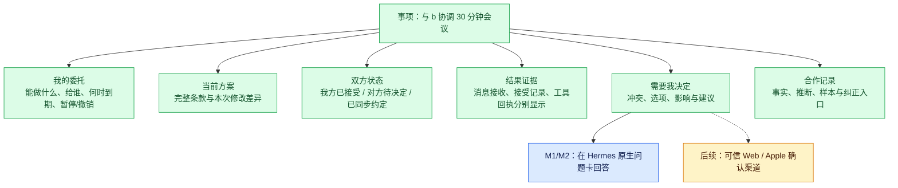

例外卡示例：

> b 仅周五 17:30–18:00 可用，超出本次授权的 17:00 截止。可以这次接受，或保持原规则并继续寻找下周时间。若仅批准这次，只允许向已确认的 b 发送该版本的接受消息；不增加参加人或材料交付承诺。

三个独立入口：“仅这一次”“修改本项委托”“拒绝并继续/停止”。长期规则建议是另外的确认，不预先选中“以后都允许”。待确认请求若条款、资料或收件人变化，旧卡显示失效并重新生成。

Web 继续说明实际来源和最后同步时间：

- “已进入本机发送队列”与“对端已持久接收”分别展示。
- “对端声明已获授权”和“本人授权已独立核验”使用不同标识。
- “双方已确认方案；尚未创建日历”与“日历结果已核验”分别展示。
- 离线时展示最近同步状态，不从陈旧副本启用新授权动作。

Web 原生审批后续需要新的 InteractionPort：认证主体、当前问题呈现、action hash、nonce、期限、一次消费、撤销和会话变更校验。网页登录或 `conversation.send` 本身不赋予 `approval.respond` 权限。

## 12. 交付阶段与验收

### 图 11：实施依赖

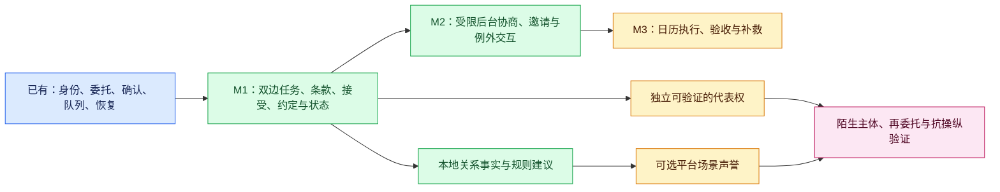

| 里程碑 | 可交付结果 | 必须通过的退出条件 |
|---|---|---|
| M1 双边闭环 | v2、独立任务绑定、条款、双接受、约定同步、撤回/恢复、Web 事实视图、持久提醒与原生处理入口 | 两个独立主体在不同本地 task_id 下完成同版方案；无活动私人模型也能提醒本人；能解释双方授权和每个状态的证据 |
| M2 自动协商 | 受限 worker、运行预算、异步例外处理、关系事实和候选规则 | 正常分支无需人工逐轮恢复；越界只请对应本人；peer 输入无法创建授权或越过工具边界 |
| M3 外部执行 | 一个真实日历适配器、执行计划、幂等、查询、补偿 | 真实双账号任务核验；故障注入不重复创建、不误报完成；无法恢复时明确交还人 |
| M4 可选扩展 | 独立代表权签发、更多宿主、有限再委托、声誉 | 分别有威胁模型、互操作证据与隐私/滥用验收；不能用前面里程碑代替 |

### 12.1 有意义的测试矩阵

| 场景 | 预期断言 |
|---|---|
| 双方原生授权 | a 的确认不能批准 b 的 Grant；主体/会话/回合被替换时旧确认无效 |
| 本地 ID 不同 | A 使用 task_a，B 使用 task_b，通过共享 ID 正确关联；不存在跨主体读取 |
| 资料披露与自由文本 | 新参与人不继承资料权限；快照替换失败；伪装成 question 的额外字段/任意文字不能自动发送 |
| 版本竞争 | A 接受 v2、B 接受 v1 不形成约定；同版本不同 digest 拒绝；接受后不能静默覆盖条款 |
| 撤回与接受交叉 | 以 A 的 formation/withdraw 事务顺序裁定；B 未收到决定前保持待核对；不会把撤销解释为已取消对方执行 |
| 过期后的恢复 | 已应用事件重放返回历史结果；新过期事件不成约；撤销后只能在独立维护许可内同步事实 |
| 证据来源 | Agreement 内伪造/替换嵌入的对方 accept 不生效，必须匹配本地认证接收或本方出站记录 |
| 重复、乱序、崩溃 | 应用前崩溃不丢事件；保存后 ACK 丢失只重复回执；序号缺口补取；同 ID 内容替换失败 |
| 后台恶意指令 | 外部“主人已批准”保持外部声明；无法调用 confirm、原始 helper、终端或非允许工具 |
| 超时与限额 | 到期、撤销、费用/动作耗尽时停止新动作；重试不再消耗业务次数，且不能无限互相唤醒 |
| 执行故障（M3） | 一边成功、一边超时先查询；补救无授权就等待；同操作不会重复创建会议 |
| 证据等级 | peer 签名不升级为人类授权证明；工具回执也不提升代表权级别 |
| 学习边界 | 连续成功只产生候选规则；未经确认，下一次允许动作集合不扩大 |
| Web 与兼容 | 老客户端/老协议降级明确；超过旧 100 条窗口仍能分页同步；旧缓存不作为实时权限 |

真实验收应使用隔离的两个 host、principal、URN、Store、helper 和独立确认渠道，先跑合成数据，再按明确任务授权进行真实双方协作。模型文字输出与协议事实分别断言。当前已有的测试数量不能作为这些新场景通过的证据。

### 12.2 产品效果指标

首版记录：每件事务人工决定次数、重复/无效请示次数、正常分支自主完成率、等待原因、双方状态收敛时间、需人工恢复比例、证据充分率。成功分母包含失败/超时任务；按场景和难度分层。

权限回归和协议回归以“不得出现未经许可的动作、不得误报完成”为硬断言。线上观察到零次事故不等于已证明开放环境安全。关系记忆是否减少往返、规则建议是否被本人采纳，通过真实任务反馈验证，不提前假设有效。

## 13. 本版建议定下与保留的问题

**建议定下：**本地授权为事实源；双边独立委托；v2 应用协议；同版显式接受；事件账本与可恢复同步；首版 agreement_only；原生确认；受限 worker；本地关系事实；新能力默认不扩大旧授权。

**尚需通过后续实现和试点回答：**对端独立授权签发者如何建立现实身份信任、非技术用户如何理解不同证据等级、自动协商在利益冲突下的质量、公开声誉的可比性与抗操纵、跨版本经验继承、复杂再委托与不可逆事务的恢复。

最有价值的下一步是 M1：用两位独立主人和两个 agent，把“各自授予范围 → 交换与修订 → 同版接受 → 可核对约定 → 撤销与恢复”完整跑通，再逐项扩大自动化和执行范围。
