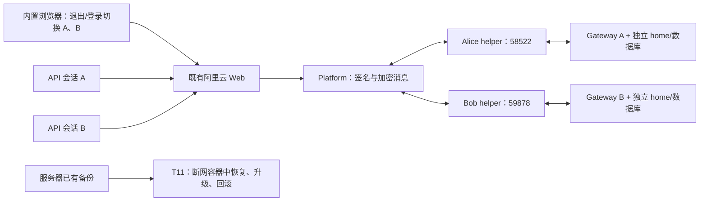
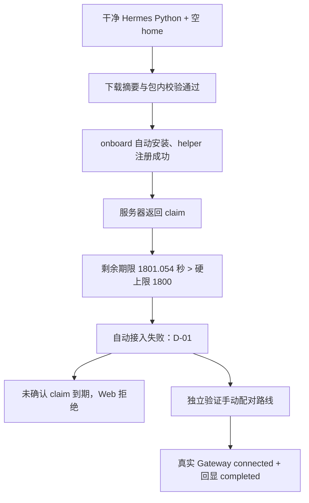

# 功能测试报告：双 Agent、Web、Hermes 与阿里云部署

执行日期：2026-09-22～2026-09-23（Asia/Shanghai）。运行编号：`20260922-213955-692a4d`。

后续原因复核、源码修复与复测见[2026-09-23 测试问题修复记录](REMEDIATION_2026-09-23.md)；本报告保留原测试发生时的结果。

本轮执行结果：**7 项通过、1 项部分通过、1 项不通过；4 项按要求不执行。** 已完成测试、证据整理及临时运行环境清理。这不是“全部功能已通过”的发布结论：T12 自动接入失败，Web 还出现过 HTTP 500。

所有操作由 Codex 执行，包括浏览器注册、登录、添加连接、发送好友请求、切换账户、拒绝、接受及状态核对。你已提供环境和操作授权，本轮没有要求你补做点击或主观体验评价。没有修改产品运行代码来使测试通过；临时测试脚本的适配及初次失败单独记录。

## 1. 范围与结论

| 编号 | 结果 | 本轮结论 |
| --- | --- | --- |
| T00 | **通过** | 本机、阿里云访问、源码版本、容器、HTTPS 和隔离边界可追踪 |
| T01 | **通过，有警告** | 502 个计数的组件测试通过，SDK/Platform Go 测试及 Web 构建通过 |
| T02 | **通过** | 两个真实 helper 的签名、加密、好友、收发、已读、去重及持久化闭环通过 |
| T03 | **通过** | Web 注册、保存连接、手动本机配对、真实 Gateway 连接及账户隔离通过 |
| T04 | **通过** | Web 发起好友请求、Bob 拒绝、重试、Bob 接受及两侧事实核对通过 |
| T05 | **未执行：按要求排除** | 不给出独立“双向消息、已读与提醒用户旅程”的验收结论 |
| T06 | **未执行：按要求排除** | 不给出双边协作及用户审批旅程的验收结论 |
| T07 | **未执行：按要求排除** | 不执行独立 conversation 验收；T12 的一次无工具回显只用于证明接入 |
| T08 | **部分通过** | 故障注入与恢复断言通过；实际云端请求出现 HTTP 500，稳定性未全通过 |
| T09 | **通过** | 过期、撤销、跨账户、错误 Origin、方法范围、签名关联及重放负向测试通过 |
| T10 | **未执行：按要求排除** | 不评价手机、键盘、OS 通知及人的理解和心理感受 |
| T11 | **通过** | 阿里云隔离升级、数据库备份、历史数据恢复及旧版回滚通过 |
| T12 | **不通过** | 干净环境自动安装进入 claim 阶段后失败；手动配对和实际回显通过，不能替代自动接入结果 |

T01/T02 的现有聚合测试包含协议消息、审批等底层断言；这些是组件回归，不计为 T05/T06 的整项验收。没有把模拟 Agent、协议收件或 `submitted` 当成真实 Hermes 已完成回答。

本报告补充[测试步骤说明](TEST_EXECUTION_GUIDE.md)。该说明保留每项的目标、Codex/人工分工、所需环境、流程图及项目位置图；下文记录本轮**实际操作与结果**。

## 2. 实际环境与隔离

| 对象 | 本轮使用方式 |
| --- | --- |
| 本机 | Windows AMD64；Node 24.12.0；Go 1.26.8；Python 3.11 |
| Hermes | 0.21.3，源码提交 `110baa095bc7135a0624557a9cc35df0f98ece0f` |
| 阿里云 | 既有 ECS，通过 Workbench CLI 访问；未购买服务器或更换公网入口 |
| 线上测试入口 | `https://agent-communication.online`；仅创建本轮 A/B 测试账户、连接和测试数据 |
| 升级 staging | 同 ECS 独立容器、网络、目录，绑定 `127.0.0.1:13961/13962`；不挂载现网卷为测试写入卷 |
| 历史恢复补测 | 从已有备份复制数据；临时 Web 使用 `--network none`，无发布端口；不会连接真实 Agent |
| E0/E1 | 本机临时 Platform/helper、随机身份、临时数据库和可用 loopback 端口 |

远程访问沿用了已跑通的 [阿里云 Workbench CLI](https://help.aliyun.com/zh/ecs/user-guide/connect-to-an-instance-through-workbench-cli/)。没有将直接 SSH 是否可用作为测试前提。

固定的若干 `45xxx` 端口在本机曾报 `WinError 10048`，Python 和 Go 的独立绑定探针都能复现。后续使用 OS 分配的空闲端口，作为环境适配记录，不归因于 agent-comm。

### 2.1 版本清单

| 组件 | 提交/版本 |
| --- | --- |
| 根仓库 | `5a44fd3e323e22477aa4569e49e78bf3f06c46b3` |
| Web | `3a2b2517f238023b4c6800a41bf51f7b314a4eee` |
| Platform | `2ed906d28f27d76cbdcf463b4031d364aae63486` |
| agent-comm SDK | `ecf829dc31099ea889abf2633cbe47afd522eab5` |
| 官网安装包 | `2026-09-18-onboarding-r2` |
| 安装包 runtime / connector | `0.1.4` / `1.5.5` |

本地组合测试最终使用本轮从上述提交构建的 `helper.exe`、`platform.exe` 重跑。官网下载包作为独立发布物测试，其 manifest 中根仓库/Web 的版本早于当前工作区，不能混称为同一发布物；Platform/SDK 提交一致。完整镜像摘要在 T00/T11 证据中。

### 2.2 两个 Agent 的实际隔离

所有本地相对路径以下列运行目录为基准：

`build/test-runs/20260922-213955-692a4d/`

| 项目 | Alice | Bob |
| --- | --- | --- |
| Hermes home | `T12/automatic-hermes-home` | `agents/bob/hermes-home` |
| helper 端口 | `58522` | `59878` |
| Agent URN | `urn:agent-comm:agent:Rc86H3TLKii9pJQgJTGk19` | `urn:agent-comm:agent:4ndywaNM82pS2uzGgXg17g` |
| Console URN | `urn:hermes:agent:MZ6FZeQxcqxGoSRZ1SYxL9` | `urn:hermes:agent:9JeLYsCJTkD5rwRmsafMmG` |
| 初次核对 Gateway PID | `52632` | `65888` |
| 状态 | 各自 identity、mailbox、collaboration DB、pairing DB、session | 独立于 Alice |

干净安装使用独立 Python 环境，安装前证明两个 agent-comm 包和旧 profile 状态均不存在。安装验收结束后，A/B 共用这套已安装的 Python 包，但运行不同进程、不同 home；期间没有再向共用解释器安装或升级组件。

API 核对使用独立 CookieJar。内置浏览器在同一个会话中**明确退出再登录**切换 Alice/Bob，没有把两个普通标签页当成登录隔离。停止 Alice Gateway 时，Bob 仍可返回 capabilities，作为进程隔离的实际证据。

这些是功能测试的身份和状态隔离，不是 OS 安全沙箱。没有声称两个同 OS 用户下的 Agent 无法读取对方文件；本轮唯一模型调用是约定的纯文字回显，未要求工具操作。

## T00：通过——环境、版本与服务器预检

**目标与环境：**确认测试使用的版本、阿里云服务和隔离边界。Codex 执行；你无需操作。

| 步骤 | 实际操作 | 对应结果 |
| --- | --- | --- |
| 1 | 生成 RUN_ID，读取根仓库和递归子模块提交 | 本地与服务器提交可核对，见版本清单 |
| 2 | 用既有 Workbench CLI 连接 ECS | 命令执行成功，取得服务、镜像、卷和资源信息 |
| 3 | 执行 `docker compose config --quiet` 与 `docker compose ps` | Compose 可解析，Web/Platform/nginx 在运行 |
| 4 | 在 nginx 容器执行 `nginx -t` | 语法通过；存在 `listen ... http2` 弃用警告 |
| 5 | 请求 HTTPS `/healthz` 及首页并校验证书 | `{"status":"ok"}`，首页 HTTP 200，TLS verify 0 |
| 6 | 核对 A/B 的身份、profile、端口、Console 和 Gateway PID | 均独立；后续 T08 进一步验证停止 A 不影响 B |
| 7 | 单独创建 T11 测试资源；测试后比较现网容器 ID/启动时间 | 原部署未被升级或重启；临时资源与现网分离 |

**证据：**[服务器预检](../../build/test-runs/20260922-213955-692a4d/T00-remote-verified.json)、[A/B 隔离](../../build/test-runs/20260922-213955-692a4d/T03-account-isolation.json)。

## T01：通过——组件回归、构建与基础安全

**目标与环境：**验证当前源码的组件行为和构建。E0、本机依赖及临时数据库；Codex 执行。

| 步骤 | 实际操作 | 对应结果 |
| --- | --- | --- |
| 1 | 执行 Web `npm test` | 173/173 通过，无失败和跳过 |
| 2 | 执行 Web lint、build | 两者退出码 0；lint 有一条既有 Hook dependency 警告 |
| 3 | 执行 Python runtime 单元测试 | 154/154 通过 |
| 4 | 执行 Hermes connector 单元测试 | 首次缺少宿主源码路径；补齐 `PYTHONPATH` 后原源码 142/142 通过 |
| 5 | 执行接入包安装/配置脚本测试 | 33/33 通过 |
| 6 | 在 SDK、Platform 分别执行 `go test ./...` | 有测试的包全部通过；`[no test files]` 不计为测试数量 |
| 7 | 从本轮提交构建 Windows helper、Platform | 构建成功，供 T02/T08/T09 与 full-stack 重跑使用 |
| 8 | 执行部署安全脚本 | 3/3 通过；镜像范围见 T09 |

计数的组件测试共 **502** 个；不把 Go 包数、3 个部署测试和集成检查点混入该数字。既有 lint 警告位于 `src/app/dashboard/notifications/page.tsx:21`，内容是 `useEffect` 缺少 `notifications` 依赖。

**证据：**[最终组件汇总](../../build/test-runs/20260922-213955-692a4d/T01-final-summary.json)，内含逐项日志文件名。最初的 `T01-summary.json` 保留初次 connector 路径错误，不是最终结论。

## T02：通过——双 Agent 协议闭环

**目标与环境：**不调用模型，验证两个 Agent 的真实传输和共同事实。E1 真实 Go Platform/helper + Python Store；Codex 执行。

| 步骤 | 实际操作 | 对应结果 |
| --- | --- | --- |
| 1 | 创建 A/B 临时密钥和目录，启动真实 Platform 及两个 helper | 健康检查通过，两个不同 URN 签名注册成功 |
| 2 | 执行 `test_agent_web_parity_network.py`，由 Web 控制身份向未知 Bob 发好友请求 | 请求经 Registry/MQ 到达 Bob；未把排队当成已连接 |
| 3 | Bob 通过本机 owner 路径接受 | 两边通讯录转为 connected，收到请求的提醒关闭 |
| 4 | 验证 Web/native 消息、回复、已读与提醒 | 使用同一个 Agent inbox 和消息事实，没有两套业务数据 |
| 5 | 查询好友 presence | 能取得已验证的近期心跳状态 |
| 6 | 执行 `test_helper_platform.py`，重复稳定 ID 并中断 helper/Platform | 双向收发、inbox 持久化、outbox 重试及去重通过；详细恢复步骤见 T08 |

**证据：**[一致性结果](../../build/test-runs/20260922-213955-692a4d/T02-parity-result.json)、[helper/Platform 结果](../../build/test-runs/20260922-213955-692a4d/T02-T08-helper-result.json)。这些证明底层闭环，不替代被排除的 T05 用户旅程。

## T03：通过——Web 账户、连接、Console 配对和归属

**目标与环境：**从 Web 账户建立到本机 Agent 的受控连接。既有云端服务 + 两个真实 Hermes 测试 Gateway；Codex 执行。

| 步骤 | 实际操作 | 对应结果 |
| --- | --- | --- |
| 1 | 在内置浏览器注册、登录 Alice 测试账户 | 登录成功，初始连接列表为空 |
| 2 | 用“添加连接”输入 Alice 的真实 URN | 保存连接并生成 Console 身份；未配对时没有获得 Agent 权限 |
| 3 | 在隔离 Alice home 中执行接入包的手动配置/配对命令 | 明确绑定 Alice Console、列出 Web 方法并设置 1 天期限 |
| 4 | 启动真实 Hermes Gateway，读取运行状态和 capabilities | `agent_comm=connected`；Web 获得真实 Agent 返回的能力及快照 |
| 5 | 为 Bob 建立独立账户、Console、helper、home，并启动第二个 Gateway | Bob 也 connected；身份、状态、进程与 Alice 不同 |
| 6 | 用独立 API 登录会话交叉访问对方 workspace、bind-owner、control | Alice→Bob、Bob→Alice 均返回 HTTP 404 |
| 7 | 匿名读取，以及用错误 Origin 提交保存连接 | 分别 HTTP 401、403；没有新增越权连接 |
| 8 | 用当前源码运行完整 Next/Go/helper/Python full-stack smoke | 登录、超过 72 字节的 UTF-8 密码、签名加密 RPC、方法范围及加密工作台副本通过 |

这里通过的是**手动本机配对路线**。自动 claim 路线在 T12 失败，未混入此项结论。A/B 的授权最终都在 T09 撤销。

**证据：**[账户隔离](../../build/test-runs/20260922-213955-692a4d/T03-account-isolation.json)、[full-stack](../../build/test-runs/20260922-213955-692a4d/T03-T04-full-stack-result.json)、[浏览器操作记录](../../build/test-runs/20260922-213955-692a4d/browser-observations.json)。

## T04：通过——Web 添加联系人，另一边拒绝与接受

**目标与环境：**验证双方用户决定会正确进入两边 Agent 的事实。两套真实 Gateway、两套账户、云端 Web；Codex 代表约定的测试用户点击。

| 步骤 | 实际操作 | 对应结果 |
| --- | --- | --- |
| 1 | Alice 打开联系人页，点击添加联系人，填写 `Bob 692a4d` 和 Bob URN | 未勾选确认框时发送按钮禁用 |
| 2 | 勾选确认并点击发送 | 显示“好友请求已发出，等待对方接受”；联系人处于 pending |
| 3 | 退出 Alice，登录 Bob，进入 Bob 自己的工作台 | 只看到 Bob 的连接和收到的请求 |
| 4 | Bob 点击“拒绝”第一次请求 | 请求为 rejected；Bob 没有因此建立联系人；待处理请求提醒关闭 |
| 5 | 读取两侧真实 Store 的 RPC 结果 | Alice 原联系人为 rejected，Bob 联系人数为 0 |
| 6 | Alice 通过正常 control 接口对同一联系人重新申请，并重放同一新 RPC request_id | 两次返回结果相同；Alice 仍只有一个联系人；生成一个新的待处理好友请求 |
| 7 | Bob 在 Web 刷新并点击“接受好友请求” | 显示已建立连接；保留旧请求的已拒绝记录 |
| 8 | 分别读取两边 contacts、requests、attention | 两边恰好各一个 connected 联系人；接受记录一致；没有未关闭的收到好友请求提醒 |

第一次好友请求：`friend-478531d55b761a5b5a5c63c9e4826c05234fa9a6`，结果 rejected。

第二次好友请求：`friend-e1f906416cdee9f061e2bc3452871be7ed466106`，结果 accepted。

重试是同一个联系人的显式新申请；重放检验复用这次申请的 RPC ID，没有靠新建随机请求来掩盖重复执行。浏览器没有注入网络故障；不确定性与恢复分别由 T08 的真实进程和本地传输测试覆盖。

**证据：**[拒绝与重试](../../build/test-runs/20260922-213955-692a4d/T04-rejection-retry.json)、[两侧最终事实](../../build/test-runs/20260922-213955-692a4d/T04-connected-and-T12-echo.json)。最终核对期间出现一次已记录的 HTTP 500，使用原请求 ID 轮询后成功；该异常在 T08/D-02 单独保留，没有被通过结果抹去。

## T05：未执行——按要求排除，不作通过判定

没有独立执行双向消息、已读与提醒用户旅程。T02 的底层协议断言不计作本项通过。

## T06：未执行——按要求排除，不作通过判定

没有执行双边协作与双方用户审批旅程。T01/T09 的权限断言不计作本项通过。

## T07：未执行——按要求排除，不作通过判定

没有执行完整真实 conversation 验收。T12 的一次回显只证明连接后的基本可用性。

## T08：部分通过——离线、重启、恢复与稳定性

**目标与环境：**覆盖 helper、Platform、Web 和真实 Gateway 的故障与恢复。每次仅停止隔离测试进程；既有阿里云三项服务未重启。

| 步骤 | 实际操作 | 对应结果 |
| --- | --- | --- |
| 1 | 在本地真实 helper/Platform 链路发送带稳定 ID 和路由元数据的测试消息 | 正常投递，无需 SSE 订阅者 |
| 2 | 强制中断并恢复接收 helper，再消费和重试同一消息 | inbox 数据保留；消费回执与重复投递去重 |
| 3 | 停止 Platform，发送入 outbox，再中断发送 helper | outbox 接受且持久保存待发消息 |
| 4 | 恢复 helper 和 Platform | 原消息重试送达；接收 helper 离线期间 Platform 保留密文 |
| 5 | 启动真实 Next + 带签名/加密的本地服务 fixture，建立两条已完成历史对话 | 三个测试连接先完成主动同步；前置数据已保存 |
| 6 | fixture 模拟 Platform 不可用并使 capabilities 到期 | Web 标记 offline，联系人、inbox 和历史对话仍可读；跨账户仍为 404 |
| 7 | 离线期间重启 Next，随后恢复 fixture 并注入新来信 | 历史数量不变；三个连接补拉新数据；旧 `conversation.send` 调用数没有增加 |
| 8 | 在真实云端链路保存 Alice 联系人和已完成回显，然后只终止 Alice Gateway | Bob capabilities 仍正常，证明一侧停止不影响另一侧 |
| 9 | 请求 Alice 同步并等待状态超时 | Web 转为 offline，旧联系人 ID、原回答和 turn 完整保留 |
| 10 | Alice 离线时提交读取，恢复同一 home 的 Gateway，并用原 request_id 核实 | 恢复 connected/ready；原读取完成；仍只有一个原回显 turn，没有重复模型回合 |
| 11 | 检查云端实际请求与 Web 日志 | 发现 HTTP 500；同一时段日志持续出现 SQLite `database is locked` 与数据库超时，见 D-02 |

**判定：**故障注入后的数据保留、稳定 ID 和恢复断言通过；云端稳定性不能判为全通过。没有做压测、整机重启或资源耗尽，也没有用重启现网服务来掩盖 HTTP 500。

本地 Web fixture 模拟远端服务，不是真实 Platform；真实 Go 崩溃恢复和云端真实 Gateway 恢复另有独立证据。fixture 最初未等待历史 turn 完成便断网，产生前置条件失败；补齐等待后测试通过，未修改产品实现。

**证据：**[helper/Platform](../../build/test-runs/20260922-213955-692a4d/T02-T08-helper-result.json)、[Web 重启](../../build/test-runs/20260922-213955-692a4d/T08-web-resilience-result.json)、[真实 Gateway 重启](../../build/test-runs/20260922-213955-692a4d/T08-real-gateway.json)、[HTTP 错误记录](../../build/test-runs/20260922-213955-692a4d/cloud-http-errors.jsonl)。

## T09：通过——撤销、过期及安全负向路径

**目标与环境：**验证认证、归属、方法范围、到期与撤销能阻止读写。E1 真实网络链路与云端本轮 A/B 账户；Codex 执行。

| 步骤 | 实际操作 | 对应结果 |
| --- | --- | --- |
| 1 | 执行部署安全测试 | 缺少部署 secret/origin 时配置失败；nginx 限流、请求体限制和代理头覆盖通过；Web 降权和旧卷文件保留通过 |
| 2 | 运行真实加密 control 网络负向用例 | 方法范围、owner、未知方法、错误参数、伪造发送者与错误关联被拒绝 |
| 3 | 模拟 response 保存失败、Bridge 重启并重放 | 未成功处理的请求不被提前 ACK；恢复后相同请求返回不可变结果 |
| 4 | 验证错误 scope/owner 的审批及 attention | 不能越权；旧 lease 不能反转已经完成的决定；原生处理产生终态记录 |
| 5 | 建立短期限 pairing 并等待过期 | 后续读取返回 `not_paired`；没有把过期授权当成可用 |
| 6 | 验证跨 Web 账户、匿名与错误 Origin | 分别 404、401、403，见 T03 |
| 7 | 在 Alice、Bob 各自本机调用 RemoteBridge revoke | 两侧 pairing 持久标记 revoked |
| 8 | 从对应 Web 会话分别发 `contacts.list`、`contacts.add`、`messages.send`、`approval.respond` | 8 次有效格式请求全部返回 `not_paired`，无成功 result |
| 9 | 重新实例化 Bridge 读取 pairing，并查询 Web workspace | 撤销持久存在；两侧为 `needs_pairing`，旧联系人和 Alice 回显保留 |
| 10 | 在 Bob Web 查看联系人、等待旧心跳到期后刷新 | “需要重新配对 · 显示已保存内容”；添加联系人、回复禁用；过期在线状态显示“在线状态待更新” |

**测试脚本问题：**仓库 `test_remote_control_network.py` 原用例复用已确认联系人 URN 再创建 pending 联系人，与当前重复联系人规则冲突。临时副本改用不同 URN，省略本轮排除的完整双边协作块；最终 15 项命名检查点及额外过期断言通过。没有修改 runtime。云端撤销测试首次发送消息的参数误用了 `contact_id`，Web 正确返回 400；改为协议要求的 `recipient_urn` 后，才计入撤销验收。

**镜像限制：**本地部署安全脚本复用了 `agent-web:security-review-20260916` 和 `agent-security-nginx:local`，不能单凭它宣称当前镜像已完成所有容器检查。当前 Web 镜像的 UID 1001、现网 nginx 配置和 HTTPS，分别在 T11/T00 实际核对。

**证据：**[网络安全结果](../../build/test-runs/20260922-213955-692a4d/T09-security-result.json)、[云端撤销](../../build/test-runs/20260922-213955-692a4d/T09-cloud-revoke.json)、[部署安全日志](../../build/test-runs/20260922-213955-692a4d/T09-deployment-security.log)。

## T10：未执行——按要求排除，不作通过判定

没有执行通知、窄屏、键盘或真实手机体验验收，没有收集用户理解和心理感受的结论。

## T11：通过——阿里云备份、升级、恢复和回滚

**目标与环境：**在既有 ECS 验证持久数据可备份、迁移和恢复。运维操作由 Codex 使用既有授权执行。现网只做备份/状态检查；版本切换在临时容器中进行。

| 步骤 | 实际操作 | 对应结果 |
| --- | --- | --- |
| 1 | 记录现网三个容器的 ID、启动时间和镜像 | 建立前后比较基线 |
| 2 | 用 SQLite backup API 分别备份 Web 与 Platform 数据库 | `prod.db`、`mq.db`、`audit.db`、`registry.db` 均 `quick_check=ok`；没有直接复制正在写入的 WAL 主文件代替备份 |
| 3 | 备份部署配置、环境文件、密钥及证书目录 | 保留在服务器本地受限目录，未把秘密内容下载到报告 |
| 4 | 用独立目录、网络、容器和 loopback 端口启动旧 Web/Platform | 创建测试账户、连接、加密 Console 身份及签名 Registry 记录 |
| 5 | 停止临时服务并备份其数据，再启动当前镜像执行迁移 | 原密码可登录，Agent ID、Console URN、Registry 记录不变；Web 服务 UID 为 1001 |
| 6 | 将升级前备份复制到新目录，逐文件比较 SHA256，再以旧镜像启动 | 数据文件和平台密钥摘要一致；旧版可以登录并读取原连接、Console、Registry |
| 7 | 补充从现网备份恢复真实测试历史，全程 `--network none` | 旧 Web 能用 A/B 原测试账户解密读取已保存联系人；Alice 原回显状态仍为 completed |
| 8 | 在该历史副本上升级到当前 Web | 两侧 Agent/Console、联系人 ID/状态、inbox 消息 ID、conversation/turn ID 和回答与旧版读取结果一致 |
| 9 | 从历史冷备份再恢复旧 Web | 上述历史内容再次完全一致；不会向真实 Agent 发请求 |
| 10 | 核对现网容器、HTTPS 并清理临时容器/网络/临时加密配置 | 原容器 ID 和启动时间不变；healthz 正常，首页 200；测试容器清除，备份保留 |

升级镜像：Web `bf4d40418a55…` → `5a6029f249a6…`；Platform `20323a12f31f…` → `b3359b418035…`。回滚使用旧镜像与升级前的独立备份，不是让旧应用直接猜测如何读取已迁移数据库。

服务器备份目录：`/root/agent-comm-test-runs/20260922-213955-692a4d/production-backup-node24`。该目录及本轮父目录权限为 `700`、owner 为 root。历史恢复副本同样留在该受限父目录下。

本项没有执行现网升级/现网回滚，没有测试 ACME 实际续期、跨地域灾备或 T06 双边协作升级旅程。当前持久化历史包括本轮真实联系人、好友通知、Console 和一次已完成回显；这是所执行数据集的保留证据，不是任意历史版本/任意数据集的兼容性保证。

**证据：**[升级/回滚结果](../../build/test-runs/20260922-213955-692a4d/T11-final.json)、[断网历史恢复结果](../../build/test-runs/20260922-213955-692a4d/T11-history-final.json)、[现网收尾检查](../../build/test-runs/20260922-213955-692a4d/final-server-check.json)、[全部补测后的资源清理核验](../../build/test-runs/20260922-213955-692a4d/completion-server-check.json)。

## T12：不通过——干净环境安装 agent-comm 并连接 Web

**目标与环境：**验证官网下载包在没有旧 agent-comm 的 Hermes 中完成自动安装与连接。Windows 原生环境、独立 Python venv、新 home；未覆盖原生 Linux/macOS 安装。

| 步骤 | 实际操作 | 对应结果 |
| --- | --- | --- |
| 1 | 在独立 venv 准备可工作的 Hermes，记录包清单和空 home | `agent_comm_runtime`、`hermes_platform_agent_comm` 均不可导入；无旧身份/数据库/配对 |
| 2 | 下载 Windows ZIP 与外部 release-manifest，计算 SHA256 | 匹配 `dc70a0058292d9989fdeb1a3bfcd16a44a1dabbe8ad6c56b25a947deddeb0e40` |
| 3 | 解压后执行 `install.py --check-only` | helper、wheel 摘要及 wheel 元数据校验通过 |
| 4 | 在空 home 用指定 Python 运行 `onboard_hermes.py --allow-web-actions --pair-days 1 --port 58522` | 自动安装两包，创建新身份，helper 启动并签名注册到 Platform |
| 5 | 自动申请 Web claim | **失败：`ValueError: Invalid short-lived pairing deadline`**；没有进入正常自动确认/配对完成状态 |
| 6 | 保持产品校验逻辑不变，记录请求起止时间与服务器返回 expires_at 后重现 | 返回的剩余时间约 1801.054 秒，超过本地硬上限 1800 秒，复现 D-01 |
| 7 | 不确认该 claim，等真实期限结束后打开链接 | Web 显示“连接申请无效或已过期，请让 agent 重新发起” |
| 8 | 为继续独立功能测试，走接入包已有手动配对路线，启动真实 Gateway | connected，Web capabilities/同步正常；此为替代路线的独立结果 |
| 9 | Web 发送约定的无工具回显，等待真实 Hermes 回答及服务器持久状态 | 回答为 `连接成功 692a4d`，turn 为 completed；T08 重启后仍只有原 turn |
| 10 | 另做安装负向分支，最后撤销配对并清理 | 结果如下；临时模型凭据已移除 |

| 负向分支 | 实际操作与结果 |
| --- | --- |
| 篡改包 | 修改副本 wheel 字节，`--check-only` 退出 2，明确 SHA256 mismatch，未安装 |
| 无有效 Hermes | 新建不含 Hermes 的解释器执行安装，退出 2；两个 agent-comm 包仍不存在 |
| 缺少依赖 | 新建只有 Hermes 核心依赖的 venv，缺 `aiohttp` 时退出 2；未安装两个包 |
| 端口属于别人 | 新 home 指定 Bob 已占用端口，调用实际 `ensure_helper` 分支；拒绝不同身份，没有接管 Bob，也没有创建 pairing。这是安装后组件分支检查，不计为另一轮完整自动首装 |
| 错误系统包 | 在 Windows 仅校验完整 Linux ZIP，摘要匹配且 `--check-only` 返回 0；未执行 Linux helper。确认安装器校验不包含 OS/CPU 判断，必须由下载预检负责 |
| 未确认 claim | 真实到期后页面拒绝；没有用修改时间或数据库伪造过期 |

**主路径结论：不通过。** 正常 claim 确认后的自动配置/自动启动，以及自动接入脚本完整重跑的幂等性，因 D-01 未能在本轮验证。手动配置成功和 Gateway 重启恢复没有被当作它们的替代证明。没有验证 OS 开机自启。

**证据：**[干净基线](../../build/test-runs/20260922-213955-692a4d/T12/automatic-clean-baseline.json)、[运行配置](../../build/test-runs/20260922-213955-692a4d/T12/automatic-run.json)、[期限观测](../../build/test-runs/20260922-213955-692a4d/T12/deadline-observation.json)、[负向分支](../../build/test-runs/20260922-213955-692a4d/T12/negative-results.json)、[真实回答](../../build/test-runs/20260922-213955-692a4d/T04-connected-and-T12-echo.json)。

## 3. 发现的问题及建议复测

### D-01：自动接入不容忍很小的服务器/客户端时钟偏差

**影响：高；阻断自动首装接入。** 产品位置：`tools/release/early_access/onboard_hermes.py` 的 claim deadline 校验，约第 555～556 行。

复现证据：本地请求结束于 `2026-09-22T23:38:44.728965Z`，返回 expiry 为 `2026-09-23T00:08:45.783Z`，两者相差 `1801.0540349` 秒。代码要求 `time.time() < deadline <= time.time() + 1800`，因此拒绝该正常约 30 分钟的票据。helper 已启动，失败后自动接入状态没有完成保存。

建议修复时保留有效期与签名检查，明确设计有限时钟偏差容忍，不要简单移除期限校验。复测至少覆盖服务器领先/落后 1～5 秒、真正过期、异常过长票据，以及失败后的同身份重试、正常确认、自动 Gateway 启动与清理。

### D-02：云端轮询偶发 HTTP 500，同期存在 SQLite 锁和超时

**影响：中；影响状态核实和后台同步可靠性。** 一次完整记录的请求为 Bob 的 `contacts.requests`，request_id `204f933e-5070-4af2-90a5-a89d2edfd34b`，轮询返回 500，正文“请求未完成，请检查连接并重试”。保留原 ID 重试后成功。

同一时间段 Web 日志持续出现 `database is locked`、`controlRequest.deleteMany()` 超时、工作台同步及 Web Push 重试。检查时仅有既有三个服务容器，没有临时备份容器或残留备份进程；可用内存约 1.1 GiB、磁盘余量约 20 GiB。**这些支持数据库并发竞争的排查方向，但尚未证明是哪一个具体事务导致该 HTTP 500。** 本轮没有重启现网 Web 或修改数据库来掩盖问题。

建议复测包含两个登录会话、后台 sync 与 control 轮询并存时的 SQLite 等待/事务边界、缓存清理及重试行为；为请求增加可关联日志，确认 500 消除后再把 T08 判为全通过。

证据：[服务器错误](../../build/test-runs/20260922-213955-692a4d/cloud-web-errors.json)、[进程/资源检查](../../build/test-runs/20260922-213955-692a4d/cloud-db-lock-diagnostic.json)、[逐次 HTTP 错误](../../build/test-runs/20260922-213955-692a4d/cloud-http-errors.jsonl)。该 JSONL 也含一条测试参数错误导致的 400，不能把它计为产品稳定性故障。

### 其他限制与测试维护项

- `install.py --check-only` 不识别错误 OS/CPU；本轮以真实 Windows 包预检补足，没有声称安装器具备该能力。
- 远程控制网络测试的联系人数据需要更新，避免对同 URN 重复建 pending 联系人。临时适配在运行目录中，正式测试源文件未改。
- Web 的一条 lint 警告、nginx 的 http2 弃用警告仍存在，没有升级为本轮失败。
- 本轮为功能测试；没有给出容量、长时间稳定性、真实双人体验或全平台安装的结论。

## 4. 清理与证据位置

1. Alice/Bob 的 Console pairing 已在本机撤销；云端读取、写入的拒绝已实际验证。
2. 只终止本轮 RUN_ID 下的 Gateway、helper、supervisor 及其子进程；收尾扫描剩余本轮进程为 0。
3. 删除临时复制的模型 `.env`、`auth.json`、含模型配置的 `config.yaml` 及其备份；删除临时账户凭据 JSON。未删除测试结果、合成身份和故障日志。
4. 浏览器已退出测试账户，确认返回登录页，随后关闭本轮标签页。
5. 阿里云 staging、历史恢复临时容器及网络已清理，历史恢复临时 secret 环境文件已删除。现网部署保持原版本和启动时间。
6. Web 中的本轮 A/B 测试账户、已保存连接、测试联系人/请求与回答仍保留供追溯；对应本机授权均已撤销。服务器备份及隔离恢复数据仍保留在 root 受限目录，没有永久删除现网数据。

运行目录：[原始证据](../../build/test-runs/20260922-213955-692a4d/)。[证据摘要与 SHA256 清单](../../build/test-runs/20260922-213955-692a4d/evidence-manifest.json)、[进程和凭据清理结果](../../build/test-runs/20260922-213955-692a4d/cleanup.json)。浏览器证据是本轮可访问性树/DOM 的操作观察记录，不是导出的 Playwright trace，也没有伪造截图文件。

原始运行目录位于 Git 忽略的 `build/` 下，保留在当前机器；本报告及[可版本管理的结果索引](results/20260922-213955-692a4d.json)位于文档目录。完整数据库、私钥和模型凭据不进入可版本管理的报告。
