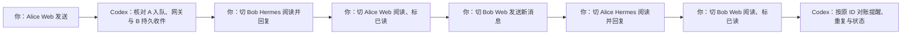
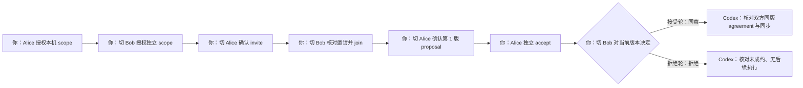
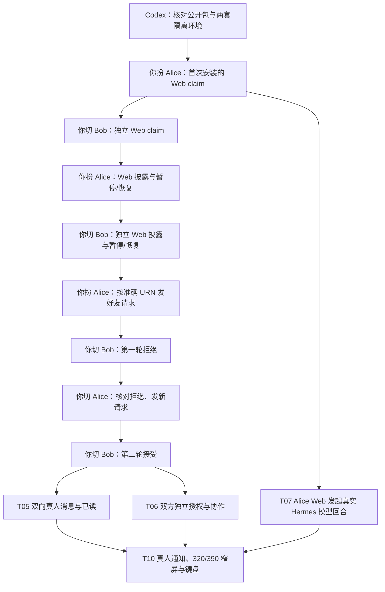

# 双 Agent 真人体验逐段执行卡（2026-09-25）

状态：**部分执行，仍有未覆盖项**。这张卡原本按同一位测试者依次扮演 Alice、Bob 编排；已完成的真人操作和客观证据见[本轮验证记录](../verification/UX_2026-09-25.md)。在真人阶段，每次切换都先核对 Hermes profile、helper 身份、浏览器账户和目标联系人，Codex 不代替任一真人作披露、发送、任务授权、接受或拒绝的决定。此后测试者明确授权 Codex 执行后续流程：Codex 可以在**新建、隔离且由 Codex 持有的合成账户、浏览器和 Agent 身份**上预设效果并执行操作；该结果必须标为自动化机制验证，不能冒充此前 Alice/Bob 的真人选择或主观体验。

现网参考基线是签名 v2 `compliance`、epoch 3、`allow_v1=false`，策略摘要 `6f9f7bdf26c5e7761cbe8c451a22fd11f9a448d912fa5bc3ae61c1e53f3ff5c4`；正式接入包为 v0.9.1。**执行前按真实运行状态重新核对**，不要用本段文字代替本机验签结果。v0.9.1 同 Platform 的准确 URN 首联可以自动验证 Registry 中的密钥绑定，但这不能证明某个 URN 属于现实中的某个人；测试者仍须从独立可信渠道确认所要扮演的两端及准确 URN。

## 本轮通用准备与记录

| 项目 | Codex 准备、验证与记录 | 测试者要做的决定或操作 | 待填结果 |
| --- | --- | --- | --- |
| 环境和隔离 | 记录 RUN_ID、环境（隔离 E2-V / 线上专用测试账户）、四仓提交、镜像、公开包版本和策略摘要；建立两套独立 helper 数据目录、端口、Hermes profile、协作 Store 和 Web 账户，核查不共用身份或 SQLite。线上不注入停机、改策略或破坏性故障。 | 分别进入 Alice 和 Bob 环境，核对当前角色标识及测试对象；如使用真实身份，亲自确认准确 URN 与真人/设备的绑定。 | RUN_ID：__；环境：__；版本：__；A/B 身份隔离：__；角色核对：__ |
| 合规披露 | 分别读取两端本机 `/api/v2/disclosure` 的验签状态、模式、epoch、策略摘要、Platform ID、网关 key ID 与可解密范围；记录授权前的拒绝状态。 | **扮演 Alice 时**决定是否针对当前精确摘要在 Alice 本机授权；切换为 **Bob** 后独立决定 Bob 本机授权。任一方未授权就停在门禁验证，不以旧 v1 或旧策略绕行。 | Alice 本机决定及时间：__；Bob 本机决定及时间：__；未授权门禁：__ |
| Web 披露和权限 | 检查两账户是否各自确认当前 Web 披露、配对是否有效；列出当前已授权的方法。T05 需要 `messages.send`、`inbox.mark_read`，T06 从 Web 决定还需 `approval.respond`；读取与提醒同步也需对应只读方法。升级不会自动扩大旧配对。 | 分别登录 Alice Web 与 Bob Web，亲自阅读并各自确认当前披露（若愿意）；如需扩大 Web 配对权限，分别在相应本机核对配对计划及网页显示的范围、期限后再授权。Web 确认不代替上述本机网关披露授权。 | Alice Web 确认/配对：__；Bob Web 确认/配对：__；方法范围：__ |
| 联系关系和证据 | 核对双方 `connected`、对端准确 URN、提醒/收件箱基线；准备只含 RUN_ID 的无敏感测试文本与无副作用会议主题。证据按 ID 和时间线脱敏保存，不收录密钥、凭据、私人正文或完整身份目录。 | 以 Alice、Bob 各看一次联系人展示，确认要测试的确是预期对端；若尚未 `connected`，先按 T04 完成独立的好友申请和接受，再返回本卡。 | A/B connected：__；基线快照：__；T04 依赖：__ |

任何需要人在 Hermes **原生问题卡**确认的步骤，都要在该问题卡的文本回答框答复；主聊天输入“可以”会开启另一回合，**不是**审批。网页审批必须点击具体 `approval.respond` 卡的按钮；阅读提醒、标记已读和普通聊天也都不是批准。问题卡过期、版本变化或结果不确定时，Codex 先读取原 ID 的最新状态，再准备有效新卡，不能替测试者猜测决定。

## T05：双向消息、阅读和跨端提醒

目标：分别覆盖 **Alice Web → Bob 原生 Hermes** 和 **Bob Web → Alice 原生 Hermes**，并由测试者亲自判断收件人、正文、回复和提醒。协议层要把本机入队、网关准入、收件端持久接纳 ACK、Web 同步、真人阅读和业务回复逐项区分。

| 段 | 此时你扮演谁、看哪里 | 测试者操作 | Codex 在交接前后代办与验证 | 待填结果 |
| --- | --- | --- | --- | --- |
| 05-A1 | Alice；Alice Web 工作台的“收件箱” | 核对 Bob 完整 URN 和预填的 `T05/<RUN_ID>/A→B` 纯文本，亲自点击“发送消息”。该 Web 按钮就是本次发送动作；不要预设另有原生确认卡。 | 预填无敏感正文；保存 Web 请求 ID、消息 ID、Alice 本机持久入队和网关准入回执；等 Bob 持久收件/ACK，不把“Agent 已受理”记为 Bob 看见。 | Alice 本人点击：__；request_id：__；message_id：__；入队/回执/ACK：__ |
| 05-B1 | **切换到 Bob**；Bob Hermes profile、原生来信或待办中心 | 亲自查看来信发送者、准确 URN、RUN_ID 正文及未读提醒，判断是否能理解；在 Bob 原生会话中对该消息作带 RUN_ID 的回复，按具体问题卡确认发送。 | 先核对当前确为 Bob profile；记录原生可见时间、提醒、回复 ID、Bob 出站与 Alice 收件；若只在 Web 或脚本看见，不记为原生真人体验。 | Bob 实际看见/理解：__；提醒：__；回复内容判断：__；回复 message_id：__ |
| 05-A2 | **切回 Alice**；Alice Web“收件箱”和“提醒中心” | 亲自阅读 Bob 的回复，核对发送者、RUN_ID 与上下文语义；点击该条的“标为已读并关闭提醒”。 | 用 Bob 回复的独立 `message_id`、发送角色、RUN_ID 和正文语义核对往返；普通 `chat.message` 当前不带 `in_reply_to`。再核对 Alice Agent 的已读记录、Web 状态与该消息提醒终态；刷新或重连后按原 ID 检查无重复。 | Alice 实际阅读：__；回复 message_id/RUN_ID：__；Agent 已读：__；提醒关闭：__；重复数：__ |
| 05-B2 | Bob；Bob Web 工作台的“收件箱” | 核对 Alice URN 和预填的 `T05/<RUN_ID>/B→A` **新消息**，亲自点击发送；该 Web 按钮不要求另答原生确认卡。 | 预填正文；记录独立请求/消息 ID、本机队列、网关准入、Alice 持久收件/ACK。 | Bob Web 点击：__；request_id：__；message_id：__；回执/ACK：__ |
| 05-A3 | **切回 Alice**；Alice Hermes 原生来信 | 亲自查看 Bob Web 来信、未读提醒，并在 Alice 原生会话回复；核对它与前一轮不是同一条。 | 记录 Alice 原生呈现、回复 ID 与 Bob 收件。 | Alice 实际看见/理解：__；原生提醒：__；回复 ID：__ |
| 05-B3 | **切回 Bob**；Bob Web 收件箱 | 亲自阅读 Alice 回复，并点击该条“标为已读并关闭提醒”。 | 核对 Bob Agent 已读、Bob 这条收件提醒关闭、Web 副本刷新/重连后不重复；分别核对 A/B 各自收件提醒，不把一端标为已读推断成另一端已读。 | Bob 实际阅读：__；Agent 已读：__；提醒终态：__；重复数：__；T05 结论：__ |

T05 通过需两轮消息的发送者、收件人、正文、独立消息 ID、RUN_ID/上下文语义和实际原生呈现正确；**不要求普通聊天回复具有 `in_reply_to`**。Web 已读要写回相应收件 Agent，其自身相关提醒最终关闭；刷新或重连不重复。未见真人原生来信时，只能报告传输/状态结果，不能报告真人阅读体验通过。

## T06：双边会议提议、双方决定与拒绝

目标：用**无实际会议邀请、无资料泄露、无日历写入**的测试事项，验证 Alice 与 Bob 的本机任务授权彼此独立，邀请与加入不构成提议接受，同一版本的约定须双方各自接受。执行两轮：一个拟覆盖双方接受，另一个用全新的事项/协作/提议 ID 覆盖 **Alice 接受后 Bob 独立拒绝**。两轮的预期分支只是测试计划；只记录测试者真实作出的选择，不由 Codex 预设批准。

每轮固定并记录 `task_id_A`、`task_id_B`、共同 `collaboration_id`、`proposal_id`、版本、主题、双方准确 URN、起止时间与时区、时长、有效期、`operation_id`。Codex 逐项生成并出示；两边的本地 task ID **可以不同**，共同 collaboration ID **不授予**对方权限。所有实际时间必须在两边已授权的 scope 内，测试内容不得触发外部日历或其他工具。

| 段 | 此时你扮演谁、看哪里 | 测试者操作 | Codex 在交接前后代办与验证 | 待填结果（每轮单独填写） |
| --- | --- | --- | --- | --- |
| 06-1 | Alice；Alice Hermes 本机任务确认卡，或有权限的 Alice Web 具体审批卡 | 核对联系人、主题、`propose_meeting` / `accept_meeting` 能力、参与人、时间窗口、时长、次数、期限和资料范围，亲自决定是否授权 **Alice 自己的 scope**。 | 准备 `prepare_task(task_id_A, scope_A)`，展示完整问题与审批 ID；只在获准后保存 Alice 本机授权结果。 | Alice scope/approval_id/实际决定：__ |
| 06-2 | **切换 Bob**；Bob Hermes 或 Bob Web 的独立任务确认卡 | 对 Bob **自己的 scope** 再作一次独立核对和决定；Alice 的授权不能替代。 | 准备 `prepare_task(task_id_B, scope_B)`，校验 Bob owner、范围、有效期；在 Bob 未授权时验证不能代其加入/接受。 | Bob scope/approval_id/实际决定：__；单侧门禁：__ |
| 06-3 | **切回 Alice**；Alice 具体邀请确认卡 | 核对 Bob 是准确目标、协作 ID 和邀请内容，按当前策略要求亲自确认本次 `invite`。 | 准备 `prepare_collaboration(kind=invite)`；获得本次许可后以原 operation ID 投递，核对 Bob 持久 inbox 和新协作提醒。 | invite operation/event/message ID：__；Bob 收件/提醒：__ |
| 06-4 | **切换 Bob**；Bob 收到的协作邀请及加入确认卡 | 核对已落盘邀请的发送者和内容，再独立决定是否 `join`；阅读邀请本身不算加入。 | 从 Bob 已认证 inbox 的 `message_id` 准备 `join`，不让模型编造邀请；获准后投递并核对双方 joined 状态。 | Bob 邀请 message_id：__；join 决定/operation ID：__；双方 joined：__ |
| 06-5 | **切回 Alice**；Alice 精确会议提议确认卡 | 核对 `proposal_id`、第 1 版、主题、参与人、起止时间及时区、期限，亲自决定是否发送此版 `proposal`。 | 按已授权 scope 准备提议，获准后投递；核对 Bob 已验签、解密、持久接收的同版提议，不把投递当接受。 | 提议版本/operation/event/message ID：__；Bob 同版收件：__ |
| 06-6 | Alice；Alice 对同一提议的接受确认卡 | 独立判断是否由 Alice 接受当前第 1 版；若该动作返回 `ask`，亲自答原生问题卡或点击 Alice Web 的具体审批按钮。 | 从 Alice 当前协作状态准备 `accept`，核对本机 owner、条款摘要、版本、审批 ID；获准后以原 operation ID 投递，只记 Alice 接受。 | Alice accept 决定/approval_id/事件 ID：__ |
| 06-7 | **切换 Bob**；Bob 当前提议与独立接受确认卡 | 重新核对来源、完整条款、版本、期限及当前审批卡。**接受轮**由你决定是否点击“同意本次请求”；**拒绝轮**由你在另一份独立提议上决定是否点击“拒绝本次请求”。若用 Hermes 原生卡，在问题卡文本回答框答复。 | 从 Bob 已落盘提议和当前协作状态准备 `accept`，将审批 ID 与版本绑定；只按你的实际决定继续。拒绝后不得代 Bob 发送 accept；记录拒绝状态和无后续约定。 | Bob accept/deny 实际决定：__；approval_id：__；版本：__；结果：__ |
| 06-8 | Codex 对账；如需人工查看则分别切回 Alice/Bob 的“事项” | 亲自判断双方界面上的状态、约定内容和拒绝分支是否容易理解；若查看两个页面，分别核对角色。 | 接受轮检查双方同版接受、agreement/ACK/sync 与双方状态；拒绝轮检查 Bob 无接受、双方未成约、未继续执行。两轮都检查无日历事件或外部工具副作用，并记录过期/版本变化后的旧审批拒绝情况。 | Alice/Bob 最终状态：__；同版证据：__；拒绝后副作用：__；过期/旧版拒绝：__；T06 结论：__ |

接受轮与拒绝轮不得重用同一 `collaboration_id`、`proposal_id` 或审批 ID。Web 卡可能只直接显示事项主题、完整问题和有效期；Codex 负责从可信状态把后台 `approval_id` 与该卡核对并呈现给测试者，不能要求测试者在页面上寻找未展示的字段。`accepted` / MQ ACK 是投递状态，`approved_once` 是本机授权结果，双方同版 `accept` 与 agreement 同步才是双边约定证据；即使成约，当前产品也不创建日历会议，更不证明会议实际举行。

## 本轮结论模板

| 检查 | 结果（通过 / 失败 / 受阻 / 未执行） | 实际环境、执行者与证据索引 | 备注或修复后重测 |
| --- | --- | --- | --- |
| T05 Alice Web → Bob 原生 → Alice Web | 部分通过 | 真人依次发信、原生阅读/回复、Web 阅读并标记；ID 和状态见[验证记录](../verification/UX_2026-09-25.md) | 两条 Bob 来信曾被误认；按 ID 复核后分别标记已读。完整收发与提醒对账见验证记录。 |
| T05 Bob Web → Alice 原生 → Bob Web | 真人未完成；合成闭环通过 | 真人 Bob Web 已发送，Alice Web 已看到并标记该消息；另一组合成身份的原生 Hermes 回复及 Bob Web 精确已读已通过，见[验证记录](../verification/UX_2026-09-25.md)。 | 真人 Alice 原生 Hermes 阅读/回复与 Bob 再阅读尚未发生；合成模型曾多准备一张同文待确认卡，已单独拒绝且无第二条出站。 |
| T06 独立 scope、invite、join、proposal | 真人未执行 | 本机协议与生产合成双端协议通过，见[验证记录](../verification/UX_2026-09-25.md) | 真人对授权范围、提议及界面的理解仍未验收。 |
| T06 Alice/Bob 同版接受、约定同步 | 合成 Web 主动审批通过；真人未执行 | 第一轮发现旧卡缺完整条款；修复后候选包及正式 v0.9.2 包分别用新 ID 验证，两端各自 Web 同意后同版成约，详见验证记录。 | 合成决策不替代真人对条款的理解。 |
| T06 新提议上 Bob 独立拒绝 | 合成 Web 主动审批通过；真人未执行 | 候选包及正式 v0.9.2 包均验证 Alice 先同意、Bob 在独立 Web 卡拒绝；Bob 未发 accept、双边未成约且无日历事件。 | 真人对拒绝界面的理解仍未验收。 |
| 双方合规本机授权与逐账户 Web 确认区分 | 已完成本轮授权 | Alice/Bob 各自确认 Web 披露，并各自在本机执行精确策略授权 | T18 真人暂停/恢复仍未执行；另有隔离合成账户的生产复测，见验证记录。 |

取证至少包括 RUN_ID、实际策略与版本、角色切换时间、去敏截图、请求/消息/审批/协作 ID、Agent Store 与 Web 的前后状态、网关回执、收件 ACK、真人选择记录、`result.json` 和清理记录。测试者看到的画面与决定以其实际反馈为准；Codex 自动投递或合成账户的预设选择另标为机制验证，不计入真人体验。

## 本轮其余真人体验与前置依赖

下面各项补足 T05/T06 之前及并行的体验验收。**T03/T20 双端接入 → T18 两端分别确认 → T04 好友连接**是 T05/T06 的实际门禁；T07 在其所属 Web–Hermes 连接完成后可独立运行；T10 使用本轮已产生的消息、请求与审批提醒。下图和各段“测试者亲自操作”描述的是**原定真人流程**，并非后续合成浏览器自动执行的授权模板。真人阶段由同一位测试者依次扮演两位主人，角色切换时核对当前 profile、Web 账户、目标 Agent 和卡片。表中未填写的双下划线表示该段尚无对应结论；实际进度以[验证记录](../verification/UX_2026-09-25.md)为准。

### T03/T20：两位角色分别从干净 Hermes 接入，并认领一次性 Web 链接

**目标。** 用当时公网下载清单中的正式、匹配宿主系统的 v0.9.1 完整 ZIP，各自安装到独立 Hermes Python/profile、helper 身份目录和端口，从零生成两条一次性 claim；由测试者分别核对并授权 Alice、Bob 的网页连接。T20 的包校验、错误架构拒绝、其它原生 OS 与服务器镜像权限属于并列的技术检查，未实际跑过的系统标“未覆盖”，不以本机双端首装替代。

| 段 | 此时你扮演谁 | 测试者亲自操作与判断 | Codex 代办与客观取证 | 待填结果 |
| --- | --- | --- | --- | --- |
| 03/20-1 | 尚未进入任一账户 | 核对计划中两套测试 Hermes/profile 是隔离测试对象；若触及正在工作的真实 profile，先看保留身份、mailbox、配对的计划。 | 从官网实际 HTTPS 下载清单与对应 ZIP，核对外部和包内摘要、helper/两个 wheel、Python/OS/CPU；分别运行 `install.py --check-only`，保存脱敏安装前基线。检查 A/B 目录、端口和解释器不共用；按实际接入包执行首装，不记录密钥或完整 claim 票据。 | 官网清单/包版本：__；A/B 原生 OS：__；摘要及 check-only：__；隔离：__ |
| 03/20-2 | Alice；Alice 本机 Hermes 与 Alice 浏览器账户 | 查看 Alice Hermes 生成的**本轮一次性**网页链接；在已登录的 Alice Web 页面核对 Agent、账户、方法范围和期限，亲自点击“授权并连接这个 Hermes”。评价文案、等待状态及失败提示是否清楚。 | 在 Alice 隔离 profile 运行接入流程，暂存链接于受限本机位置供浏览器打开；验证 claim 未确认前不算配对完成，确认后核对同一 profile 的 Gateway、helper `/info`、注册、capabilities 与连接状态。 | Alice 页面对象/方法/期限判断：__；本人点击时间：__；连接完成：__ |
| 03/20-3 | **切换 Bob**；Bob 本机 Hermes 与 Bob 浏览器账户 | 先核对当前不是 Alice 账户或 profile，再对 **Bob 自己的**一次性页面重复核对与点击；评价是否容易分辨两边。 | 独立运行 Bob 接入流程，核对 Bob 控制台只访问 Bob Agent，不读取 Alice；记录 Bob 方法、到期与 Gateway/capabilities。 | Bob 页面对象/方法/期限判断：__；本人点击时间：__；连接完成及账户隔离：__ |
| 03/20-4 | 分别查看 A、B；无需再次授权 | 如界面提示不完整，分别反馈哪一边、哪个阶段不易理解。 | 在各自原 profile 重跑接入入口，核对身份 URN、mailbox、配对范围不被重建或意外增权；测试进程恢复并单独记录 OS 开机自启是否覆盖。整理错误包/篡改包的隔离负向结果。 | A/B 重跑保留状态：__；进程恢复：__；OS 自启：未覆盖/证据 __；错误包：__ |

一次性链接、轮询凭据和完整 `onboarding.json` 只留在受限本机，不进入报告、截图或 Git。首装时如直接申请 `--allow-web-actions`，新增方法必须出现在本人核对的网页授权范围中；旧配对升级则按原控制台 URN 明确检查和更新，不把“安装完成”当成自动增权。Web claim 完成也不等于 Agent 间合规披露授权；该决定仍按本卡通用准备在两端分别作出。

### T18：两账户分别理解合规披露，并各自暂停、恢复 Web 控制

**目标。** 验证 Alice 与 Bob 的 Web 账户分别理解“Web 可读”和“合规网关可读”的区别，各自确认当前签名策略，并可独立暂停/恢复新的受管控制及同步；本机 helper 的精确策略授权另列，不用 Web 点击代替。现行 Web 控制使用有证书约束的受管 **v1 控制例外**，不把它误写成 Agent↔Agent v2 消息回执。

| 段 | 此时你扮演谁 | 测试者亲自操作与判断 | Codex 代办与客观取证 | 待填结果 |
| --- | --- | --- | --- | --- |
| 18-A | Alice；Alice Web 的策略披露与连接设置 | 阅读当前模式、epoch、Platform ID、网关 key ID 和披露文字，用自己的话反馈谁能读消息；亲自决定是否确认 Alice 账户当前策略。随后分别点击暂停、恢复控制/同步，并观察旧内容。 | 核对 API 中已验签的精确 `policy_hash` 与提交绑定；记录确认前、新控制受阻、暂停 API 成功后无**新的**控制/MQ 拉取/同步、旧副本仍可读、恢复后新请求可执行。Web 页面未必直接显示完整摘要，后台绑定由 Codex 验证。 | Alice 理解反馈：__；确认实际选择：__；暂停/旧副本：__；恢复/新请求：__ |
| 18-B | **切换 Bob**；Bob Web 的独立披露与连接设置 | 核对当前确为 Bob 账户，独立阅读、反馈理解并决定是否确认 Bob 账户；再亲自暂停、恢复 Bob 控制/同步。 | 验证 Alice 确认不替 Bob 确认，Bob 暂停不影响 Alice；分别记录策略摘要绑定、状态、受管证书与本机 pairing 有效性。 | Bob 理解反馈：__；确认实际选择：__；暂停/旧副本：__；恢复/新请求：__；账户隔离：__ |
| 18-C | 无需新的人为决定 | 如实际状态与界面表达不符，指出文案或体验问题。 | 在隔离环境完成错 hash、无证书、过期/撤销证书、策略不可用与旧快照边界；在途响应/ACK 单列，不误算成暂停后的新请求。真实生产不切策略或故意吊销正在使用的凭据。 | 负向门禁：__；在途边界：__；T18 结论：__ |

### T04：v0.9.1 准确 URN 首联，拒绝和接受分两轮

**目标。** 两个 Agent 在同一个 Platform 上以准确 URN 建立密码学身份绑定；Alice 经 Web 发起好友请求，Bob 在自己账户或原生 Hermes 分别完成**拒绝**和**接受**两种真人决定。必须是不同请求和业务 ID；接受只使通讯关系变为 `connected`，不授予任务、资料、工具或合规披露权限。

| 段 | 此时你扮演谁 | 测试者亲自操作与判断 | Codex 代办与客观取证 | 待填结果 |
| --- | --- | --- | --- | --- |
| 04-1 | Alice；Alice Web“联系人” | 从预先认可的独立渠道确认 Bob 的准确完整 URN、姓名/别名；查看预填表单的确认说明，亲自勾选并点击发起。 | 准备两个已隔离、当前没有同名冲突的测试 Agent；检查 v0.9.1 运行版本、双方策略与权限。验证未勾选不能提交；记录请求 ID、本机排队、v2 握手/Registry 验证、网关准入及 Bob 持久收件。页面 `requested` 只算 Alice 本机排队。 | Alice 本人确认/提交：__；准确 URN 来源：__；request_id：__；Bob 实收：__ |
| 04-2 | **切换 Bob**；Bob Hermes 原生好友卡或 Bob Web“好友请求” | 查看 Alice URN 与这次请求，亲自点击/回答**拒绝**。 | 核对 Bob 原有请求 ID 与审批归属，随后核对 Alice 显示 `rejected`、Bob 未 `connected`、后续普通业务消息受阻。 | Bob 拒绝操作：__；Alice/Bob 终态：__；业务门禁：__ |
| 04-3 | **切回 Alice**；Alice Web | 确认上一轮已拒绝。对新的独立请求再核对 Bob URN、确认说明，亲自提交；不能复用上一轮 ID 或把旧请求改成接受。 | 准备新的请求数据并检查未重复创建；记录新 request_id、网关/收件证据。若产品规则不允许同一对身份立即重申，请使用经记录的独立合成身份/清理流程，不重置真实用户身份掩盖问题。 | Alice 对拒绝状态判断：__；新 request_id：__；Bob 新实收：__ |
| 04-4 | **切换 Bob**；Bob 的新请求卡 | 重新确认发送者与新请求，亲自点击/回答**接受**。 | 核对两端最终 `connected`、Web 快照与 Agent Store 一致；记录接受仅建立联系，不提高 `trusted`、不触发额外授权。 | Bob 接受操作：__；A/B connected：__；额外权限未增加：__；T04 结论：__ |

同一 Platform 的 v0.9.1 helper 能根据准确 URN 查询并验证对应公钥；已有手工 pin 的冲突不得静默覆盖。该验证证明持钥身份与 URN 的对应关系，不证明现实人物身份。若一端仍安装 v0.8.0，则执行其独立带外完整公钥固定要求，不能把本段当成已具备 v0.9.1 自动发现。

本轮按 04-1、04-2 真人操作后，Alice 在 Web 试图为**同一个 Bob URN**新建第二个联系人来重申请，返回 `invalid_params`：Agent 保留了已拒绝联系人的 URN 绑定，而 Web 当时没有沿用该绑定的重申请入口。这是 T04 原定“拒绝后由 Alice 再申请”的真人实测失败。为了继续其他用例，改由 Bob 发起一个独立新请求、Alice 接受；双方最终 `connected`，但这只是另一方向的替代路径。此后重申请 UI 修复已部署，并由 Codex 持有的**另一对隔离合成身份**完成线上复测；详见[验证记录](../verification/UX_2026-09-25.md)。不把合成复测倒填为原真人 Alice 的体验通过。

### T07：Alice Web 对话进入真实 Hermes 模型回合

**目标。** 证明无副作用文本从 Alice Web 到达 Alice 的真实 Hermes Gateway/模型，页面按 `submitted`、`running`、`completed` 或失败/不确定状态准确显示，并由测试者判断最终答复的语义。Bob 不参与此用例。

| 段 | 此时你扮演谁 | 测试者亲自操作与判断 | Codex 代办与客观取证 | 待填结果 |
| --- | --- | --- | --- | --- |
| 07-1 | Alice；Alice 已配对 Web 与模型账户 | 核对本轮模型账户、费用范围、无外部副作用的测试提示词；查看预填内容并亲自点击发送。 | 检查 Alice Gateway、模型配置与 `conversation.send/get` 配对权限，预填一次性 RUN_ID 回显提示词；记录唯一请求 ID、conversation/turn 和提交时间。 | 账户/费用边界：__；本人提交时间：__；prompt 判断：__；request/conversation/turn ID：__ |
| 07-2 | Alice；同一 Web 对话和 Hermes 原生记录 | 看真实回复，判断是否满足提示词，并描述任何语义偏差；“已受理”或“处理中”时不提前判通过。 | 轮询原 conversation/turn，核对真实 Gateway/模型处理、最终状态、回复关联、密文及 Web 副本；隔离测试环境中验证浏览器刷新/网络不确定后按原 ID 查询，无重复模型回合。 | 最终状态：__；真人语义判断：__；真实 Gateway/模型证据：__；重复执行数：__；T07 结论：__ |

### T10：真人通知、320/390 窄屏与键盘体验

**目标。** 用提醒中心固定文案的“发送测试提醒”检验 Bob Edge 的真实系统横幅与点击导航，无须为这一步制造新的私人消息或审批；已有 T04/T05/T06 提醒用于检查站内事项入口。另检验 320px、390px 与键盘操作能否完成关键步骤。系统通知点击只导航到 `/dashboard/notifications`，不批准、接受或发送。

| 段 | 此时你扮演谁 | 测试者亲自操作与判断 | Codex 代办与客观取证 | 待填结果 |
| --- | --- | --- | --- | --- |
| 10-1 | Bob；Bob Edge 顶栏铃铛或侧栏“提醒中心” | 核对 Bob 账户后，亲自点击“开启系统提醒”并决定 Edge 权限弹窗；再亲自点击一次“发送测试提醒”，切走页面或应用，观察 OS 横幅和通知中心。可切换系统勿扰并报告真实表现。固定测试文案不含私人正文，不发送协作消息或批准事项。 | 只读记录页面显示“后台推送已开启”还是“仅页面打开时提醒”、权限、浏览器回执和脱敏截图；前者测试按钮走后台 Push，后者由页面请求显示本机通知。Codex 不代点权限或测试按钮；`displayed` 只证明浏览器接受显示请求，不能替你断言亲眼见到横幅。 | 权限决定：__；通知模式：__；真人看见横幅：__；正文泄露判断：__；勿扰差异：__ |
| 10-2 | Bob；Bob Edge 系统通知与站内提醒中心 | 亲自点击系统测试通知，核对它只打开或聚焦 `/dashboard/notifications`；如有本轮现存事项卡，再亲自点卡内“查看当前事项”进入具体消息/事项，核对没有自动接受好友或审批。 | 只读核对点击前后请求/审批状态及无新业务动作，分别记录“系统通知→提醒中心”和“站内卡→具体事项”两跳。 | 系统点击目标：__；站内卡目标：__；无自动决定：__ |
| 10-3 | 分别切 Alice 与 Bob；320px、390px 视口或真实窄屏设备 | 在每种角色下核对账户标识，并用窄屏完成本轮适用的联系人、消息、审批的**查看**与必要操作；亲自反馈文字、按钮、滚动、遮挡和误触。任何会产生新业务决定的按钮仍只由你点击。 | 设置 320px/390px 视口，自动测横向溢出、截断、页面错误和截图；若没有真实手机，仅报告模拟视口，不称手机实机通过。 | 320px 真人评价：__；390px 真人评价：__；真实手机：未覆盖/证据 __ |
| 10-4 | Alice 或 Bob 当前页面；仅键盘 | 用 Tab/Shift+Tab、Enter/Space 操作主要导航、表单和当前适用的请求卡，判断焦点是否可见、顺序是否合理；提交或审批仍由你决定。 | 自动核对焦点、ARIA 标签、可操作性与控制台错误，记录键盘路径。 | 键盘真人评价：__；自动检查：__；T10 结论：__ |

若通知权限拒绝，仍检验站内提醒；是否修改浏览器/系统设置由测试者决定。现有提醒可以验证站内“查看当前事项”，但旧提醒可能已经投递或超过系统推送时效，不能保证重新弹出横幅；系统横幅优先用无私人内容的固定测试提醒。T10 的自动可访问性、Service Worker 或外部推送证据都不能冒充人实际看到了系统横幅或理解了文案。

### 其余用例本轮结果栏

| 用例 | 结果（通过 / 失败 / 受阻 / 未执行） | 真人角色交接及体验反馈 | Codex 客观证据索引 | 未覆盖范围 / 修复后复测 |
| --- | --- | --- | --- | --- |
| T03/T20 Alice 首装及本人 claim | 部分通过 | Alice 本人注册、确认披露并领取自己的连接；本人表示连接正常、未见 Bob 数据 | 两套隔离 Windows Hermes，本轮记录见[验证记录](../verification/UX_2026-09-25.md) | T20 其他 OS、错误包等范围未覆盖。 |
| T03/T20 Bob 首装及本人 claim | 部分通过 | Bob 本人注册、确认披露并领取自己的连接；本人表示连接正常、未见 Alice 数据 | 同上 | T20 其他 OS、错误包等范围未覆盖。 |
| T18 Alice 确认、暂停、恢复 | 真人部分通过 | Alice 本人确认当前 Web 披露、本机精确合规策略 | Web 与本机授权分开记录 | 真人暂停/恢复未执行；合成账户的生产边界复测已通过。 |
| T18 Bob 确认、暂停、恢复 | 真人部分通过 | Bob 本人确认当前 Web 披露、本机精确合规策略，反馈文案清楚 | 同上 | 真人暂停/恢复未执行；合成账户的生产隔离复测已通过。 |
| T04 第一轮拒绝 | 通过 | Alice 本人发起，Bob 本人拒绝，Alice 看见“已拒绝”且未连接 | 请求 ID `friend-c9c2753e15ee311bbe9c1d61b2f9593584d9f992` | 同 URN 重申请的下一段失败。 |
| T04 第二轮接受 | 真人原定路径失败；替代路径通过 | Alice 同 URN 新增返回 `invalid_params`；后由 Bob 发起、Alice 本人接受 | 新请求 ID `friend-5f40d4d9fa5ccdc441adba95d5ac207497bedfa9`，两端 `connected` | 修复后的生产合成浏览器复测已通过；原真人体验未重做。 |
| T07 Alice 真实模型回合 | 功能完成，回答质量偏差 | Alice 本人看到最终回复含指定标记，并报告页面显示完成 | 原 turn `turn-5bb3ebbe0f6078dd7ae64d0d286e86e9e663a65f` 在本机 Store 为 `completed` | 回复多于要求的一句，且主动建议个人画像；状态变化易懂程度未单独评价。 |
| T10 真人通知、窄屏与键盘 | 通知段通过，其余未执行 | Bob 本人启用后台推送、见到 Windows 通知，点击进入提醒中心；报告无私人正文、无自动接受 | Edge 实机真人反馈 | 320/390px 真人评价、键盘真人评价与真实手机未覆盖。 |
